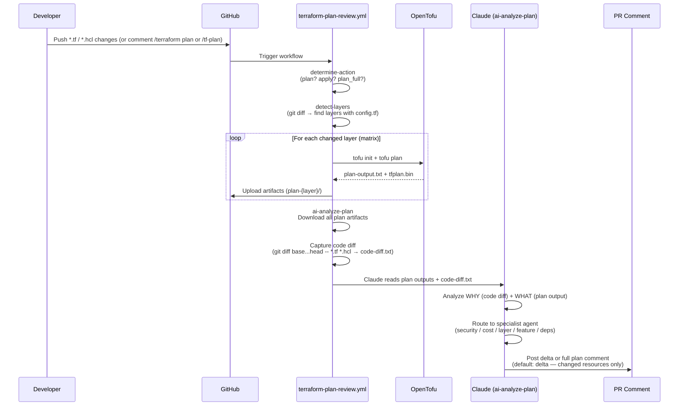
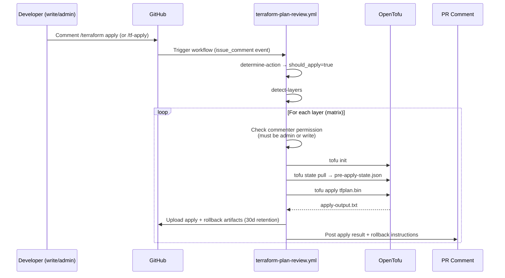
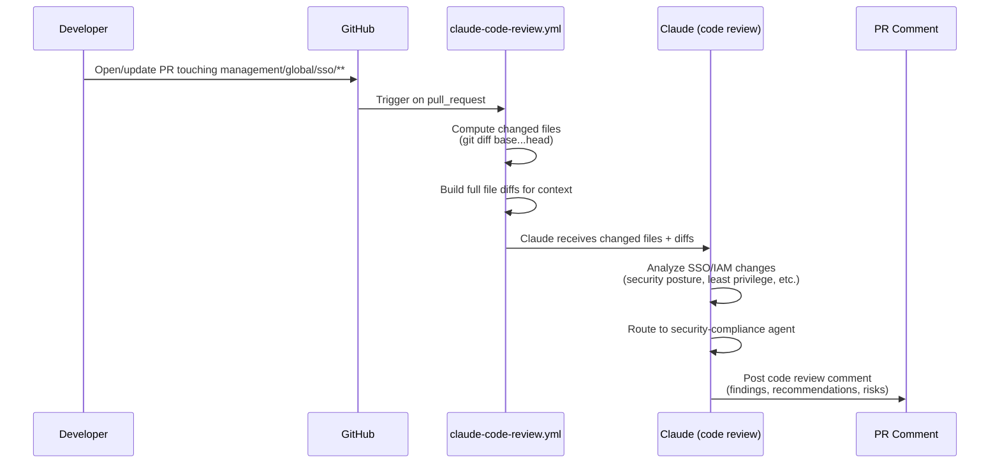
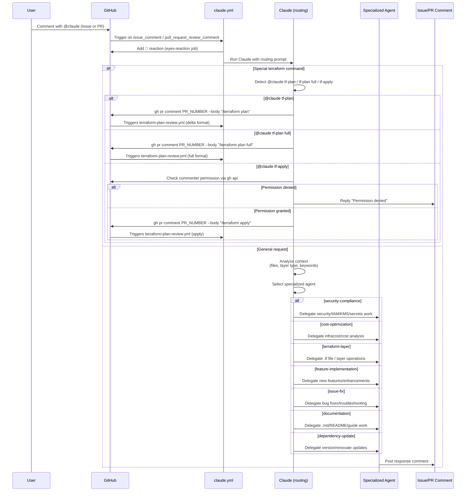

# Claude Code GitHub Workflows

This document describes the three GitHub Actions workflows that integrate Claude AI into the Binbash Leverage Reference Architecture CI/CD pipeline. It is intended for new contributors and team members who want to understand how automated plan review, code review, and bot commands work.

---

## 1. Overview

| Workflow | File | Trigger | Purpose |
|----------|------|---------|---------|
| **Terraform Plan Review** | `terraform-plan-review.yml` | PR open/update, `/terraform` comment | Auto-plan changed layers, AI analysis, apply on demand |
| **Claude Code Review** | `claude-code-review.yml` | PR to `management/global/sso/**` | Focused code review of SSO/IAM changes |
| **General @claude Handler** | `claude.yml` | `@claude` mention in issues/PRs | Bot commands + intelligent agent routing |

---

## 2. Workflow: Terraform Plan Review

**File**: `.github/workflows/terraform-plan-review.yml`

This is the primary workflow for infrastructure change management. It replaces Atlantis/GitOps by combining automated Terraform plans with AI-powered analysis.

### Plan Path



### Apply Path



### Key Features
- **Delta format by default**: PR comments show only changed resources (`+`, `~`, `-`) plus a meaningful one-sentence summary.
- **Full format on demand**: Use `/terraform plan full` to get the complete unfiltered output.
- **Short aliases**: `/tf-plan` = `/terraform plan`, `/tf-plan full` = `/terraform plan full`, `/tf-apply` = `/terraform apply`.
- **Code diff context**: Claude reads `.tf`/`.hcl` code changes alongside the plan to understand developer intent.
- **Rollback safety**: Pre-apply state snapshot is retained for 30 days.
- **Concurrency guard**: Only one plan/apply runs per PR at a time (`cancel-in-progress: false`).

---

## 3. Workflow: Claude Code Review

**File**: `.github/workflows/claude-code-review.yml`

A focused review workflow that triggers when PRs touch SSO/IAM configuration files.



---

## 4. Workflow: General @claude Handler

**File**: `.github/workflows/claude.yml`

Handles all `@claude` mentions in issues, PR comments, and PR review comments.



---

## 5. Agent Integration Map

Claude uses specialized agents (subprocesses) for deep domain expertise. The routing decision is made by analyzing file paths, layer names, resource types, and request keywords.

| Agent | Trigger Patterns | Capabilities |
|-------|-----------------|--------------|
| **security-compliance** | `security-*`, `secrets-manager`, `iam`, `kms`, `audit`, `compliance` | IAM policy analysis, encryption review, CIS compliance, least privilege |
| **cost-optimization** | `cost`, `infracost`, `billing`, resource sizing, `spot`, `reserved` | Infracost analysis, tagging strategy, right-sizing recommendations |
| **terraform-layer** | General `.tf` changes, `base-network`, `databases-*`, `k8s-*` | Layer creation/modification, init/plan/apply, state management |
| **feature-implementation** | New layers, new services, `feature`, `add`, new `aws_*` resources | New service integration, multi-account patterns, reference architectures |
| **issue-fix** | `fix`, `bug`, `error`, `failed`, troubleshooting, CI failures | Root cause analysis, debugging, error resolution |
| **documentation** | `.md`, `README`, `DEPLOYMENT.md`, `docs/` | Layer docs, Mermaid diagrams, CLAUDE.md maintenance |
| **dependency-update** | Renovate PRs, `provider`, `module`, version constraints | Version bump reviews, compatibility checks, lock file updates |

---

## 6. Command Reference

### Local Claude Code IDE (slash commands)

| Command | Description | Output |
|---------|-------------|--------|
| `/tf-plan` | Delta plan for current layer | Changed resources only + meaningful summary |
| `/tf-plan-full` | Full plan for current layer | Complete unfiltered plan output |
| `/tf-apply` | Apply for current layer | Shows delta plan first, asks for confirmation |

Run from a Terraform layer directory (one containing `config.tf`):
```bash
cd apps-devstg/us-east-1/secrets-manager
/tf-plan        # See what will change
/tf-apply       # Apply changes (confirms first)
```

### PR Comment Bot Commands

| Command | Alias | Surface | Behavior |
|---------|-------|---------|----------|
| `@claude tf-plan` | — | PR comment | Delta plan via Claude bot (triggers `/terraform plan`) |
| `@claude tf-plan full` | — | PR comment | Full plan via Claude bot (triggers `/terraform plan full`) |
| `@claude tf-apply` | — | PR comment | Apply via Claude bot — checks permission first |
| `/terraform plan` | `/tf-plan` | PR comment | Delta plan via terraform-plan-review workflow |
| `/terraform plan full` | `/tf-plan full` | PR comment | Full plan via terraform-plan-review workflow |
| `/terraform apply` | `/tf-apply` | PR comment | Apply with permission check (full pipeline + rollback) |
| `@claude <question>` | — | Issue or PR comment | General intelligent routing to specialized agent |

### Permission Requirements

| Command | Alias | Required GitHub Role |
|---------|-------|---------------------|
| `/terraform plan` | `/tf-plan` | Any collaborator |
| `/terraform plan full` | `/tf-plan full` | Any collaborator |
| `@claude tf-plan` | — | Any collaborator |
| `@claude tf-plan full` | — | Any collaborator |
| `/terraform apply` | `/tf-apply` | Write or Admin |
| `@claude tf-apply` | — | Write or Admin |

---

## 7. Plan Output Formats

### Delta Format (default)

Used when: PR push/update, `/terraform plan` (or `/tf-plan`), `@claude tf-plan`

```
Summary: Creates a KMS-encrypted Secrets Manager secret for the API key and grants the devops role read access.

# aws_secretsmanager_secret.api_key will be created
+ resource "aws_secretsmanager_secret" "api_key" {
    + kms_key_id = "arn:aws:kms:us-east-1:123456789012:key/..."
    + name       = "bb-apps-devstg-api-key"
  }

# aws_iam_policy.secrets_read will be created
+ resource "aws_iam_policy" "secrets_read" {
    + name   = "bb-apps-devstg-secrets-read"
    + policy = (known after apply)
  }

Plan: 2 to add, 0 to change, 0 to destroy.
```

### Full Format

Used when: `/terraform plan full` (or `/tf-plan full`), `@claude tf-plan full`

Shows complete unfiltered output (all resources, refresh output, etc.) in a collapsible `<details>` block, prefixed with the same Summary line and assessment section.
