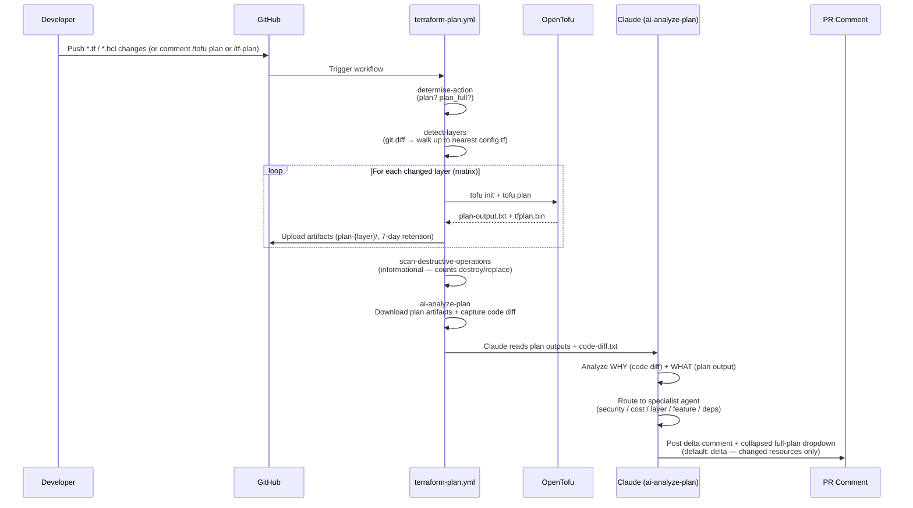

# Terraform Plan Workflow

This document describes the **Terraform Plan** GitHub Actions workflow that runs
automated OpenTofu plans with AI-powered analysis on pull requests. It is intended
for contributors who want to understand how automated plan review works.

> Scope: this is the **plan stage**. The apply path and the Claude assistant /
> code-review workflows are delivered in later staged PRs and will be documented
> here as they land.

---

## Overview

| Workflow | File | Trigger | Purpose |
|----------|------|---------|---------|
| **Terraform Plan** | `terraform-plan.yml` | PR open/update on `*.tf`/`*.tfvars`/`*.hcl`, or `/tofu plan` comment | Auto-plan changed layers, scan for destructive ops, AI analysis |

---

## Workflow: Terraform Plan

**File**: `.github/workflows/terraform-plan.yml`

This is the primary workflow for infrastructure change review. It replaces the
Atlantis/GitOps plan step by combining automated OpenTofu plans with AI analysis.



### Jobs

| Job | Role |
|-----|------|
| `authorize` | Collaborator gate for comment-triggered runs (admin/write only) |
| `eyes-reaction` | 👀 reaction to acknowledge a triggering comment |
| `determine-action` | Decide whether to plan and which format (delta vs full) |
| `setup-environment` | Python + dependency cache warm-up |
| `detect-layers` | Marker-based detection — find layer roots (`config.tf`) for changed files |
| `run-terraform-plan` | Per-layer matrix: `setup-layer-context` → `tofu init` → `tofu plan` → upload artifact |
| `scan-destructive-operations` | Count `destroy`/`replace` and post an informational warning |
| `ai-analyze-plan` | Claude reads plan + code diff and posts the PR comment |

`run-terraform-plan` uses the **`setup-layer-context`** composite action, which
consolidates the repeated OpenTofu/Leverage install, account resolution, AWS
credentials, and reference-architecture config into a single step.

### Key Features
- **Delta format by default**: PR comments show only changed resources (`+`, `~`, `-`, `-/+`) plus a meaningful one-sentence summary, with a collapsed dropdown carrying the full plan.
- **Full format on demand**: `/tofu plan full` promotes the complete output to the top of the comment.
- **Complete plan retained**: every run uploads the full `plan-output.txt` + `tfplan.bin` as the `plan-<layer>` artifact (7-day retention) — the authoritative, never-truncated copy.
- **Short aliases**: `/tf-plan` = `/tofu plan`, `/tf-plan full` = `/tofu plan full`.
- **Code diff context**: Claude reads `.tf`/`.hcl` changes alongside the plan to understand developer intent.
- **Destructive-op scan**: destroy/replace counts are surfaced for reviewer attention (informational — the plan stage does not apply).
- **Concurrency guard**: one plan runs per PR at a time (`cancel-in-progress: false`).

Output formatting is defined once in [`.claude/docs/output-formats.md`](../../.claude/docs/output-formats.md) and referenced by both the workflow's AI step and the local `/tf-plan` skills.

---

## Agent Integration Map

The `ai-analyze-plan` step routes to specialized agents for deep domain expertise,
based on file paths, layer names, resource types, and request keywords (see
[`.claude/docs/agent-guide.md`](../../.claude/docs/agent-guide.md)).

| Agent | Trigger Patterns | Capabilities |
|-------|-----------------|--------------|
| **security-compliance** | `security-*`, `secrets-manager`, `iam`, `kms`, `audit`, `compliance` | IAM policy analysis, encryption review, CIS compliance, least privilege |
| **cost-optimization** | `cost`, `infracost`, `billing`, resource sizing, `spot`, `reserved` | Infracost analysis, tagging strategy, right-sizing recommendations |
| **terraform-layer** | General `.tf` changes, `base-network`, `databases-*`, `k8s-*` | Layer creation/modification, init/plan, state management |
| **feature-implementation** | New layers, new services, `feature`, `add`, new `aws_*` resources | New service integration, multi-account patterns, reference architectures |
| **issue-fix** | `fix`, `bug`, `error`, `failed`, troubleshooting, CI failures | Root cause analysis, debugging, error resolution |
| **documentation** | `.md`, `README`, `DEPLOYMENT.md`, `docs/` | Layer docs, Mermaid diagrams, CLAUDE.md maintenance |
| **dependency-update** | Renovate PRs, `provider`, `module`, version constraints | Version bump reviews, compatibility checks, lock file updates |

---

## Command Reference

### Local Claude Code IDE (slash commands)

| Command | Description | Output |
|---------|-------------|--------|
| `/tf-plan` | Delta plan for current layer | Changed resources only + meaningful summary |
| `/tf-plan-full` | Full plan for current layer | Complete unfiltered plan output |

Run from a Terraform layer directory (one containing `config.tf`):
```bash
cd apps-devstg/us-east-1/secrets-manager
/tf-plan        # See what will change
/tf-plan-full   # See the complete output
```

### PR Comment Commands

| Command | Alias | Required GitHub Role | Behavior |
|---------|-------|----------------------|----------|
| `/tofu plan` | `/tf-plan` | Any collaborator | Delta plan via the Terraform Plan workflow |
| `/tofu plan full` | `/tf-plan full` | Any collaborator | Full plan via the Terraform Plan workflow |

Automatic plans run on every PR that changes `*.tf` / `*.tfvars` / `*.hcl` (non-fork).
