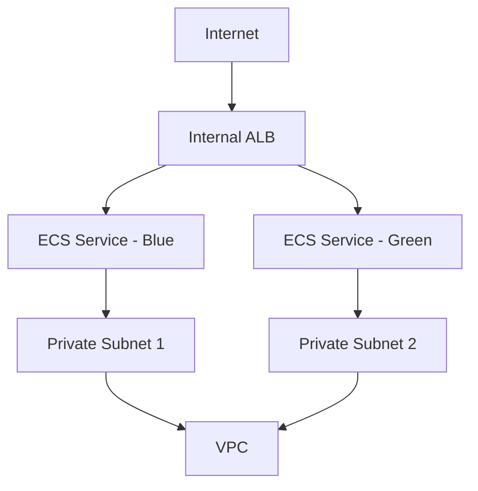

# ECS Blue/Green Deployment Infrastructure

## Product Overview

This Terraform stack provides a production-ready infrastructure for deploying containerized applications using Amazon ECS with Blue/Green deployment capabilities. It's designed to ensure high availability, zero-downtime deployments, and secure application hosting in AWS.

### Key Features

- 🚀 **Zero-Downtime Deployments**: Blue/Green deployment strategy for seamless application updates
- 🔒 **Enhanced Security**: VPC-based isolation and strict security group rules
- 📊 **Load Balancing**: Internal ALB with path-based routing and health checks
- 🔄 **Auto Scaling**: Built-in support for ECS service auto-scaling
- 🛡️ **High Availability**: Multi-AZ deployment across private subnets
- 🔍 **Service Discovery**: Integrated service discovery for microservices
- 🔐 **IAM Integration**: Pre-configured IAM roles with least privilege principle

## Architecture



### Infrastructure Components

1. **Application Load Balancer (ALB)**
   - Internal-facing ALB for secure access
   - HTTP/HTTPS listeners (ports 80, 8080)
   - Path-based routing for multiple services
   - Advanced health check configuration
   - SSL/TLS termination support

2. **ECS Services**
   - Containerized application hosting
   - Blue/Green deployment target groups
   - Service auto-scaling capabilities
   - Task definition management
   - Container health monitoring

3. **Networking**
   - VPC-based network isolation
   - Private subnet deployment
   - Security group rules
   - NACL configurations
   - Service-to-service communication

4. **Security**
   - VPC endpoint integration
   - IAM role-based access control
   - Security group restrictions
   - Network isolation
   - Encryption at rest and in transit

## Getting Started

### Prerequisites

- AWS Account with appropriate permissions
- Terraform v1.0.0 or later
- AWS CLI configured
- Docker installed (for local development)

### Quick Start

1. Clone the repository:
```bash
git clone <repository-url>
cd ecs-demoapps-bluegreen
```

2. Configure your variables:
```bash
cp services.auto.tfvars.example services.auto.tfvars
cp deployments.auto.tfvars.example deployments.auto.tfvars
```

3. Initialize Terraform:
```bash
terraform init
```

4. Deploy the infrastructure:
```bash
terraform plan
terraform apply
```

## Configuration

### Service Configuration (`services.auto.tfvars`)

```hcl
services = {
  "app1" = {
    application_port = 8080
    cpu    = 256
    memory = 512
    desired_count = 2
    # Additional configuration...
  }
}
```

### Deployment Configuration (`deployments.auto.tfvars`)

```hcl
deployments = {
  "app1" = {
    deployment_type = "blue_green"
    deployment_config = {
      # Deployment settings...
    }
  }
}
```

## Best Practices

1. **Resource Naming**
   - Use consistent naming conventions
   - Include environment and service identifiers
   - Follow AWS resource naming guidelines

2. **Security**
   - Regularly rotate IAM credentials
   - Review security group rules
   - Monitor CloudTrail logs
   - Implement least privilege access

3. **Monitoring**
   - Set up CloudWatch alarms
   - Monitor ECS service metrics
   - Track ALB metrics
   - Configure log aggregation

4. **Maintenance**
   - Regular Terraform state updates
   - Security patch management
   - Resource cleanup
   - Cost optimization

## Troubleshooting

Common issues and solutions:

1. **Deployment Failures**
   - Check ECS service events
   - Verify task definition
   - Review container logs
   - Check IAM permissions

2. **Connectivity Issues**
   - Verify security group rules
   - Check VPC configuration
   - Validate ALB health checks
   - Review NACL settings

## Support

For support and questions:
- Create an issue in the repository
- Contact the DevOps team
- Check the documentation
- Review AWS ECS documentation

## Contributing

We welcome contributions! Please follow these steps:

1. Fork the repository
2. Create a feature branch
3. Make your changes
4. Submit a pull request
5. Ensure CI/CD checks pass

## License

This project is licensed under the MIT License - see the LICENSE file for details.

## Roadmap

- [ ] Multi-region deployment support
- [ ] Enhanced monitoring integration
- [ ] Cost optimization features
- [ ] Additional deployment strategies
- [ ] Automated testing framework
