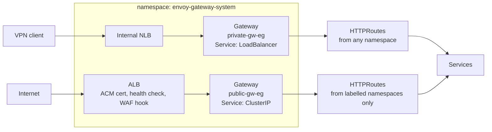

# Ingress on this cluster: Envoy Gateway

nginx-ingress was retired; L7 traffic goes through
[Envoy Gateway](https://gateway.envoyproxy.io/), driven by Gateway API
resources. **`private-apps` is a dead ingress class** — an Ingress naming it is
accepted by the API server and then ignored forever, because nothing watches
it any more.

`public-apps` is *not* dead: it belongs to the AWS Load Balancer Controller,
which is running, and the public path depends on it. An Ingress on that class
provisions the ALB that fronts the public gateway — that is how ACM, the health
check and AWS WAF attach, none of which can attach to an NLB.

Assumes you know Ingress and have read a Gateway API overview. Everything below
is what is specific to *this* cluster.

## Topology



|                | `private-gw-eg`            | `public-gw-eg`                        |
| -------------- | -------------------------- | ------------------------------------- |
| GatewayClass   | `envoy-gateway`            | `envoy-gateway-public`                |
| Frontend       | internal NLB, VPN-only     | internet-facing **ALB**               |
| Gateway's Svc  | `LoadBalancer`             | `ClusterIP` — the ALB reaches it      |
| TLS terminates | Envoy, off the wildcard    | the ALB, off an ACM certificate       |
| Hostnames      | `<app>.aws.binbash.com.ar` | `<app>.binbash.com.ar`                |
| Wildcard cert  | `*.aws.binbash.com.ar`     | `*.binbash.com.ar`                    |
| Who may attach | any namespace              | namespaces carrying an opt-in label   |
| Access control | VPN                        | per-route `SecurityPolicy` in Envoy   |

The private gateway runs `nlb-target-type: instance`, so **the client IP reaches
Envoy** and `X-Forwarded-For` is real. The public one gets the client IP from
the ALB's `X-Forwarded-For` instead, via a `ClientTrafficPolicy` with
`numTrustedHops: 1` — see "Six things that will surprise you".

The frontend is selected by `envoy_gateway.public_gateway.frontend`; `"nlb"` is
the previous shape and flipping that one word is the whole rollback.

Each Gateway gets its own GatewayClass because Envoy Gateway binds `EnvoyProxy`
(the per-gateway infra config: LB annotations, node scheduling) at the
**GatewayClass** level via `spec.parametersRef`, not at the Gateway level. Two
gateways needing different LB annotations therefore need two classes. Envoy
Gateway provisions one Envoy data plane Deployment + one Service per Gateway.

## Components, and how each is exposed

Most of what runs here exposes nothing at all — it is controllers and platform
plumbing. **`echo-server` is the only workload that uses both APIs at once**;
the other two workloads are private-only.

| running today                                     | namespace              | exposure                                          |
| ------------------------------------------------- | ---------------------- | ------------------------------------------------- |
| aws-load-balancer-controller                       | `alb-ingress`          | none — it *materialises* ALBs from Ingress objects |
| envoy-gateway                                      | `envoy-gateway-system` | none — it materialises the Gateways                |
| cert-manager                                       | `certmanager`          | none                                               |
| clusterissuer-binbash, cluster-issuer-binbash-aws  | `certmanager`          | none — ClusterIssuers                              |
| private-gw-eg-tls, public-gw-eg-tls                | `envoy-gateway-system` | none — listener Certificates                       |
| external-dns, private and public                   | `externaldns`          | none                                               |
| cluster-autoscaler                                 | `monitoring-metrics`   | none                                               |
| external-secrets + `cluster-secrets-manager`       | `external-secrets`     | none — a ClusterSecretStore                        |
| argo-cd                                            | `argocd`               | private — `argocd.aws.binbash.com.ar`              |
| argo-rollouts (+ dashboard)                        | `argocd`               | private — `rollouts.aws.binbash.com.ar`            |
| **echo-server** (from `k8s-workloads`)             | `echo-server`          | **both** — see below                               |
| **emojivoto** (from `k8s-workloads`, via Argo CD)  | `emojivoto`            | private — `emojivoto.aws.binbash.com.ar`           |
| **google-microservices** (idem)                    | `demo-google-microservices-dev` | private — `gmd.aws.binbash.com.ar`       |

The objects that actually carry exposure:

| object                        | kind        | what it does                                              |
| ----------------------------- | ----------- | --------------------------------------------------------- |
| `private-gw-eg`               | Gateway API | its Service is `LoadBalancer` → internal NLB → Envoy       |
| `public-gw-eg`                | Gateway API | its Service is `ClusterIP`; provisions nothing             |
| `envoy-apps`                  | **Ingress** | asks the LBC for the ALB: ACM, health check, WAF hook      |
| `echo-server-eg`              | HTTPRoute   | `echo-server.aws.binbash.com.ar` on the private gateway    |
| `echo-server-eg-public`       | HTTPRoute   | `echo-server.binbash.com.ar` on the public gateway         |
| `emojivoto-eg`                | HTTPRoute   | `emojivoto.aws.binbash.com.ar` on the private gateway      |
| `google-microservices-dev-eg` | HTTPRoute   | `gmd.aws.binbash.com.ar` on the private gateway            |
| `argocd-server`, `argo-rollouts-dashboard` | HTTPRoute | rendered by their own charts, private gateway |
| `private-gw-eg-https-redirect`| HTTPRoute   | platform: 80 → 443                                         |
| `public-gw-eg-healthz`        | HTTPRoute   | platform: the fixed-200 the ALB's health check needs       |

### Why echo-server is "both"

On the public path the two APIs do different, complementary jobs:

```text
private:  NLB ──────────────► Envoy ──► app     Gateway API alone
public:   ALB ──────────────► Envoy ──► app     Ingress + Gateway API
          ▲                   ▲
          │                   └─ HTTPRoute: routing by hostname
          └─ Ingress: obtains the ALB, ACM, health check, WAF
```

The **Ingress routes no application traffic**. It exists so the LBC provisions
an ALB and hangs ACM, the health check and (when enabled) the WebACL off it. The
**HTTPRoute** does the actual hostname routing. That is why the public gateway's
Service is `ClusterIP`: it has nothing to provision, the ALB reaches it.

### Switched off, exposure already written

All on **Gateway API** — converted during the nginx migration, so enabling one
needs no networking work: `grafana`, `prometheus`, `alertmanager`,
`uptime-kuma`, `gatus`, `goldilocks`, each with its own route. `argocd` and
`argo-rollouts` were on this list until Day 11, when the GitOps workloads
brought them back; theirs are the first two routes here rendered by the charts'
own keys to have actually served traffic.

`traefik` is the exception: the last component here that would expose over
**Ingress** (`traefik_apps`), and the only consumer left of
`var.ingress.apps_ingress`.

### Switched off, no exposure

`external-secrets`, `cluster-secrets-manager`, `vpa`, `metrics-server`, `keda`,
`keda-http-add-on`, `cluster-overprovisioner`, `cluster-proportional-autoscaler`,
`kube-state-metrics`, `node-exporter`, `kube-prometheus-stack`, `datadog-agent`,
`kwatch`, `fluentbit`, `fluentd-awses`, `fluentd-selfhosted`, `k8s-event-logger`,
`kube-resource-report`, `cost-analyzer`, `argocd-image-updater`.

### There is no third mechanism

No NodePort, no standalone `LoadBalancer` Service. The cluster's only
`LoadBalancer` Service is the one Envoy Gateway derives from `private-gw-eg` —
Gateway API's own plumbing, not an alternative route in. Everything that enters
goes through Gateway API, and the single appearance of Ingress is the one that
goes to fetch an ALB.

## Exposing an app

Private — this is the whole thing:

```yaml
apiVersion: gateway.networking.k8s.io/v1
kind: HTTPRoute
metadata:
  name: my-app
  namespace: my-app
spec:
  parentRefs:
    - name: private-gw-eg
      namespace: envoy-gateway-system   # cross-namespace, no ReferenceGrant needed
  hostnames: ["my-app.aws.binbash.com.ar"]
  rules:
    - backendRefs: [{ name: my-app, port: 80 }]
```

No TLS block, no cert-manager annotation, no DNS record: the gateway terminates
TLS with its wildcard, and external-dns watches `gateway-httproute` and creates
the Route53 ALIAS from `hostnames`.

**Public** additionally requires labelling the namespace — writing an HTTPRoute
is deliberately not enough to put something on the internet:

```bash
kubectl label ns my-app gateway.binbash.com.ar/public-exposure=allowed
```

In Terraform, put the route next to the `helm_release` it exposes (see
`cicd-argo.tf`, `monitoring-metrics.tf`), and reuse
`local.private_gw_parent_refs` / `local.private_gw_enabled` from `locals.tf`.

## Six things that will surprise you

**Hostnames are one label deep.** `app.aws.binbash.com.ar`, never
`app.demo.devstg.aws.binbash.com.ar`. A single-label wildcard does not match
three labels, so a deeper name silently needs its own certificate and defeats
the point of a shared gateway.

**Access control is per-application, and the perimeter is open.** The ALB admits
everyone (`public_gateway.open_to_internet`), and filtering happens per route as
a `SecurityPolicy` with `authorization.rules[].principal.clientCIDRs` and
`defaultAction: Deny`. Envoy Gateway policies only target same-namespace
resources, which puts each policy in the app's own layer — the faithful
translation of a per-Ingress annotation. There are therefore two independent
lists on purpose: `envoy_gateway_public_allowed_cidrs` (the perimeter, here) and
per-app lists such as `echo_server_public_allowed_cidrs` (in `k8s-workloads`),
both kept out of git in `allowlist.local.auto.tfvars` — copy the `.example`.
Closing the perimeter as well is defence in depth, but it also masks whether the
per-route policy works.

**`numTrustedHops: 1` is load-bearing on the public path, and only there.**
Without it Envoy treats the ALB as the client: it overwrites
`X-Forwarded-Proto` with `http`, which loops any app that builds its own URLs,
and it reports the ALB's address as the origin, which would make CIDR matching
useless. Counting from the *right* of `X-Forwarded-For` resists forgery — a
client-sent `X-Forwarded-For: 1.2.3.4` still resolves to the address AWS
observed. The private gateway must **not** get this policy. Side effect:
`X-Envoy-External-Address` disappears on the public lane.

**Prove an allowlist from inside the cluster, not by editing it.** A 200 from
your own machine only shows the request arrived. A throwaway pod egresses
through the NAT Gateway, so its address is by construction not on any operator
allowlist: `kubectl run probe --rm -i --restart=Never --image=curlimages/curl
--command -- curl -s -o /dev/null -w '%{http_code}\n' https://<host>/` should
answer `403`, with `RBAC: access denied` in the body — that string is Envoy's
RBAC filter specifically, where the ALB would refuse the connection and a
routing miss would be 404.

**Backends serve cleartext.** TLS ends at the gateway; the hop to the Service is
plain HTTP. An app that insists on doing its own TLS must be told to stop —
ArgoCD needed `configs.params."server.insecure": true`, otherwise it answers the
gateway's cleartext request with a 307 to `https://` and the browser loops. The
alternative, `BackendTLSPolicy`, is experimental and needs CA plumbing.

**gRPC needs `--grpc-web`.** Envoy speaks HTTP/1.1 upstream by default, so
`argocd login` cannot negotiate gRPC over the h2c that insecure mode
multiplexes. Use `argocd login argocd.aws.binbash.com.ar --grpc-web`. The clean
fix is `appProtocol: kubernetes.io/h2c` on the Service port, which Envoy Gateway
honours to switch the upstream to HTTP/2 — the ArgoCD chart does not expose that
field.

## Coming from Ingress

| nginx-ingress                                   | here                                                     |
| ----------------------------------------------- | -------------------------------------------------------- |
| `kubernetes.io/ingress.class`                   | `parentRefs` naming a Gateway                            |
| `cert-manager.io/cluster-issuer` + `tls:`       | nothing — the gateway's listener terminates              |
| `nginx.ingress.kubernetes.io/backend-protocol`  | make the backend serve HTTP (or a `BackendTLSPolicy`)    |
| `nginx.ingress.kubernetes.io/ssl-redirect`      | nothing — port 80 only serves a platform redirect        |
| `nginx.ingress.kubernetes.io/rewrite-target`    | `filters: [{type: URLRewrite}]` on the rule              |
| path in `spec.rules[].http.paths[]`             | `matches: [{path: {...}}]` on the rule                   |

There is no HTTP variant of any app route: each Gateway's port-80 listener only
accepts routes from its own namespace, where a platform-owned redirect sends
everything to HTTPS. Attaching to a gateway is HTTPS-only by construction.

nginx also synthesised `X-Real-Ip`, `X-Forwarded-Host`, `X-Forwarded-Port` and
`X-Scheme`. Envoy does not emit these and no setting brings them back.

## Operations

**Fresh cluster: `k8s-components` needs two applies.** `kubernetes_manifest`
validates against the live API at *plan* time, so `EnvoyProxy` manifests fail
before their CRDs exist. First:

```bash
leverage tofu apply \
  -target=kubernetes_manifest.gateway_api_crds \
  -target=kubernetes_manifest.envoy_gateway_crds \
  -target=helm_release.envoy_gateway
```

then the full plan is clean.

**Do not `dig` a hostname before external-dns creates it.** One early query
caches the NXDOMAIN, and how long you pay for it depends on the zone: the
private `aws.binbash.com.ar` SOA carries TTL 900, so 15 minutes — but the
public `binbash.com.ar` SOA carries `minimum=86400`, so **24 hours**. Validate
with `curl --resolve <host>:443:<nlb-ip>` and only check real DNS after
external-dns logs the `CREATE`. If you have already poisoned it, public
resolvers are unaffected (`dig @8.8.8.8 …`); locally,
`sudo dscacheutil -flushcache && sudo killall -HUP mDNSResponder`.

**Destroys need the drain gate.** Envoy Gateway provisions Services of type
LoadBalancer that the AWS LB Controller collects. Destroying both controllers in
the same pass strands TargetGroupBindings and deadlocks namespace deletion on
finalizers. `time_sleep.controller_drain` in `networking-ingress.tf` keeps them
alive long enough to garbage collect; `depends_on` alone does not fix this.

**Route not serving?** Check `Accepted` and `ResolvedRefs` first:

```bash
kubectl get httproute -A -o custom-columns=\
'NS:.metadata.namespace,NAME:.metadata.name,HOSTS:.spec.hostnames[*],'\
'ACCEPTED:.status.parents[0].conditions[?(@.type=="Accepted")].status,'\
'RESOLVED:.status.parents[0].conditions[?(@.type=="ResolvedRefs")].status'
```

`Accepted=False` on the public gateway almost always means the namespace label
is missing. `ResolvedRefs=False` means the `backendRefs` name or port is wrong —
they are not validated at apply time.

**NLB targets read `unhealthy` for the first few minutes** after a gateway is
created. That is health-check convergence, not misconfiguration. Also note that
with `instance` targets and `externalTrafficPolicy: Local`, only nodes actually
running an Envoy pod ever pass the check — the rest are `unhealthy` by design.

## Re-vendoring the CRD bundles

Both CRD sets live in `crds/`, committed, rather than being fetched from GitHub
at plan time. The version is in the filename and the path is built from the
same variable that drives the chart, so bumping one without the other fails on
a missing file instead of silently pairing a new chart with old CRDs.

To bump either version, edit `terraform.tfvars` and then re-download to match:

```bash
# Gateway API — must match envoy_gateway.gateway_api_version
V=v1.4.0
curl -sL -o crds/gateway-api-standard-$V.yaml \
  https://github.com/kubernetes-sigs/gateway-api/releases/download/$V/standard-install.yaml

# Envoy Gateway — must match envoy_gateway.version
V=v1.7.2
curl -sL -o crds/envoy-gateway-crds-$V.yaml \
  https://github.com/envoyproxy/gateway/releases/download/$V/envoy-gateway-crds.yaml
```

Then `git rm` the superseded file. Keep the downloaded bytes untouched — the
files are excluded from the `trailing-whitespace` hook precisely so they stay
identical to the upstream release asset.

Expect a large diff and do not try to read it line by line; what you are
reviewing is the version bump and the fact that the bundle came from the
matching release, not 40k lines of OpenAPI schema. Note that a plan after
re-vendoring will show real changes to `kubernetes_manifest.*_crds` — that is
the CRD schema delta, and it is the one moment where the two-stage apply
matters again.

Why vendored at all: a `for_each` built from a network read can go empty for
reasons outside the config, and empty means destroy — which for these keys
would take every Gateway and HTTPRoute in the cluster with it. Secondarily, a
version tag pins a URL and not a payload (GitHub release assets are mutable),
and vendoring makes plan/apply hermetic so Atlantis needs no egress to GitHub.

## Why Envoy Gateway

Benchmarked against nginx-ingress and kgateway; see `../loadtest/test-results.md`
for the numbers. Short version: on identical `instance`-target plumbing Envoy logged
zero failures over 450k requests where nginx logged 425, and the long-standing
"nginx is faster" reading turned out to be an artifact of comparing different
NLB target types.

## Files

| file                          | what                                                       |
| ----------------------------- | ---------------------------------------------------------- |
| `crds/`                       | vendored upstream CRD bundles, version-stamped filenames     |
| `networking-gateway-api.tf`   | upstream Gateway API CRDs (shared by any data plane)        |
| `networking-envoygateway.tf`  | EG CRDs, controller, both Gateways + their classes and TLS  |
| `networking-ingress.tf`       | AWS LB Controller (`public-apps`), drain gate, the public ALB Ingress, traefik |
| `networking-dns.tf`           | external-dns, private and public                            |
| `networking-cluster-issuer.tf`| cert-manager ClusterIssuer backing both wildcards           |
| `locals.tf`                   | route conventions, `private_gw_parent_refs`                 |
