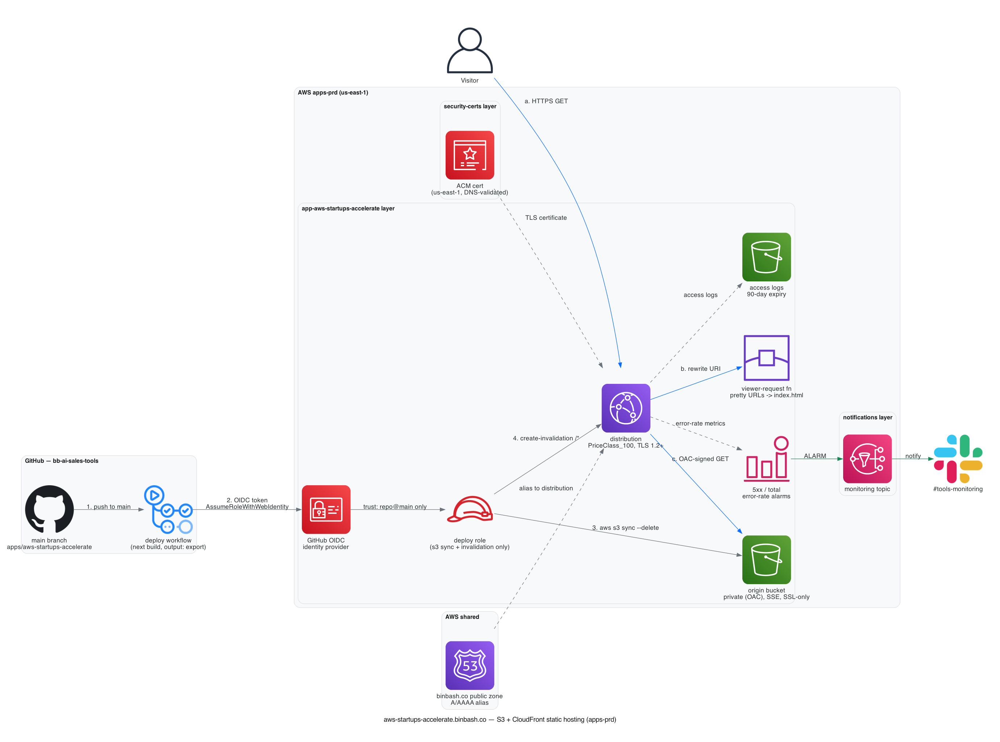

# Deployment: app-aws-startups-accelerate

Static hosting for `https://aws-startups-accelerate.binbash.co` (Next.js static
export from the `bb-ai-sales-tools` monorepo) on S3 + CloudFront, deployed by the
app repo CI via a GitHub OIDC role.



Diagram source: [`doc/diagrams/app-aws-startups-accelerate.py`](../../../doc/diagrams/app-aws-startups-accelerate.py)
(diagrams-as-code — `pip install diagrams && brew install graphviz`, then re-run the script).

```text
GitHub: bb-ai-sales-tools (CI)                         shared (global)
  next build (output: export) → out/                Route53 public zone: binbash.co
        │  assume role via GitHub OIDC                 aws-startups-accelerate.binbash.co ─┐
        ▼  (least-priv: s3 sync + cf invalidation)                                         │ A/AAAA alias
apps-prd / us-east-1                                                                       │ (aws.shared-route53)
  ┌─ S3 (private, OAC, SSE, SSL-enforce) ◀── aws s3 sync out/ --delete                     │
  │        ▲ OAC                                + CloudFront invalidation                  │
  └─ CloudFront ◀── ACM cert (us-east-1, security-certs) + access logs + CW alarms ◀───────┘
```

## Apply order

This layer consumes the `aws_startups_accelerate_certificate_arn` remote-state
output from `security-certs`, so that layer must be applied first — until then,
`plan` on this layer fails resolving the output.

1. **`apps-prd/us-east-1/security-certs`** — creates the ACM certificate
   (us-east-1, required by CloudFront) plus its DNS validation records in the
   shared account `binbash.co` zone:

   ```bash
   cd apps-prd/us-east-1/security-certs
   leverage tofu init && leverage tofu plan && leverage tofu apply
   ```

2. **`apps-prd/us-east-1/app-aws-startups-accelerate`** (this layer):

   ```bash
   cd apps-prd/us-east-1/app-aws-startups-accelerate
   leverage tofu init && leverage tofu plan && leverage tofu apply
   ```

Both layers need valid `bb-apps-prd-devops` and `bb-shared-devops` credentials
(`leverage aws sso login`, then `leverage tofu refresh-credentials` if stale).

## Handoff to the app repo CI

Consume these outputs (`leverage tofu output`) in `bb-ai-sales-tools`:

| Output               | Used for                                            |
| -------------------- | --------------------------------------------------- |
| `deploy_role_arn`    | `aws-actions/configure-aws-credentials` role to assume via OIDC |
| `s3_bucket`          | `aws s3 sync out/ s3://<s3_bucket> --delete`        |
| `cf_distribution_id` | `aws cloudfront create-invalidation --distribution-id <id> --paths '/*'` |

The role trust is scoped to `var.github_repository` @ `var.github_branch`
(defaults: `binbashar/bb-ai-sales-tools` @ `main`) — override via tfvars if the
repo/branch differs.

App build requirements (companion work in `bb-ai-sales-tools`):

- `next.config.ts`: `output: 'export'`, `images: { unoptimized: true }`, and
  **`trailingSlash: true`** — the CloudFront viewer-request function rewrites
  directory-style URIs to `{route}/index.html`, which is the layout
  `trailingSlash: true` produces (see `cloudfront-function.tf`).

## Post-apply verification

- `https://aws-startups-accelerate.binbash.co` serves with a valid cert; the
  S3 bucket is not directly reachable (OAC only).
- `/`, `/roadmap`, `/co-sell`, `/privacy` resolve (with and without trailing
  slash); an unknown path returns the app 404 page with HTTP 404.
- CloudFront access logs land in the `...-cloudfront-logs` bucket (90-day
  expiry) and the two `cf-*-error-rate` alarms show `OK` in CloudWatch.
- The deploy role can `s3 sync` + invalidate and nothing else.

## Notes

- **GitHub OIDC provider**: created by this layer while no other `apps-prd`
  layer owns one (`var.create_github_oidc_provider = true`). When a dedicated
  identities layer takes ownership (see issue #1081), set it to `false` —
  the role then looks the provider up by URL.
- **Phase-2 backend** (Bedrock invoke + SES IAM hooks) is intentionally a
  disabled stub in `backend-stub.tf`; API style (AppSync vs API Gateway +
  Lambda) is deferred. See issue #1085.
