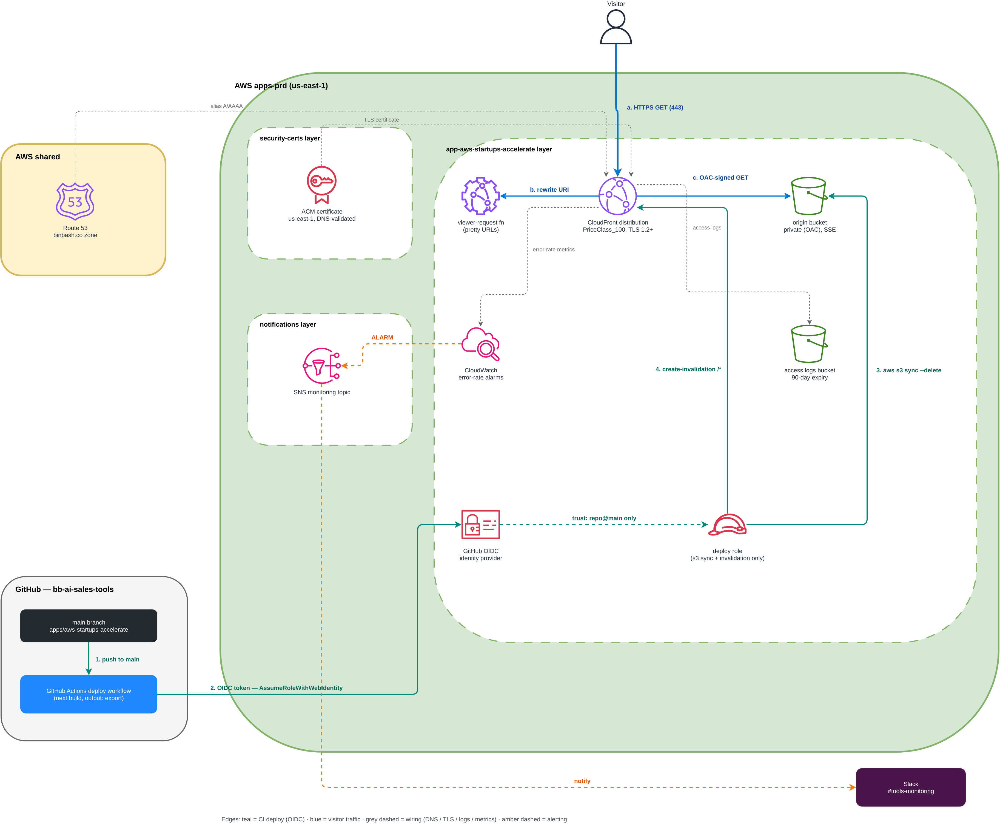

# app-aws-startups-accelerate

Static hosting for **`https://aws-startups-accelerate.binbash.co`** — the AWS
Startups onboarding roadmap app (a fully static Next.js export from the
[`bb-ai-sales-tools`](https://github.com/binbashar/bb-ai-sales-tools) monorepo)
served natively on AWS instead of Vercel.

Diagram source: [`doc/diagrams/app-aws-startups-accelerate.drawio`](../../../doc/diagrams/app-aws-startups-accelerate.drawio)
(edit at [app.diagrams.net](https://app.diagrams.net); re-export per [DEPLOYMENT.md](DEPLOYMENT.md)).

## What this layer provisions

| Concern | Resources |
| --- | --- |
| **Serving** | CloudFront distribution (`PriceClass_100`, TLS 1.2+, compression) with a private S3 origin (OAC, SSE, SSL-enforced, public access blocked) and a viewer-request CloudFront Function rewriting pretty URLs (`/roadmap` → `/roadmap/index.html`); 403/404 mapped to the app's `404.html` |
| **DNS / TLS** | A/AAAA alias records in the shared account `binbash.co` zone (cross-account `aws.shared-route53` provider); ACM certificate consumed from the `security-certs` layer via remote state |
| **Deploy identity** | GitHub OIDC identity provider + least-privilege deploy role — `s3 sync` + CloudFront invalidation only, trust scoped to `repo:binbashar/bb-ai-sales-tools:ref:refs/heads/main` |
| **Operations** | CloudFront access logs (dedicated bucket, 90-day expiry) and `5xxErrorRate` / `TotalErrorRate` CloudWatch alarms wired to the `notifications` layer SNS → Slack pipeline |
| **Phase 2 (disabled)** | `backend-stub.tf` documents the future Bedrock + SES IAM hooks; API style intentionally deferred |

## Outputs (consumed by the app repo CI)

| Output | Purpose |
| --- | --- |
| `deploy_role_arn` | Role assumed via OIDC by the GitHub Actions deploy workflow |
| `s3_bucket` | Sync target for the static export |
| `cf_distribution_id` | Invalidation target after each deploy |
| `cf_domain_name` / `app_fqdn` | Distribution endpoint / public FQDN |

## Deployment

See [DEPLOYMENT.md](DEPLOYMENT.md) for the full runbook: apply order
(`security-certs` first), credentials, CI handoff, app build requirements
(`output: 'export'`, `images.unoptimized`, `trailingSlash: true`) and the
post-apply verification checklist.

## References

- Feature issue: [#1085](https://github.com/binbashar/le-tf-infra-aws/issues/1085) · Implementation PR: [#1097](https://github.com/binbashar/le-tf-infra-aws/pull/1097)
- Companion deploy workflow (app repo): [bb-ai-sales-tools#82](https://github.com/binbashar/bb-ai-sales-tools/issues/82)
- Module: [`binbashar/terraform-aws-cloudfront-s3-cdn`](https://github.com/binbashar/terraform-aws-cloudfront-s3-cdn) `v2.1.1`
