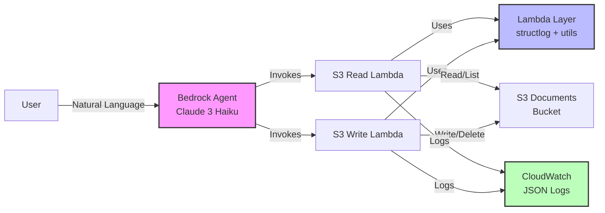

# AWS Bedrock Agent - S3 Integration Example

This layer implements a **simplified** AWS Bedrock Agent with S3 integration capabilities as part of the Binbash Leverage Reference Architecture. The agent demonstrates basic read and write operations on S3 buckets through separate action groups.

## Overview

This **streamlined** implementation provides:
- A Bedrock agent powered by Claude 3 Haiku (configurable)
- Two action groups for S3 operations:
  - **S3 Read Actions**: Read objects from S3 buckets
  - **S3 Write Actions**: Write objects to S3 buckets
- Simplified Lambda functions handling single operations each
- Proper IAM roles and policies with least privilege access
- S3 buckets for document storage and OpenAPI schemas
- **Fast deployment** with minimal resource count (~15 resources)

## Architecture



## Components

### 1. Bedrock Agent
- **Foundation Model**: `anthropic.claude-3-haiku-20240307-v1:0` (configurable)
- **Instructions**: Helpful assistant for S3 document management
- **Action Groups**: S3 read and write operations
- **Agent Alias**: Production deployment endpoint

### 2. Lambda Functions
- **S3 Read Handler** (`src/lambda/s3_read_handler.py`):
  - Reads objects from S3 buckets
  - Structured JSON logging with correlation IDs
  - Returns content and metadata
- **S3 Write Handler** (`src/lambda/s3_write_handler.py`):
  - Writes content to S3 buckets
  - Structured JSON logging with correlation IDs
  - Adds creation metadata
- **Shared Layer** (`src/layers/bedrock_agent/`):
  - `structlog` for professional logging
  - Request parsing and response formatting utilities
  - Correlation ID generation for request tracing

### 3. S3 Resources
- **Documents Bucket**: Storage for documents the agent can manipulate
- **Example Content**: Sample welcome document for testing

### 4. Security
- **Agent Service Role**: Allows Bedrock to invoke models and Lambda functions
- **Lambda Execution Role**: S3 access limited to specific buckets
- **Resource-based Policies**: Only Bedrock service can invoke Lambda functions
- **KMS Encryption**: Optional (disabled by default)

## Deployment

### Prerequisites
1. Authenticate with AWS SSO:
   ```bash
   leverage aws sso login
   ```

2. Ensure dependencies are deployed:
   - `data-science/us-east-1/security-keys` (for KMS encryption)
   - AWS Bedrock service enabled in the account

### Deploy the Layer
Navigate to the layer directory and deploy:
```bash
cd data-science/us-east-1/bedrock-agent

# Initialize and validate
leverage tf init
leverage tf validate

# Plan and apply
leverage tf plan
leverage tf apply
```

## Configuration

Key variables (see `variables.tf` for all):
- `agent_foundation_model`: Claude 3 Haiku (default) or other Bedrock models
- `lambda_timeout`: 60s default
- `lambda_memory_size`: 512MB default  
- `enable_encryption`: false default (set true for production)
- `LOG_LEVEL`: INFO/DEBUG/WARNING/ERROR for Lambda logging

## Usage Examples

Once deployed, you can interact with the agent through the AWS Bedrock console or API:

### 1. Reading Documents
```
"Can you read the welcome document from the documents bucket?"
```

### 2. Writing Documents
```
"Please create a new document called 'meeting-notes.txt' with the content 'Meeting notes from today's discussion' in the documents bucket."
```

### 3. Listing Objects
```
"Show me all the documents in the documents bucket."
```

### 4. Managing Documents
```
"Delete the file 'old-document.txt' from the documents bucket."
```

## Outputs

The layer provides the following outputs for integration with other layers:
- `agent_id`: The Bedrock agent ID
- `agent_arn`: The Bedrock agent ARN
- `agent_alias_arn`: The agent alias ARN for production use
- `documents_bucket_name`: Name of the documents S3 bucket
- `s3_read_lambda_arn`: ARN of the S3 read Lambda function
- `s3_write_lambda_arn`: ARN of the S3 write Lambda function

## Development and Testing

### Local Development
1. Modify Lambda functions in `src/lambda/`
2. Run `leverage tf plan` to see changes
3. Apply with `leverage tf apply`

### Testing the Agent
1. Use the AWS Bedrock console to test the agent
2. Try various S3 operations through natural language
3. Check CloudWatch logs for Lambda function execution details

### Monitoring with Structured Logging
- **CloudWatch Logs**: `/aws/lambda/bb-data-science-agent-s3-{read,write}`
- **JSON Format**: Query with CloudWatch Insights
- **Correlation IDs**: Track requests end-to-end
- **Example Query**:
  ```sql
  fields @timestamp, correlation_id, event, bucket, key
  | filter event = "s3_read_completed"
  | stats count() by bucket
  ```

## Security & Cost

- **IAM**: Least privilege access for all roles
- **S3**: Public access blocked, optional KMS encryption
- **Logging**: No sensitive data in structured logs
- **Cost**: Claude 3 Haiku model, S3 lifecycle policies, appropriate Lambda sizing

## Troubleshooting

- **Agent preparation fails**: Run `aws bedrock-agent prepare-agent --agent-id {id} --region us-east-1`
- **Lambda timeouts**: Increase `lambda_timeout` variable
- **Debug logs**: Set `LOG_LEVEL=DEBUG` and use correlation IDs in CloudWatch Insights
- **Provider errors**: Run `rm -rf .terraform .terraform.lock.hcl && leverage tf init`

## Future Enhancements

- Additional action groups for other AWS services
- Guardrails for content filtering
- Event-driven processing with EventBridge

## References

- [AWS Bedrock Agents](https://docs.aws.amazon.com/bedrock/latest/userguide/agents.html)
- [AWS-IA Bedrock Module](https://github.com/aws-ia/terraform-aws-bedrock)
- [Leverage Architecture](https://leverage.binbash.co)