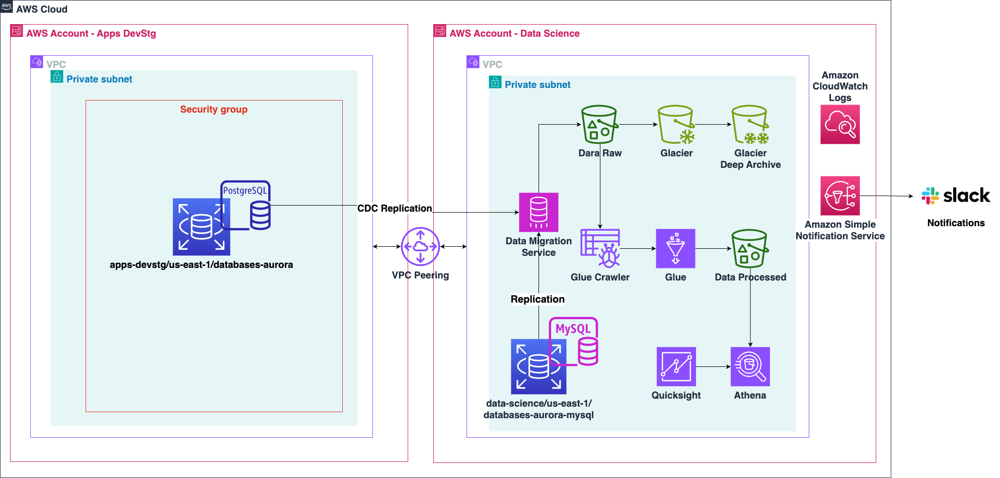
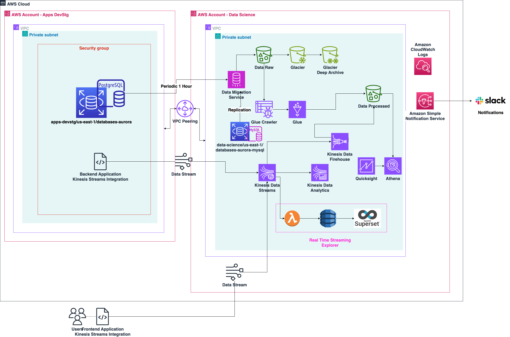

# binbash Leverage™ Data Lake Reference Architecture

## Overview

This document provides an overview of the Data Lake architecture depicted in the attached diagram and
its associated Terraform Infrastructure as Code (IaC) implementation. The solution is part of 
[binbash's Leverage™ Reference Architecture](https://github.com/binbashar/le-tf-infra-aws), which 
aims to create robust and scalable AWS cloud environments for modern data science and data engineering
use cases.

The architecture comprises two main AWS accounts: 
[`Apps DevStg`](https://github.com/binbashar/le-tf-infra-aws/tree/master/apps-devstg) and 
[`Data Science`](https://github.com/binbashar/le-tf-infra-aws/tree/master/data-science), each hosting
dedicated infrastructure components for their respective purposes. The `Apps DevStg` account serves
as the source of application data, while the `Data Science` account is responsible for advanced data
processing, analytics, and archival.

We are leveraging the binbash Leverage™ framework to maintain consistency, efficiency, and best
practices in developing our Terraform modules. The Data Lake stack currently under development
uses a combination of AWS services and is a work-in-progress that aligns with the approach documented
in our [binbash Leverage™ site](https://leverage.binbash.co).

## Architectural Components

### AWS Account - Apps DevStg

- **Aurora PostgreSQL Database**: The source data is stored in the PostgreSQL instance
[Ref Arch layer](https://github.com/binbashar/le-tf-infra-aws/tree/feature/data-science-data-lake-ref-arch/apps-devstg/us-east-1/databases-aurora) running on AWS Aurora. 
The database is part of the VPC within the `Apps DevStg` account and is protected by security groups to ensure
only authorized access.
- **CDC Replication**: Change Data Capture (CDC) is implemented to replicate changes from the Aurora PostgreSQL
database to the Data Science account S3 bucket, enabling near real-time synchronization.
- **VPC Peering**: A VPC peering connection links the `Apps DevStg` and `Data Science` accounts to facilitate
secure data transfer without traversing the public internet.
  - ⚠️Pending VPC peering [data-science-account w/ shared-account layer] (https://github.com/binbashar/le-tf-infra-aws/blob/master/shared/us-east-1/base-network/vpc_peerings.tf) 
  - ⚠️Pending VPC peering [data-science-account w/ apps-devstg layer] (https://github.com/binbashar/le-tf-infra-aws/tree/master/data-science/us-east-1/base-network) 

### AWS Account - Data Science

- **Data Migration Service (DMS)**: AWS DMS is used to replicate data from the Aurora PostgreSQL in the `Apps DevStg` 
account to a [MySQL database layer](https://github.com/binbashar/le-tf-infra-aws/tree/feature/data-science-data-lake-ref-arch/data-science/us-east-1/databases-aurora-mysql--) 
in the Data Science account. DMS supports CDC to ensure changes from the source are
continuously replicated to the target.
- **Glue Crawler**: AWS Glue is used to discover and catalog metadata from the raw data stored
in Amazon S3, making the datasets accessible for analysis and processing.
  - [Terraform Glue Module](https://github.com/binbashar/terraform-aws-glue) 
- **Glue ETL Jobs**: Data processing and transformation tasks are managed using AWS Glue 
ETL jobs, which transform the raw ingested data into a processed form suitable for analysis.
  - [Terraform Glue Module](https://github.com/binbashar/terraform-aws-glue)  
- **Data Lake Storage**: The architecture includes three main storage layers within Amazon S3:
  - **Data Raw**: The raw data ingested via DMS is stored in this S3 bucket.
  - **Glacier & Glacier Deep Archive**: These tiers are used for long-term storage of historical
  data to reduce costs.
  - **Data Processed**: Data processed through Glue ETL is stored here for analysis and consumption.
- **Athena**: Amazon Athena is used for interactive query analysis on the processed data, allowing data 
engineers and analysts to derive insights directly from S3.
- **QuickSight**: Amazon QuickSight is integrated for visualization and dashboarding, enabling stakeholders
to easily interpret data.
- **Notification and Monitoring Services**:
  - **Amazon CloudWatch Logs** for auditing and logging.
  - **Amazon SNS** for notifications integrated with **Slack** to notify about important events, 
  such as ETL failures or data ingestion issues.
 
## Terraform Infrastructure as Code Implementation

The implementation of this Data Lake architecture follows the Infrastructure as Code (IaC) paradigm
using Terraform and aligns with the principles of the [binbash Leverage](https://leverage.binbash.co) 
framework. The repository under development for the Data Lake reference architecture is 
available at: [binbash Leverage™ Infra AWS Data Lake Demo](https://github.com/binbashar/le-tf-infra-aws/tree/feature/data-science-data-lake-ref-arch).

### Key Terraform Components

- **VPC and Networking Configuration**: Terraform configurations define VPCs, subnets, and peering
connections required for secure data movement across accounts.
- **Database Replication Setup**: DMS configurations are defined to automate the replication of data
from PostgreSQL to MySQL, including the relevant source and target endpoints, replication instances, 
and task definitions.
- **S3 Buckets and Glue Configuration**: S3 bucket definitions are provided for raw, processed,
and archival data. Glue resources, including Glue Crawlers and ETL jobs, are also defined in
Terraform to ensure automated data discovery and transformation.
- **IAM Roles and Policies**: Access control is managed through IAM roles and policies defined
in Terraform, ensuring that least privilege is enforced across all data services.
- **Notification Integrations**: SNS topics are configured to send notifications to Slack using 
a webhook. Terraform definitions include CloudWatch alarms that trigger SNS in case of ETL job
failures or other anomalies.

## Next Steps

- **Complete Terraform Implementation**: The Terraform code for the Data Lake demo is a work-in-progress, with ongoing efforts to finalize DMS tasks, Glue ETL processes, and S3 bucket policies. Contributions are welcome, and more details can be found in the GitHub repository linked above.
- **Testing and Validation**: The Data Lake components will be thoroughly tested to ensure data integrity during migration, transformation, and analysis phases.
- **Documentation and Deployment**: Further documentation will be provided as development progresses. The deployment process will be detailed using the binbash Leverage™ deployment framework.

## To-Do

- **Real-Time Data Support:** Add support for real-time data processing using the following options
  - Kinesis Data Analytics
  - StarRocks

## Contributing

Contributions to the development of the Data Lake stack are welcome. 
Please refer to the [binbash Leverage™ GitHub repository](https://github.com/binbashar/le-tf-infra-aws) for more 
details on how to get involved. Follow our contributing guidelines for a smooth collaboration process.

## Related Resources

- [binbash Leverage™ Documentation](https://leverage.binbash.co)
- [AWS Data Migration Service (DMS)](https://aws.amazon.com/dms/)
- [AWS Glue](https://aws.amazon.com/glue/)
- [Terraform by HashiCorp](https://www.terraform.io/)

Feel free to reach out to us via Slack or GitHub issues for any questions or suggestions 
regarding this architecture.

