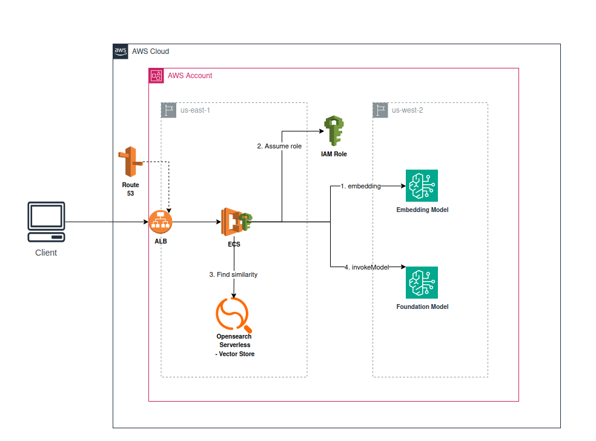

# Infrastructure Setup for Data Science GenAI LLM RAG Full

This guide provides instructions for setting up the infrastructure required for the Data Science GenAI LLM RAG Full.

In this demo, we create an ECS task that assumes an IAM role within the same AWS account. However, in a real-world scenario, the ECS task would assume a cross-account role to obtain temporary credentials, which are then used to access OpenSearch Serverless collections hosted in the target account. Additionally, the ECS task invokes machine learning models located in a different AWS region.

## Architecture

## Steps to Set Up the Infrastructure

1. **Run Leverage commands**

   - `leverage terraform plan`
   - `leverage terraform apply`

     **NOTE**: The terraform command will execute successfully; however, the ECS task will initially transition to a **Failed** state. This behavior is expected and will be resolved in the following steps.
2. **Log in to the AWS Management Console**Open your web browser and log in to the data-science AWS account.
3. **Navigate to AWS Secrets Manager**In the AWS Management Console, search for and select **Secrets Manager**.
4. **Find the Secret**In the Secrets Manager dashboard, locate the secret that starts with `/data-science/genai-llm-rag-full`.
5. **Edit the Secret**

   - Click on the secret to view its details.
   - Click on the **Edit secret** button.
6. **Add the Password Key**

   - In the **Key/Value pairs** section, add a new key with the following details:
     - **Key**: `PWD_DEMO`
     - **Value**: `<your_specific_password>` (replace this with the specific password you will use for the demo)
7. **Save Changes**

   - After adding the key and value, scroll down and click on the **Next** button.
   - Review your changes and click on **Save**.
8. **Build Container Image**

   - In order for the demo to work, you need to create the Docker image running the Action from the demo-app repository [here](https://github.com/binbashar/le-genai-ml-clients/actions/workflows/build-and-push.yml "Build and Push to ECR") (Select **full** as build type)
9. **Access the DNS domain**

   - Go to **demo-genai.binbash.co** and  log in using the credentials that were created in the Step 6.
