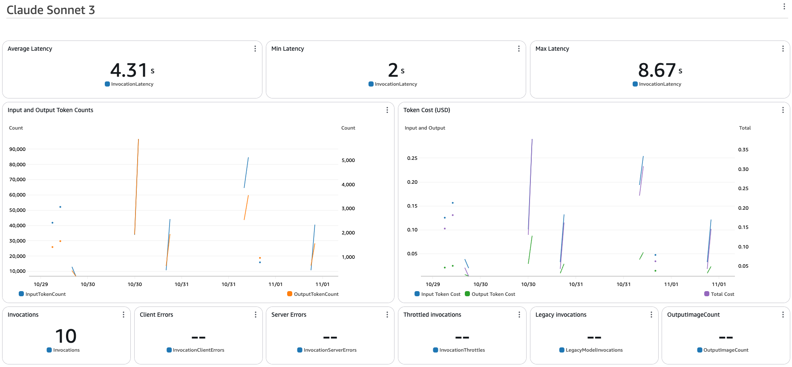

# Customization Guide

## Chatbot Customization

> Important:
> - This section is **only applicable** if you set `"deploy:case": "chatbot"` in your configuration.
> - For `text2sql` use case, please refer to [Text2SQL Customization](#text2sql-customization)

### Customize Prompts

You can customize the agent's instructions to better fit your specific use case. Follow these steps to modify the prompt:

1. Navigate to `packages/cdk_infra/src/prompt/instruction`
2. Select the appropriate use case folder: `chatbot` or `text2sql`
3. Open the text file containing the current prompt
4. Edit the file to customize the instructions
5. Save your changes
6. Redeploy the CDK stack to apply the new prompt:

   ```bash
   pnpm cdk_infra:deploy

#### Update Agent Alias (Optional)

When you make changes to your agent's configuration (such as customizing prompts), you create a new version. 
By updating the alias, you can control which version your application uses without changing your code.

For instructions on updating the agent alias for testing your customized version, please refer to the [API Testing Guide](API_TESTING.md#update-agent-alias).

### Configure Your Own Knowledge Base

> Note: This step is **only applicable** if you set `"deploy:knowledgebase": true` in your configuration.

The deployment creates a Knowledge Base with:
- Amazon OpenSearch as vector database
- S3 bucket for data storage
- Amazon Titan Embedding V2 model

#### Add Custom Data

1. Open [Amazon Bedrock Console](https://console.aws.amazon.com/bedrock)
2. Navigate to **Knowledge bases**
3. Select `KBBedrockAgenowledgeBase`
4. Click on the **Data Source** link to open the associated S3 bucket
5. Upload your custom knowledge base documents
6. Return to `KBBedrockAgenowledgeBase`
7. Select the **Amazon S3 Data source** and click **Sync** to generate vector embeddings

#### Additional Configuration Options

- Explore alternative data sources:
   - Web crawler
   - SharePoint, ...
- Customize embedding configurations

> Tip: Synchronization is crucial for making your custom data searchable by the Bedrock Agent.

#### Metadata Filtering

For detailed information about metadata filtering, please refer to the [Metadata Filtering Guide](#metadata-filtering-for-knowledge-base)

### Create Your Own Actions (Tools) 

This guide will walk you through the process of creating and customizing actions (tools) for your chatbot agent. 
These actions allow your agent to perform specific tasks or retrieve information based on user queries.

#### Sample Actions Overview

We provide two sample actions:
1. `escalate`: Used to escalate to a live agent
2. `password_change`: Used for changing account passwords

> Note: These actions are for demonstration purposes and do not perform actual system changes.

#### Testing Sample Actions

To test the `escalate` action:

1. Open the [Amazon Bedrock console](https://console.aws.amazon.com/bedrock)
2. Navigate to **Agents** and select your agent
3. In the test window, type: "I'd like to escalate."
4. When prompted, provide an email address:
    - If you enter "test@thebigtest.com", the request will succeed
    - Any other email will result in a failure message

#### Customizing Actions

To create your own actions:

1. Modify existing action logic in the Lambda function
2. Generate OpenAPI Schema for your updated action group
3. Deploy CDK to update the agent with the new action group definition

##### Action Modification Process

1. Navigate to `cdk_infra/src/backend/agents/lambda/account_actions`
2. Open the existing Python file(s) containing the sample actions
3. Modify or add new actions as needed
    - Ensure to update function names, parameters, and logic
    - Provide detailed descriptions for each function and its parameters

> Important: Detailed descriptions help the Agent understand and correctly use the tools.

##### Generating OpenAPI Schema
After modifying actions, you need to update the API schema. This schema helps the LLM understand your action group.

1. Ensure Python environment is set up:
   ```bash
   pnpm cdk_infra:init-python-venv 
   ```
   This command:
    - Creates a Python virtual environment (.venv)
    - Installs required dependencies: [pydantic](https://docs.pydantic.dev/latest/insta89ll/) and [Powertools for AWS Lambda](https://pypi.org/project/aws-lambda-powertools/)
   
2. Generate the updated OpenAPI schema:
   ```bash
   pnpm cdk_infra:generate-openapi-schemas 
   ```
   This script will update the openapi.json file with your modifications.
   Note: The updated schema will be located at: packages/cdk_infra/src/backend/agents/lambda/account_actions/openapi.json

    - Example of an OpenAPI schema: [OpenAPI Schema Example](../packages/cdk_infra/src/backend/agents/lambda/account_actions/openapi.json)

   Ensure the generated schema accurately reflects your action modifications before proceeding to deployment.

##### Deploy Updated Action Definition

Deploy the infrastructure stack with your changes:

   ```bash
   pnpm cdk_infra:deploy
   ```


## Exploring the Sample Data (Text2SQL)

This CDK Scaffolding provides you with a sample Amazon Athena database, **ecommerce_data**, which has two tables: products and reviews.
This is for demonstration purposes only. With this sample data set, you can learn how the agentic text2sql application works.

### Entity-Relationship Diagram

#### Products Table
| Column Name  | Data Type | Constraints |
|--------------|-----------|-------------|
| product_id   | int       | Primary Key |
| product_name | string    |             |
| category     | string    |             |
| price        | decimal   |             |
| description  | string    |             |
| created_at   | timestamp |             |
| updated_at   | timestamp |             |

#### Reviews Table
| Column Name   | Data Type | Constraints |
|---------------|-----------|-------------|
| review_id     | int       | Primary Key |
| product_id    | int       | Foreign Key |
| customer_name | string    |             |
| rating        | int       |             |
| comment       | string    |             |
| review_date   | timestamp |             |

#### Relationships
- One Product can have many Reviews (One-to-Many relationship)
- The `product_id` in the Reviews table is a foreign key referencing the `product_id` in the Products table

### Sample Questions

To help you understand how the agentic text2sql application works, try asking these sample questions to your AthenaAgent:
- "What are the items between USD 100 and USD 200?"
- "What are the items with the lowest reviews?"
- "What items are purchased with coupons?"

### Key Features

- **SQL Query Composition**: Example - User: "What are the items between USD 100 and 200?" You can see the generated query in traces.
- **Query Execution**: The agent uses the athena-query tool to execute the generated query and retrieve results from the database.
- **Error Handling and Query Modification**: If the query fails with an error, the agent will analyze the error, check the schema, and modify the query.
- **Dynamic Schema Discovery**:
  Example:
   - User: "What items are purchased with coupons?"
   - Agent: "I notice that the question is about items purchased with coupons, but looking at the provided schema information for the ecommerce_data database, I don't see any tables or columns that contain information about coupons or purchases made with coupons. The available tables (products and reviews) only contain information about products and their reviews.\n\nI should check if there are any other tables in the database that might contain this information."
   - The agent then uses the athena-schema-reader tool to check for any tables related to coupons or purchases.

### Code Interpreter (Optional)

Amazon Bedrock Agent offers an embedded tool called Code Interpreter, which can significantly enhance your TEXT2SQL capabilities.

#### What is Code Interpreter?

[Code Interpreter](https://docs.aws.amazon.com/bedrock/latest/userguide/agents-code-interpretation.html) enables your agent to generate, run, and troubleshoot application code in a secure test environment.
This feature allows you to leverage the foundation model's capabilities for basic code generation while you focus on building more complex generative AI applications.

#### Key Capabilities

With Code Interpreter, your agent can:

1. Understand user requests and generate code to perform specific tasks
2. Execute the generated code and provide results
3. Respond to generic queries by generating and running appropriate code
4. Perform data analysis, visualization, and evaluation
5. Process and extract information from user-uploaded files
6. Engage in interactive conversations for rapid prototyping

#### Use Cases for TEXT2SQL

In the context of TEXT2SQL, Code Interpreter can be particularly useful for:

- Creating data visualizations from SQL query results
- Performing additional data analysis beyond simple SQL queries

#### Enabling Code Interpreter

To enable Code Interpreter for your agent:

1. Open the [Amazon Bedrock console](https://console.aws.amazon.com/bedrock/)
2. Select "Agents" from the left navigation pane
3. Choose your agent in the Agents section
4. Click "Edit" in Agent Builder
5. Expand the "Additional settings" section
6. For Code Interpreter, select "Enable"
7. Click "Save" and then "Prepare" to apply the changes

#### Testing Code Interpreter with Sample Data

If you've enabled Code Interpreter for your agent, you can test its capabilities using our sample dataset. Here are some suggested prompts:

- "Calculate the average rating for each product category and display it as a bar chart"
- "Analyze the correlation between product price and rating score"

Remember to provide clear, specific instructions and ensure your agent has access to the necessary data sources.

> Note: Code Interpreter runs in a secure, isolated environment. However, always review generated code before executing it in production environments.

## Text2SQL Customization

> Important:
> - This section is **only applicable** if you set `"deploy:case": "text2sql"` in your configuration.
> - For `chatbot` use case, please refer to [Chatbot Customization](#chatbot-customization)

> Note: 
> - If you haven't explored the sample data yet, go to [Exploring the Sample Data (Text2SQL)](#exploring-the-sample-data-text2sql) first.

This guide will help you customize the Text2SQL functionality with your own data. Before customize, start with the sample data provided and understand how it works.

### 1. Prepare Your Data

#### Table and Schema Details
- List all required tables
- Provide descriptions for each table
- Specify column names and data types
- Add **comments** for each column to help the LLM understand their purpose

#### Sample Data
- Provide data in CSV or Parquet format
- Ensure proper formatting (e.g., handle commas, use YYYY-MM-DD for dates)
- Verify data accuracy by reviewing sample rows

#### Sample Questions and Queries
- Create 3-5 diverse SQL query examples
- Include a range of complexity levels
- Ensure examples are relevant to your dataset

### 2. Update the Glue Table

> Caution: The `athena-stack.ts` file contains a sample table named **products** in the `ecommerce-data` database. Modify these names if needed to avoid overwriting existing tables.

1. Navigate to `cdk_infra/src/stacks/athena-stack.ts`
2. Locate the Glue table creation section
3. Update columns to match your schema

### 3. Update Template Files

Go to the [templates folder](/packages/cdk_infra/src/prompt/orchestration/text2sql/claude/sonnet3.5/templates/) and update:

1. `tables.txt`: List tables with comprehensive comments
2. `schema.txt`: Add detailed comments for each column
3. `query_example.txt`: Provide diverse SQL query examples

### 4. Generate Orchestration Prompt

Run the prompt generator:

```bash
pnpm cdk_infra:generate-prompt
````


## CloudWatch Custom Dashboard

The workshop provides a sample CloudWatch Dashboard that displays Bedrock metrics and estimated billing amounts. This feature allows you to monitor your agent's performance and usage.

You can view your custom dashboard in the CloudWatch console:

1. Open the CloudWatch Console
2. Navigate to Dashboards
3. Select the dashboard created for your project

### Default Configuration

- The dashboard is pre-configured for the Anthropic Sonnet model.
- The estimated billing is based on token usage for specific models used in the workshop.

> Note: The cost estimate does not include other services such as OpenSearch Serverless.

### Customizing the Dashboard

If you switch to a different model, you'll need to update the dashboard configuration:

1. Navigate to the relevant agent CDK file:
   - For Chatbot: `packages/cdk/infra/src/stacks/bedrock-agent-stack.ts`
   - For Text2SQL: `packages/cdk/infra/src/stacks/bedrock-text2sql-agent-stack.ts`

2. Locate the `bddashboard` section in the file.

3. Update the model ID and pricing information to match your chosen model.

4. Re-deploy the CDK stack to apply the changes:

   ```bash
   pnpm cdk_infra:deploy
   ```


