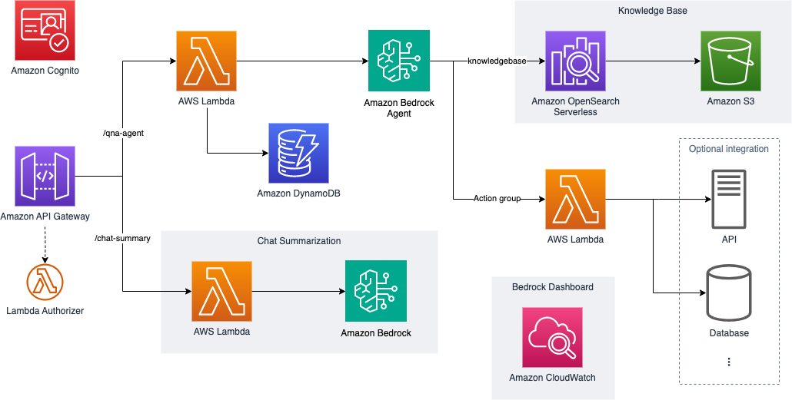
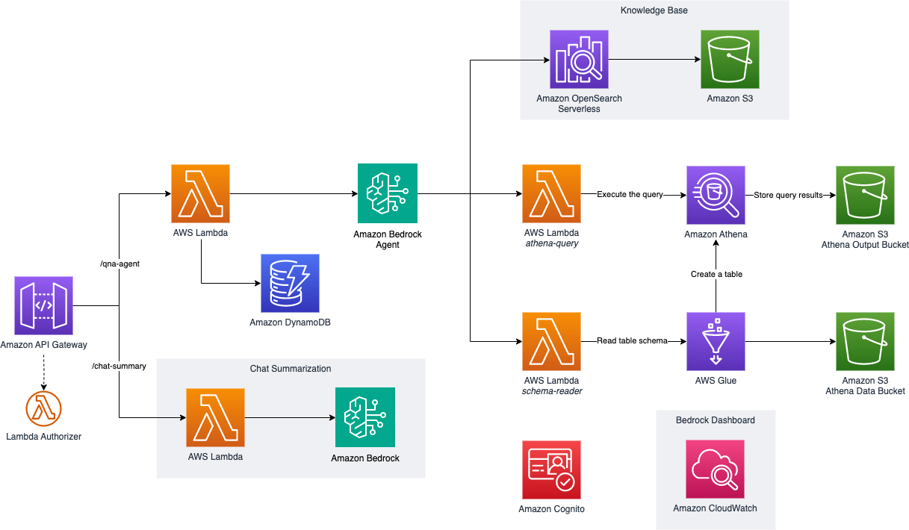

# Backend Implementation

Detailed technical documentation for the CDK infrastructure implementation. 
This includes comprehensive information about the architecture, available use cases (Chatbot, Text2SQL, Document Processing), and instructions for customizing the backend components for your specific needs.

## Use Cases

### Case 1. Chatbot
AI-powered chatbot with knowledge base and action group integration



#### Features

- Amazon Bedrock Agent with standard chatbot prompt
- Sample action group for the Agent: password change, escalation
- Knowledge base and metadata filtering with sample data
- Sample UI running on your local host with Cognito auth
- REST API to integrate with your own UI
   - QnA Agent API: Lambda backend to invoke Agent and store session information in DynamoDB table
   - Chat summary API (Optional): invoke Amazon Lite model to summarize the chat history for future use
   - Lambda custom authorizer as an example

### Services in Use for Standard Chatbot

- [Amazon Bedrock](https://aws.amazon.com/bedrock/)
- [Amazon OpenSearch Serverless](https://aws.amazon.com/opensearch-service/)
- [Amazon S3](https://aws.amazon.com/s3/)
- [Amazon API Gateway](https://aws.amazon.com/api-gateway/)
- [AWS Lambda](https://aws.amazon.com/lambda/)
- [Amazon DynamoDB](https://aws.amazon.com/dynamodb/)
- [Amazon CloudWatch](https://aws.amazon.com/cloudwatch/)
- [Amazon IAM](https://aws.amazon.com/iam/)
- [Amazon Cognito](https://aws.amazon.com/cognito/)

### Case 2. Text2SQL
Natural language to SQL conversion using Bedrock Agent



### Features

- Amazon Bedrock Agent with default Text2SQL prompts
   - Agent Instruction
   - Orchestration template
- Sample Athena tables `products` and `reviews` with sample data
- Bedrock action group to execute SQL query against Athena (`athena-query`)
- Bedrock action group to dynamically extract schema information from Athena (`schema-reader`)
- (Optional) Knowledge base and metadata filtering with sample data
- Sample UI running on your local host with Cognito auth
- REST API to integrate with your own UI
   - QnA Agent API: Lambda backend to invoke Agent and store session information in DynamoDB table
   - Chat summary API (Optional): invoke Amazon Lite model to summarize the chat history for future use
   - Lambda custom authorizer as an example

### Services in Use for Text2SQL

- [Amazon Bedrock](https://aws.amazon.com/bedrock/)
- [Amazon S3](https://aws.amazon.com/s3/)
- [AWS Glue](https://aws.amazon.com/glue/)
- [Amazon Athena](https://aws.amazon.com/athena/)
- [Amazon API Gateway](https://aws.amazon.com/api-gateway/)
- [AWS Lambda](https://aws.amazon.com/lambda/)
- [Amazon DynamoDB](https://aws.amazon.com/dynamodb/)
- [Amazon CloudWatch](https://aws.amazon.com/cloudwatch/)
- [Amazon IAM](https://aws.amazon.com/iam/)
- [Amazon Cognito](https://aws.amazon.com/cognito/)

### Case 3. Document Processing
Automated document processing and validation using Bedrock Agent


### Features

- Amazon Bedrock Agent for document processing and validation
- Dedicated S3 buckets for document input and output
- Document validation Lambda functions
- Document processing Lambda functions
- REST API for document processing operations
- CloudWatch dashboard for monitoring
- Sample UI running on your local host with Cognito auth

### Services in Use for Document Processing

- [Amazon Bedrock](https://aws.amazon.com/bedrock/)
- [Amazon S3](https://aws.amazon.com/s3/)
- [Amazon API Gateway](https://aws.amazon.com/api-gateway/)
- [AWS Lambda](https://aws.amazon.com/lambda/)
- [Amazon CloudWatch](https://aws.amazon.com/cloudwatch/)
- [Amazon IAM](https://aws.amazon.com/iam/)
- [Amazon Cognito](https://aws.amazon.com/cognito/)

## Backend structure

```directory 
packages                                        
   └── cdk_infra                                
       ├── package.json                          # Libraries and Dependencies of the project
       ├── src                                   # Source code of Infra project
       │   ├── assets                            # Sample data for a KB and db table(s)
       │   ├── backend                           # Backend Logic
       │   │   ├── agents                        # Bedrock Agent Action Group
       │   │   │   ├── account_actions           # Sample action code and schema for Chatbot
       │   │   │   ├── text2sql                  # Sample Text2SQL action code
       │   │   │   └── documentprocessing        # Document processing action code
       │   │   ├── basic_rest_api                # REST API lambda code 
       │   │   ├── chat_summary                  # (Optional) Pluggable feature
       │   │   └── common                        # Lambda layers
       │   ├── constructs                        # CDK pluggable optional stacks            
       │   ├── prompt                            # Default prompts for Agent  
       │   │   ├── instruction                   # Agent instructions
       │   │   ├── ochestration/text2sql         # Template and prompt generator for Text2SQL
       │   │   └── documentprocessing            # Document processing prompts
       │   └── stacks                            # CDK core stacks of workshop
       │       ├── chatbot
       │       │   ├── bedrock-agents-stack.ts
       │       │   └── chatbot.ts
       │       ├── text2sql
       │       │   ├── athena-stack.ts
       │       │   ├── bedrock-text2sql-agent-stack.ts
       │       │   └── text2sql.ts
       │       ├── documentprocessing
       │       │   ├── bedrock-bda-agent-stack.ts
       │       │   └── documentprocessing.ts
       │       ├── basic-rest-api-stack.ts
       │       ├── bedrock-kb-stack.ts
       │       └── common-stack.ts  
       └── main.ts                               # CDK main entry point

```

This application provides a set of [AWS CDK stacks](/packages/cdk_infra/src/stacks/) and [constructs](/packages/cdk_infra/src/constructs/) for deploying and managing various components related to Amazon Bedrock and AI services. The main components include:

### Case 4. All
This will deploy all use cases (Chatbot, Text2SQL, and Document Processing). It will create all the resources mentioned in the above use cases.

## CDK Stacks

### CommonStack

The `CommonStack` is responsible for setting up common resources that are shared across the application. It creates the following resources:

1. **Amazon S3 Buckets:**
   - AccessLogsBucket: An S3 bucket used for storing access logs of other buckets. It has a lifecycle policy to transition objects to Glacier after 90 days and expire them after 365 days.
   - DocumentInputBucket: An S3 bucket for storing input documents for processing.
   - DocumentOutputBucket: An S3 bucket for storing processed documents.
2. **AWS Lambda Layers for Python:**
   - Boto3Layer: A Lambda layer containing the latest version of the Boto3 library.
   - LambdaPowertoolsLayer: A Lambda layer containing version 2.43.1 of the AWS Lambda Powertools library, compatible with both x86_64 and ARM_64 architectures.
   - PydanticV11012Layer: A Lambda layer containing version 1.10.12 of the Pydantic library.
3. **Amazon Cognito User Identity:** A Cognito user pool with MFA turned off and self-sign-up enabled.
   - Sample users and groups are created: ADMIN, READ_AND_WRITE, and READONLY.
   - A CloudFormation output is provided to list the Cognito user group names and their users.
   - **IAM Policy for Bedrock Access:** A policy document is created to allow authenticated users to call Bedrock APIs such as InvokeModel, List*, Retrieve*, InvokeAgent, ListAgents, and ListAgentAliases. This policy is attached to the authenticated role in the Identity Pool.

### BedrockKnowledgeBaseStack

The `BedrockKnowledgeBaseStack` is responsible for creating and managing the Amazon Bedrock Knowledge Base. It creates the following resources:

1. **Amazon S3 Bucket:** A bucket called AgentKnowledgeBaseDataBucket is created for storing knowledge base data.
2. **Amazon Bedrock Knowledge Base:** A knowledge base is created using the data stored in AgentKnowledgeBaseDataBucket.

### BasicRestApiStack

The `BasicRestApiStack` is responsible for creating a basic REST API that interfaces with the Bedrock agents. It creates the following resources:

1. **Amazon DynamoDB Table:**
   - SessionsTable: A DynamoDB table to store session data for the REST API.
   - Uses a partition key named sessionId and has pay-per-request billing mode.
   - The table is encrypted using AWS-managed keys and has point-in-time recovery enabled.

2. **AWS Lambda Functions:**
    - **CustomAuthorizer**: A Lambda function that serves as a custom authorizer for the API Gateway. It is responsible for handling authorization for the REST API.
    - **QnAAgentRestApiBackend:** A Lambda function that serves as the backend for the REST API. It handles requests to the Bedrock agents and interacts with the SessionsTable DynamoDB table. If a knowledge base is provided, it also includes the knowledge base ID in its environment variables.
3. **IAM Role for Lambda Functions:** A role is created for the Lambda functions with permissions to access CloudWatch logs, read/write to the DynamoDB table, and invoke the Bedrock agent.
4. **Amazon API Gateway:**
    - `QnAAgentRestApi`: A REST API with a resource `/qna-agent` that accepts POST requests. It uses a custom AWS Lambda authorizer (TokenAuthorizer) to handle authorization.
5. **Pluggable Constructs:**
    - `ChatSummaryWithSessionId`: A construct that adds a chat summary feature to the API interface (`/chat-summary`). It integrates with the REST API, the SessionsTable, and the custom authorizer.

### DocumentProcessingStack

The `DocumentProcessingStack` is responsible for setting up resources required for the document processing use case. It creates the following resources:

1. **S3 Buckets:**
   - DocumentInputBucket: For storing input documents for processing
   - DocumentOutputBucket: For storing processed documents
   - Both buckets are configured with:
     - SSL enforcement
     - Versioning enabled
     - Public read access blocked
     - S3 managed encryption
     - Auto-deletion of objects on stack deletion

2. **BedrockDocumentProcessingStack:**
   - Creates a Bedrock agent for document processing
   - Sets up Lambda functions for document validation and processing
   - Configures CloudWatch dashboard for monitoring
   - Implements action groups for:
     - Document validation
     - Document processing
     - Blueprint creation

3. **BasicRestApiStack:**
   - Creates a REST API for document processing operations
   - Integrates with the Bedrock agent and S3 buckets
   - Includes necessary IAM roles and policies
   - Provides session management for API interactions

The document processing flow is as follows:
1. User uploads document to Input Bucket
2. Bedrock Data Automation triggers processing
3. Document Processing Lambda processes the document
4. Validation Lambda validates the results
5. Results are stored in Output Bucket
6. User can interact with the system through the API

## Deploy Cases

### ChatbotStack

The Chatbot stack is responsible for setting up resources required for the conversational chatbot use case. 
It creates the `BedrockAgentsStack` and `BasicRestApiStack` stacks.

#### BedrockAgentsStack

The `BedrockAgentsStack` is responsible for creating and managing Amazon Bedrock agents and related components. It creates the following resources:

1. **Amazon Bedrock Agent**: `QnAActionsAgent` is designed to execute actions. It also has the capability to answer general service questions using the `AgentKnowledgeBase`.

2. **Agent Actions**: A Lambda function called `AgentAccountActions` is created. This function is responsible for handling actions requested by the `QnAActionsAgent`. The agent has an `AgentActionGroup` configured, which allows it to invoke the `AgentAccountActions` Lambda function when needed.

3. **Pluggable Constructs**: The stack includes placeholders for adding optional constructs, such as an email input/output processing channel for the `QnAActionsAgent`.

4. **Amazon CloudWatch Dashboard**: A custom CloudWatch dashboard called `BedrockMetricsDashboard` is created to display metrics and cost information related to Amazon Bedrock and the deployed agents.

### Text2SqlStack

The Text2SQL stack is responsible for setting up resources required for the Text2SQL use case. 
It creates the `AthenaStack`, `BedrockText2SqlAgentsStack` and `BasicRestApiStack` stacks.

#### AthenaStack

The `AthenaStack` is responsible for setting up resources required for interacting with Amazon Athena. It creates the following resources:

1. **Amazon S3 Buckets:** Two S3 buckets are created, ATHENA_DATA_BUCKET and ATHENA_OUTPUT_BUCKET, for storing Athena data and query results respectively.
2. **AWS Glue Database and Tables:** Two tables, `products` and `reviews`, are created in the AWS Glue database called `ecommerce_data`. These are external tables that point to the data stored in the ATHENA_DATA_BUCKET S3 bucket. The `products` table contains information about the products in the e-commerce system, while the `reviews` table stores customer feedback for these products.
3. **Sample Data:** A sample CSV file is uploaded to ATHENA_DATA_BUCKET.

#### BedrockText2SqlAgentsStack

The `BedrockText2SqlAgentsStack` is responsible for creating and managing Amazon Bedrock agents specifically designed for Text2SQL operations. It creates the following resources:

1. **Amazon Bedrock Agent:** An agent designed to execute SQL queries against Athena.
2. **Agent Action Groups:** Two action groups are created:
   - **athena-query:** For executing SQL queries.
   - **athena-schema-reader:** For reading schema information from Athena.
3. **Lambda Functions:** Lambda functions are created for handling the actions defined in the action groups.
4. **CloudWatch Dashboard:** A custom CloudWatch dashboard is created for monitoring the Bedrock agent.

### DocumentProcessingStack

The Document Processing stack is responsible for setting up resources required for the document processing use case.
It creates the `BedrockDocumentProcessingStack` and `BasicRestApiStack` stacks.

#### BedrockDocumentProcessingStack

The `BedrockDocumentProcessingStack` is responsible for creating and managing Amazon Bedrock agents specifically designed for document processing operations. It creates the following resources:

1. **Amazon Bedrock Agent:** An agent designed to process and validate documents.
2. **Agent Action Groups:** Action groups for document processing and validation.
3. **Lambda Functions:** Lambda functions for document processing and validation.
4. **CloudWatch Dashboard:** A custom CloudWatch dashboard for monitoring the document processing operations.

## Other Constructs (Commented Out)

The codebase includes two additional constructs that are currently commented out:

1. `EmailInputOutputProcessing`: This construct is designed to add an email input/output channel for the `QnAActionsAgent`. It can be uncommented and used if needed.

2. `OrderProcessingRestApiExample`: This construct appears to be an example construct for an order processing REST API, but it is not being used in the current application.

Overall, this application provides a comprehensive solution for deploying and managing Amazon Bedrock agents, REST APIs, and other related components. It leverages AWS services such as Lambda, API Gateway, DynamoDB, and CloudWatch to build a scalable and monitored infrastructure.
