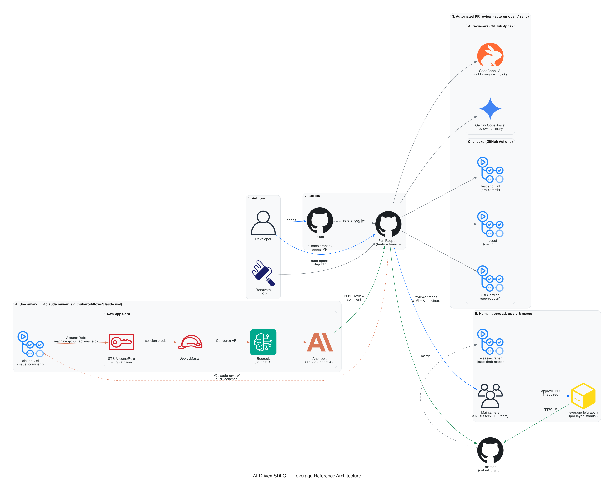
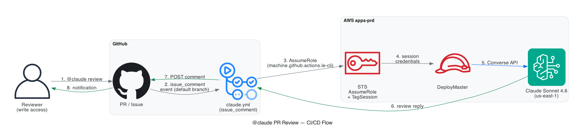

# AI-Driven SDLC — Leverage Reference Architecture

How a change reaches `master` in this repo: who reviews it, which AI/automation
runs at each step, and how the on-demand `@claude` assistant routes through
**AWS Bedrock** instead of the public Anthropic API.

> Source: [`doc/diagrams/ai-sdlc.py`](../diagrams/ai-sdlc.py) — re-render with
> `python3 doc/diagrams/ai-sdlc.py` (requires `pip install diagrams` and
> `brew install graphviz librsvg`).

---

## 1. Authors

| Actor | Trigger | Notes |
| --- | --- | --- |
| **Developer** | Opens issue or pushes a feature branch and opens a PR | CODEOWNERS team gates merges to `master`. |
| **Renovate** | Auto-opens dependency PRs | Configured in [`renovate.json`](../../renovate.json); 30-day minimum release age, grouped patch updates. |

## 2. GitHub entry points

Issues and PRs are the only entry points for change. The `master` branch
requires **at least one approving review** from the
`@binbashar/leverage-ref-architecture-aws-admin` /
`@binbashar/leverage-ref-architecture-aws-dev` teams ([`.github/CODEOWNERS`](../../.github/CODEOWNERS)).

## 3. Automated PR review  (auto on open / sync)

These run on every PR with no human action required.

### AI reviewers (installed as org-level GitHub Apps — no per-repo config file)

| Bot | What it posts | Where to look |
| --- | --- | --- |
| **CodeRabbit AI** (`coderabbitai[bot]`) | Walkthrough summary, actionable comments, nitpicks, duplicate-comment detection | Inline on the PR — top-level summary plus per-file comments. |
| **Gemini Code Assist** (`gemini-code-assist[bot]`) | Code-review summary with style / correctness observations | Inline on the PR as a top-level review. |

### CI checks (GitHub Actions workflows in this repo)

| Workflow | File | Purpose |
| --- | --- | --- |
| **Test and Lint** | [`.github/workflows/test-static-code-and-linting.yml`](../../.github/workflows/test-static-code-and-linting.yml) | Runs `make pre-commit` → `pre-commit run --all-files` (terraform_fmt, pretty-format-json, trailing-whitespace, private-key detection). |
| **Infracost** | [`.github/workflows/infracost.yml`](../../.github/workflows/infracost.yml) | Posts a monthly cost-diff comment per layer ([`infracost.yml`](../../infracost.yml)). |
| **GitGuardian** | GitHub App | Secret scanning across the diff. |

## 4. On-demand `@claude` review via AWS Bedrock

Triggered by anyone with write access mentioning `@claude` in a PR / issue /
review comment. Workflow: [`.github/workflows/claude.yml`](../../.github/workflows/claude.yml).

> Source: [`doc/diagrams/ci-claude-review.py`](../diagrams/ci-claude-review.py)
> — ported verbatim from `binbashar/bb-sales-tools` because the wiring is
> identical.

**End-to-end path**

1. Reviewer comments `@claude ...` on the PR.
2. The `issue_comment` event triggers `claude.yml` **from the default
   branch** (GitHub always runs `issue_comment` workflows from the default
   branch, so changes to `claude.yml` in a PR don't take effect until
   merged to `master`).
3. Workflow assumes
   `arn:aws:iam::<APPS_PRD_ACCOUNT>:role/machine.github.actions.le-cli`
   in **AWS apps-prd** via repo-level secrets
   (`AWS_ACCESS_KEY_ID`, `AWS_SECRET_ACCESS_KEY`,
   `AWS_ASSUME_ROLE_ARN_APPS_PRD_ACCOUNT`) with `sts:TagSession` and
   `sts:SetSourceIdentity` enabled.
4. Session credentials assume **DeployMaster** (cross-account convention).
5. `anthropics/claude-code-action@v1` with `use_bedrock: "true"` calls the
   Bedrock **Converse API**.
6. Bedrock invokes the configured Anthropic model (defaults to
   `us.anthropic.claude-sonnet-4-6`; override with the
   `BEDROCK_MODEL_ID` repo variable).
7. Reply is posted back as a PR comment.

**Configuration knobs** (repo settings → *Secrets and variables → Actions*)

| Kind | Name | Default / Notes |
| --- | --- | --- |
| Secret | `AWS_ACCESS_KEY_ID` | IAM user with permission to assume the role. |
| Secret | `AWS_SECRET_ACCESS_KEY` | — |
| Secret | `AWS_ASSUME_ROLE_ARN_APPS_PRD_ACCOUNT` | Account-suffixed so additional `AWS_ASSUME_ROLE_ARN_<OTHER>_ACCOUNT` secrets can be added later. |
| Variable | `BEDROCK_MODEL_ID` | Defaults to `us.anthropic.claude-sonnet-4-6`. |
| Variable | `AWS_REGION` | Defaults to `us-east-1`. |

**Permissions** — only users with write access can invoke `@claude`. On a
public repo, this gate is what protects the Bedrock budget from drive-by
comments.

**Troubleshooting** — if `@claude` never replies, open the **Actions** tab
and look for the most recent `Claude Code` workflow run. Because
`issue_comment` workflows always run from the default branch, edits to
`claude.yml` in an unmerged PR won't take effect.

## 5. Human approval, apply & merge

Maintainers read the AI + CI findings on the PR, then:

1. **Approve the PR** (1 approval required by branch protection).
2. **Plan & apply infrastructure changes — infra PRs only.** Run
   `leverage tofu plan` from the affected layer directory and share the output
   on the PR for reviewer visibility *before* approval, then run
   `leverage tofu apply` *after* approval. Atlantis is **deprecated** in this
   repo, so apply is a manual operation performed by the maintainer per layer
   (`{account}/{region}/{layer}/`). Docs-only PRs (like this one) have nothing
   to plan or apply — skip straight to merge.
3. **Merge to `master`**. Release notes are auto-drafted by
   [`release-drafter.yml`](../../.github/release-drafter.yml).

## Related references

- Project conventions and commands: [`CLAUDE.md`](../../CLAUDE.md)
- Workflows: [`.github/workflows/`](../../.github/workflows/)
- Diagram sources & rendered PNGs: [`doc/diagrams/`](../diagrams/)
- `@claude` action: [anthropics/claude-code-action](https://github.com/anthropics/claude-code-action)
- Leverage docs: <https://leverage.binbash.co>
