# AI-Powered Infrastructure Validation Setup Guide

This guide explains how to set up and configure the AI-powered infrastructure validation system for your Binbash Leverage Reference Architecture repository.

## 🎯 Overview

The AI validation system provides intelligent analysis of Terraform infrastructure changes using GitHub Models API, specialized AI personas, and the Leverage CLI. It automatically detects which layers are modified in pull requests and runs targeted validations with expert-level feedback.

**✅ Production Ready**: Fully functional with comprehensive error handling, persona-based analysis, and automated PR commenting.

**🎯 Current Scope**: Configured to validate `apps-devstg/us-east-1/secrets-manager/**` layers with plans to expand to all infrastructure layers.

## 📊 System Architecture


## 🔄 Workflow Process Flow


## 🤖 AI Persona Selection Logic

```mermaid
flowchart TD
    A[Layer Detected] --> B{Layer Type?}
    B -->|security-*,secrets-manager| C[Security Expert<br/>🔐]
    B -->|network-*,base-network| D[Network Specialist<br/>🌐]
    B -->|databases-*| E[Database Administrator<br/>🗄️]
    B -->|k8s-*,*-ecs| F[Container Expert<br/>🐳]
    B -->|tools-*| G[DevOps Specialist<br/>⚙️]
    B -->|*-s3,*-backup| H[Storage Expert<br/>💾]
    B -->|*-ec2,*-lambda| I[Compute Expert<br/>⚡]
    B -->|data-*,*-bedrock| J[Data Analytics Expert<br/>📊]
    B -->|Other| K[Infrastructure Generalist<br/>🏗️]
```



## ✅ Current Implementation Status

### 🚀 Production Features

The AI validation workflow is **fully operational** with the following working components:

#### Core Functionality ✅
- **Layer Detection**: Automatically detects modified Terraform layers from PR changes
- **Matrix Validation**: Parallel validation of multiple layers using Leverage CLI
- **AI Analysis**: Working integration with GitHub Models API using `actions/ai-inference@v1`
- **Persona Selection**: Dynamic selection of appropriate AI expert based on layer patterns
- **PR Comments**: Automated posting of AI analysis results to pull requests
- **AI Control**: PR label-based disable functionality to avoid API limits (`skip-ai-analysis`, `no-ai`)

#### Recent Fixes Applied ✅
- **Parameter Fix**: Corrected `user-prompt` → `prompt` for `actions/ai-inference@v1` compatibility
- **Command Fix**: Updated `leverage tf fmt` → `leverage tf format` for proper Leverage CLI usage
- **JavaScript Fix**: Implemented `toJSON()` encoding to prevent syntax errors in PR comments
- **Workflow Simplification**: Reduced from 5 jobs to 3 jobs (40% complexity reduction)
- **AI Control**: Added PR label-based disable to avoid GitHub Models API limits
- **Workflow Stalling Prevention**: Comprehensive fixes to prevent infinite hangs and improve reliability

#### Technical Specifications ✅
- **Architecture**: 5-job workflow (check-ai-control → detect-layers → validate-layer → ai-analysis-status → ai-analysis-and-comment)
- **Official Actions**: 100% GitHub official actions (`actions/ai-inference@v1`, `actions/github-script@v7`)
- **Personas**: 9 specialized AI experts with intelligent pattern matching
- **Error Handling**: Comprehensive fallbacks for backend initialization and validation failures
- **SSH Socket Fix**: Resolved Docker bind mount issues for container execution
- **API Limit Control**: PR label-based AI disable without affecting Terraform validation

#### 🔧 Workflow Stalling Prevention Fixes ✅
Recent comprehensive improvements to prevent workflow hangs and ensure reliable execution:

**Container Health & Binary Detection:**
- **Container Health Check**: Automatic testing of container startup before operations (60-second timeout)
- **Binary Detection**: Dynamic detection of available binaries (`tofu` vs `terraform`) with automatic fallback
- **Early Failure Detection**: Container issues caught immediately rather than causing hangs

**Timeout Optimization:**
- **Reduced Timeouts**: Faster failure detection with optimized timeout values:
  - Backend Init: 5min → 2min
  - Plan Operations: 10min → 5min
  - Apply/Destroy: 20min → 10min
- **Workflow Timeout**: 45-minute maximum runtime to prevent runaway processes
- **Operation Timeouts**: All operations have timeout protection to prevent infinite hangs

**State Lock Management:**
- **Automatic Lock Detection**: Proactive detection of stale DynamoDB state locks
- **Timeout-Protected Cleanup**: Force unlock operations with 30-second timeout limits
- **Lock Prevention**: Simplified logic to avoid edge cases that cause lock hangs

**Emergency Safeguards:**
- **Redundancy Removal**: Eliminated duplicate initialization steps that caused conflicts
- **Automatic Cleanup**: Emergency resource cleanup on workflow failure
- **Error Reporting**: Enhanced diagnostic information for troubleshooting
- **Graceful Degradation**: Workflows continue with warnings rather than hanging on non-critical errors

### 🎯 Validation Scope

**Currently Active**: `apps-devstg/us-east-1/secrets-manager/**`
- Testing with Security Expert persona for secrets management layer
- Comprehensive format, init, and validate checks
- Backend initialization with syntax-only fallback

**Ready for Expansion**: All layer patterns supported
- Patterns defined for security, network, database, container, storage, compute, data analytics
- Infrastructure generalist as fallback for unmatched layers

### 🎛️ AI Analysis Control

**Problem Solved**: Avoid hitting GitHub Models API limits during development and testing.

#### 🏷️ PR Label Control (Recommended)

**For Pull Requests**: Add labels to disable AI analysis while keeping Terraform validation:

| Label | Effect |
|-------|--------|
| `skip-ai-analysis` | Disables AI analysis for the PR |
| `no-ai` | Alternative label with same effect |

**Usage**:
1. Open your PR
2. Click "Labels" in the right sidebar
3. Add `skip-ai-analysis` or `no-ai` label
4. AI analysis will be skipped on subsequent commits

**What Still Runs**: All Terraform validation (format, init, validate) continues normally.

#### ⚙️ Manual Run Control

**For workflow_dispatch**: Control AI analysis in manual runs:

1. Go to Actions → AI-Powered Infrastructure Validation
2. Click "Run workflow"
3. Set "Enable AI analysis" to `false`
4. Click "Run workflow"

#### 📊 Behavior Summary

| Trigger Type | AI Control Method | Terraform Validation | AI Analysis |
|--------------|-------------------|---------------------|-------------|
| **PR with label** | `skip-ai-analysis` or `no-ai` | ✅ Runs | ❌ Skipped |
| **PR without label** | Default | ✅ Runs | ✅ Runs |
| **Manual (disabled)** | `enable_ai_analysis=false` | ✅ Runs | ❌ Skipped |
| **Manual (enabled)** | `enable_ai_analysis=true` | ✅ Runs | ✅ Runs |

## 🔄 Validation Pipeline Sequence


## 🤖 Interactive Bot State Machine


## 🌐 Cross-Layer Dependency Analysis


## ⚙️ Setup Instructions

### 1. Prerequisites

Before setting up the AI validation system, ensure you have:

- **GitHub Repository**: With Binbash Leverage Reference Architecture
- **GitHub Models API Access**: Free tier for OSS projects
- **AWS Account Access**: For infrastructure validation
- **Repository Permissions**: Admin access to configure secrets and workflows

### 2. Required GitHub Secrets

Add the following secrets to your repository (`Settings` > `Secrets and variables` > `Actions`):

| Secret Name | Description | Required |
|-------------|-------------|----------|
| `AWS_ACCESS_KEY_ID` | AWS Access Key for infrastructure validation | ✅ |
| `AWS_SECRET_ACCESS_KEY` | AWS Secret Key for infrastructure validation | ✅ |
| `AWS_DEVSTG_ACCOUNT_ID` | Account ID for apps-devstg layers | ✅ |
| `AWS_SHARED_ACCOUNT_ID` | Account ID for shared layers | ✅ |
| `AWS_SECURITY_ACCOUNT_ID` | Account ID for security layers | ✅ |
| `AWS_NETWORK_ACCOUNT_ID` | Account ID for network layers | ✅ |
| `AWS_PRD_ACCOUNT_ID` | Account ID for apps-prd layers | ✅ |
| `AWS_DATA_SCIENCE_ACCOUNT_ID` | Account ID for data-science layers | ✅ |
| `AWS_ROOT_ACCOUNT_ID` | Account ID for management layers | ✅ |
| `GITHUB_TOKEN` | Automatically provided by GitHub | ✅ |

### 3. Account-Specific Authentication

The workflow automatically selects the appropriate AWS account credentials based on the layer path:

| Layer Path Pattern | Uses Account | Example |
|-------------------|--------------|---------|
| `apps-devstg/**` | `AWS_DEVSTG_ACCOUNT_ID` | `apps-devstg/us-east-1/secrets-manager/` |
| `shared/**` | `AWS_SHARED_ACCOUNT_ID` | `shared/us-east-1/k8s-eks/` |
| `security/**` | `AWS_SECURITY_ACCOUNT_ID` | `security/us-east-1/security-hub/` |
| `network/**` | `AWS_NETWORK_ACCOUNT_ID` | `network/us-east-1/base-network/` |
| `apps-prd/**` | `AWS_PRD_ACCOUNT_ID` | `apps-prd/us-east-1/databases-aurora/` |
| `data-science/**` | `AWS_DATA_SCIENCE_ACCOUNT_ID` | `data-science/us-east-1/ml-bedrock/` |
| `management/**` | `AWS_ROOT_ACCOUNT_ID` | `management/global/base-identities/` |

### 4. AWS Credentials Setup

Configure AWS access credentials for infrastructure validation:

#### Security Considerations
- **Principle of Least Privilege**: Ensure AWS credentials have minimal required permissions
- **Credential Rotation**: Regularly rotate AWS access keys for security
- **Account Separation**: Each account ID maps to its respective AWS account for proper isolation
- **Audit Trail**: Monitor credential usage through AWS CloudTrail

#### Required AWS Permissions
The AWS credentials should have the following permissions in each respective account:
- **ReadOnlyAccess**: For reading infrastructure state and configuration
- **Terraform Backend Access**: Read/write access to S3 backend and DynamoDB lock table
- **Service-Specific Permissions**: Read access to validate specific AWS services being deployed

#### Example IAM Policy
```json
{
  "Version": "2012-10-17",
  "Statement": [
    {
      "Effect": "Allow",
      "Action": [
        "s3:GetObject",
        "s3:ListBucket",
        "dynamodb:GetItem",
        "dynamodb:PutItem",
        "dynamodb:DeleteItem"
      ],
      "Resource": [
        "arn:aws:s3:::terraform-backend-bucket/*",
        "arn:aws:dynamodb:*:*:table/terraform-state-lock"
      ]
    },
    {
      "Effect": "Allow",
      "Action": [
        "iam:Get*",
        "iam:List*",
        "ec2:Describe*",
        "s3:List*",
        "rds:Describe*"
      ],
      "Resource": "*"
    }
  ]
}
```

### 5. GitHub Models API Access

The system uses GitHub Models API (free for OSS projects):

1. **Repository Requirements**: Ensure your repository is public or part of GitHub's OSS program
2. **Authentication**: The `GITHUB_TOKEN` automatically provides access to GitHub Models API
3. **Permissions**: Workflow includes `models: read` permission for API access
4. **API Endpoint**: Uses `https://models.github.ai/inference/chat/completions`
5. **Model Format**: Uses `openai/gpt-4o` format for model specification
6. **Rate Limits**: 15-20 requests/minute depending on model tier
7. **No API Keys**: No additional setup or API keys required

**Note**: GitHub token permissions (`models: read`, `contents: read`, `pull-requests: write`, `issues: write`) should be verified by your GitHub administrator.

### 6. Step-by-Step Setup Guide

#### Step 1: Add GitHub Secrets
1. Navigate to your repository: `Settings` > `Secrets and variables` > `Actions`
2. Add each required secret from the table above:
   - Click `New repository secret`
   - Enter the secret name exactly as shown (case-sensitive)
   - Enter the corresponding value (AWS credentials and account IDs)
   - Click `Add secret`

#### Step 2: Verify Account Mapping
Ensure your layer directory structure matches the account mapping:
```
apps-devstg/us-east-1/secrets-manager/     → Uses AWS_DEVSTG_ACCOUNT_ID
shared/us-east-1/k8s-eks/                  → Uses AWS_SHARED_ACCOUNT_ID
security/us-east-1/security-hub/           → Uses AWS_SECURITY_ACCOUNT_ID
```

#### Step 3: Test Credentials
Before enabling the workflow, test your credentials:
```bash
# Set environment variables
export AWS_ACCESS_KEY_ID="your-access-key"
export AWS_SECRET_ACCESS_KEY="your-secret-key"

# Test connectivity
aws sts get-caller-identity
```

#### Step 4: Enable Workflow
1. Commit all configuration files to your repository
2. Create a test PR modifying a Terraform file in the test scope
3. Verify the workflow triggers and runs successfully
4. Check the workflow logs for any authentication issues

## 🎛️ Configuration Options

### Layer Detection Rules

The system automatically detects layers using the pattern `{account}/{region}/{layer}`:

**Current Testing Scope** (configured for initial testing):
- ✅ `apps-devstg/us-east-1/k8s-eks-demoapps/secrets` → Test layer (triggers workflow)
- ❌ Other layers → Not monitored during testing phase

**Full Implementation Example**:
- ✅ `apps-devstg/us-east-1/secrets-manager` → Valid layer
- ✅ `network/us-east-1/base-network` → Valid layer
- ❌ `README.md` → Not a layer
- ❌ `scripts/deploy.sh` → Not a layer

**Note**: The workflow is currently configured to trigger only on changes to `apps-devstg/us-east-1/k8s-eks-demoapps/secrets/**` for safe testing.

### Validation Commands per Layer Type

Each layer type has specific validation commands defined in `.github/validation-config.yml`:

| Layer Type | Commands | Timeout |
|------------|----------|---------|
| Security | `fmt`, `init`, `validate`, `security_scan`, `plan` | 5 min |
| Network | `fmt`, `init`, `validate`, `plan` | 5 min |
| Database | `fmt`, `init`, `validate`, `plan`, `backup_check` | 7 min |
| Container | `fmt`, `init`, `validate`, `plan` | 8 min |

### AI Persona Assignments

| Layer Pattern | AI Persona | Focus Areas |
|---------------|------------|-------------|
| `security-*`, `secrets-manager` | Security Expert 🔐 | IAM, KMS, compliance |
| `network-*`, `base-network` | Network Specialist 🌐 | VPC, routing, connectivity |
| `databases-*` | Database Administrator 🗄️ | RDS, backup, performance |
| `k8s-*`, `*-ecs` | Container Expert 🐳 | EKS, scaling, RBAC |

## 📱 Usage Guide

### Automatic Validation

The system automatically triggers on:

- **Pull Request Creation**: New PRs with infrastructure changes in test scope
- **Pull Request Updates**: New commits pushed to existing PRs
- **File Patterns**: Changes to `.tf`, `.tfvars`, or `.hcl` files in `apps-devstg/us-east-1/k8s-eks-demoapps/secrets/**`

**Testing Phase**: Currently limited to `apps-devstg/us-east-1/k8s-eks-demoapps/secrets/` directory for safe validation before full rollout.

### Interactive Commands

Use these commands in PR comments for additional analysis:

| Command | Description | Example |
|---------|-------------|---------|
| `@aibot explain security risks` | Deep security analysis | Detailed security vulnerability assessment |
| `@aibot blast radius` | Cross-layer dependency analysis | Impact prediction on other layers |
| `@aibot best practices` | AWS Well-Architected review | Compliance with AWS best practices |

### Example AI Response

```markdown
## ✅ AI-Powered Infrastructure Validation

> 🤖 **AI Analysis powered by GitHub Models API**
> **Overall Status:** `success`

🎯 **Executive Summary**
Changes to secrets-manager layer follow security best practices with proper KMS encryption and IAM controls.

🔍 **Key Findings**
- ✅ KMS encryption enabled for all secrets
- ✅ Proper IAM policy with specific principals
- ⚠️ Consider enabling automatic rotation

💡 **Recommendations**
1. Enable `rotation_lambda_arn` for automatic password rotation
2. Review DevOps role permissions scope
3. Add monitoring for secret access patterns

🌐 **Cross-Layer Impact Analysis**
Changes may affect: `databases-aurora`, `databases-pgsql` layers

📊 **Risk Assessment:** LOW
```

## 🔧 Troubleshooting

### Common Issues

#### 1. Workflow Not Triggering

**Symptoms**: No workflow runs appear for PRs with infrastructure changes

**Solutions**:
- Verify workflow file is in `.github/workflows/` directory
- Check file patterns in workflow trigger (must include `**/*.tf`)
- Ensure PR contains actual Terraform file changes
- Verify repository has Actions enabled in Settings

#### 1.1. Workflow Stalling or Hanging

**Symptoms**: Workflows start but never complete, appear to hang indefinitely

**Solutions (Recently Implemented)**:
- ✅ **Container Health Check**: Workflows now test container startup before operations
- ✅ **Automatic Binary Detection**: Dynamic detection of `tofu` vs `terraform` binaries
- ✅ **Timeout Protection**: All operations have timeout limits (2-10 minutes)
- ✅ **State Lock Cleanup**: Automatic detection and cleanup of stale locks
- ✅ **Emergency Cleanup**: Automatic resource cleanup on workflow failure
- ✅ **Workflow Timeout**: 45-minute maximum runtime prevents runaway processes

**Manual Checks**:
```bash
# Test container health manually
leverage tf shell -c "echo 'Container health check passed'"

# Check for stale state locks
leverage tf plan -lock-timeout=30s

# Force unlock if needed (use with caution)
echo "tofu force-unlock -force <LOCK_ID>" | leverage tf shell
```

#### 2. AWS Authentication Failures

**Symptoms**: `Error: could not retrieve credentials` or `Access Denied`

**Solutions**:
- Verify `AWS_ACCESS_KEY_ID` and `AWS_SECRET_ACCESS_KEY` secrets are correctly set
- Check that all required account ID secrets are configured (e.g., `AWS_DEVSTG_ACCOUNT_ID`)
- Ensure AWS credentials have required permissions in each account
- Verify credential mapping matches your layer directory structure
- Test credentials manually using AWS CLI: `aws sts get-caller-identity`
- Check for expired or rotated access keys
- Ensure credentials have access to Terraform backend (S3 + DynamoDB)

#### 3. Leverage CLI Installation Issues

**Symptoms**: `leverage: command not found` or installation timeouts

**Solutions**:
- Check Python installation step in workflow
- Verify pip cache is working correctly
- Try running workflow with different runner OS
- Check for conflicts with other Python dependencies

#### 3.1. Leverage CLI Testing Workflow Issues

**New Comprehensive Testing Workflow** (`leverage-cli-test.yml`):
The repository now includes a dedicated workflow for testing Leverage CLI functionality with enhanced reliability:

**Features**:
- **Parameterized Testing**: Test any layer with custom parameters
- **Container Health Checks**: Automatic binary detection and health validation
- **State Lock Management**: Automatic cleanup of stale locks
- **Emergency Cleanup**: Resource cleanup on failure
- **Timeout Protection**: Prevents infinite hangs

**Manual Workflow Trigger**:
```bash
# Test specific layer with parameters
gh workflow run leverage-cli-test.yml \
  -f target_layer="apps-devstg/us-east-1/secrets-manager" \
  -f test_mode="plan-only" \
  -f leverage_version="latest"
```

**Workflow Parameters**:
- `target_layer`: Layer to test (default: apps-devstg/global/cli-test-layer)
- `test_mode`: "full" (apply+destroy) or "plan-only" (default: full)
- `leverage_version`: CLI version (default: latest)
- `leverage_toolbox_version`: Container version (default: 1.9.1-tofu-0.3.0)

#### 4. Layer Detection Not Working

**Symptoms**: "No valid infrastructure layers detected" message

**Solutions**:
- Verify directory structure follows `{account}/{region}/{layer}` pattern
- Check that directories actually exist in repository
- Ensure files match pattern: `.tf`, `.tfvars`, `.hcl`
- Test layer detection logic locally

#### 5. AI Analysis Failures

**Symptoms**: "AI analysis unavailable" or API timeout errors

**Solutions**:
- Verify repository has `models: read` permission in workflow
- Ensure repository is public or has GitHub Models access
- Check `GITHUB_TOKEN` permissions include models scope
- Verify correct API endpoint: `https://models.github.ai/inference/chat/completions`
- Confirm model name format: `openai/gpt-4o` (not just `gpt-4o`)
- Reduce prompt size if hitting token limits
- Check rate limits (15-20 requests/minute)

#### 6. GitHub Models API Rate Limits

**Symptoms**: HTTP 429 errors or quota exceeded messages

**Solutions**:
- Implement exponential backoff in workflow
- Reduce frequency of AI analysis calls
- Use smaller prompts and responses
- Consider upgrading to paid tier if needed

### Debug Mode

Enable debug logging by adding this to your workflow file:

```yaml
env:
  ACTIONS_RUNNER_DEBUG: true
  ACTIONS_STEP_DEBUG: true
```

### Manual Testing

Test individual components manually:

```bash
# Test layer detection
gh api repos/YOUR-ORG/le-tf-infra-aws/pulls/123/files --jq '.[] | .filename'

# Test Leverage CLI
cd apps-devstg/us-east-1/secrets-manager
leverage tf validate

# Test AWS credentials
aws sts get-caller-identity

# Test AI API call
curl -X POST -H "Authorization: Bearer $GITHUB_TOKEN" \
  "https://models.github.ai/inference/chat/completions" \
  -d '{"model":"openai/gpt-4o","messages":[{"role":"user","content":"Test"}]}'
```

### 🛡️ Workflow Safeguards and Emergency Procedures

**Automatic Safeguards** (Implemented in leverage-cli-test.yml):

1. **Container Health Check**:
   - Tests container startup before any operations
   - Detects available binaries (`tofu` vs `terraform`)
   - 60-second timeout prevents indefinite hangs

2. **State Lock Protection**:
   - Automatic detection of stale DynamoDB locks
   - Timeout-protected force unlock operations
   - Prevents lock-related workflow hangs

3. **Emergency Cleanup on Failure**:
   ```yaml
   - name: Cleanup on Failure
     if: failure()
     run: |
       # Automatic state lock cleanup
       # Emergency resource destruction
       # Timeout-protected operations
   ```

4. **Timeout Hierarchy**:
   - **Workflow Level**: 45-minute maximum runtime
   - **Operation Level**: 2-10 minute timeouts per operation
   - **API Level**: 30-second timeouts for lock detection

**Manual Emergency Procedures**:
```bash
# Emergency state unlock (use with extreme caution)
cd target-layer-directory
LOCK_OUTPUT=$(leverage tf plan 2>&1 || true)
LOCK_ID=$(echo "$LOCK_OUTPUT" | grep -o 'ID:[[:space:]]*[a-f0-9-]*' | cut -d':' -f2 | tr -d ' ')
if [[ -n "$LOCK_ID" ]]; then
  echo "tofu force-unlock -force $LOCK_ID" | leverage tf shell
fi

# Emergency resource cleanup
timeout 300 leverage tf destroy -auto-approve -lock-timeout=2m
```

**Best Practices for Workflow Safety**:
1. Always use `plan-only` mode for production-like layers
2. Monitor workflow logs for container health check results
3. Review emergency cleanup logs after failures
4. Check for remaining resources after destroy operations
5. Use manual workflow triggers with appropriate parameters

## 🎨 Customization

### Adding New Layer Types

1. **Update Validation Config** (`.github/validation-config.yml`):

```yaml
validation:
  layer_types:
    my-custom-layer:
      description: "Custom infrastructure layer"
      patterns:
        - "custom-*"
      commands:
        - name: "format_check"
          command: "leverage tf fmt -check"
          required: true
```

2. **Create AI Persona** (`.github/ai-personas.yml`):

```yaml
personas:
  custom-expert:
    name: "Custom Expert"
    description: "Expert in custom infrastructure"
    layer_patterns:
      - "custom-*"
    system_prompt: |
      You are an expert in custom infrastructure...
```

3. **Update Workflow Layer Detection**:

Add pattern matching logic in the workflow file's layer detection step.

### Custom AI Prompts

Modify AI personas in `.github/ai-personas.yml`:

- **System Prompt**: Define the AI's role and expertise
- **Focus Areas**: Specify what to analyze
- **Risk Escalation**: Define risk levels and triggers

### Environment-Specific Settings

Override settings per environment in `.github/validation-config.yml`:

```yaml
environments:
  production:
    validation:
      timeout_seconds: 600
    notifications:
      status_checks:
        enable_required_check: true
```

### Integration with Existing Tools

The system integrates with:

- **Atlantis**: Workflow respects existing Atlantis configurations
- **Pre-commit hooks**: Runs alongside existing validation
- **Infracost**: Automatic cost analysis integration
- **Checkov**: Security scanning integration

## 🚀 Advanced Features

### Blast Radius Analysis

The AI automatically analyzes cross-layer dependencies:

```yaml
layer_dependencies:
  base-network:
    affects: ["k8s-*", "databases-*", "tools-*"]
    critical: true
```

### Security Pattern Detection

Automatic detection of security issues:

```yaml
security:
  critical_patterns:
    - pattern: '0\.0\.0\.0/0'
      message: "Overly permissive CIDR block detected"
      severity: "high"
```

### Cost Analysis Integration

Automatic cost impact analysis using Infracost:

```yaml
integrations:
  infracost:
    enabled: true
    api_key_secret: "INFRACOST_API_KEY"
    currency: "USD"
```

## 📞 Support

For issues and questions:

1. **Check Troubleshooting Section**: Common issues and solutions above
2. **GitHub Issues**: Create issues in the repository for bugs
3. **GitHub Discussions**: Ask questions and share feedback
4. **Documentation**: Refer to Binbash Leverage documentation

## 🧪 Testing Phase Configuration

**Current Status**: The workflow is configured for safe testing with limited scope.

### Testing Configuration
- **Scope**: Only `apps-devstg/us-east-1/k8s-eks-demoapps/secrets/**` directory
- **Python Version**: 3.13 (latest)
- **Leverage CLI**: Latest version with `--upgrade` flag
- **Purpose**: Validate functionality before full rollout

### Expanding After Testing
1. **Verify workflow operation** in test scope
2. **Confirm GitHub token permissions** with administrator
3. **Update trigger paths** to include additional layers
4. **Monitor performance** and adjust configuration as needed

## 🔄 Updates and Maintenance

### Keeping the System Updated

1. **Monitor GitHub Models API**: Stay updated on API changes
2. **Update AI Personas**: Regularly review and improve prompts
3. **Validate Dependencies**: Leverage CLI auto-updates to latest version
4. **Review Security**: Regularly audit permissions and access

### Version Tracking

Track system versions in your repository:

```yaml
# .github/ai-validation-version.yml
version: "1.0.0"
last_updated: "2024-01-15"
features:
  - "Layer-based validation"
  - "AI-powered analysis"
  - "Interactive bot commands"
```

---

**🎉 Congratulations!** Your AI-powered infrastructure validation system is now ready to provide intelligent analysis of your Terraform changes.