# AI-Powered Infrastructure Validation Setup Guide

This guide explains how to set up and configure the AI-powered infrastructure validation system for your Binbash Leverage Reference Architecture repository.

## 🎯 Overview

The AI validation system provides intelligent analysis of Terraform infrastructure changes using GitHub Models API, specialized AI personas, and the Leverage CLI. It automatically detects which layers are modified in pull requests and runs targeted validations with expert-level feedback.

**🧪 Testing Phase**: Currently configured to trigger only on `apps-devstg/us-east-1/k8s-eks-demoapps/secrets/**` for safe validation before full deployment.

## 📊 System Architecture


## 🔄 Workflow Process Flow


## 🤖 AI Persona Selection Logic

```mermaid
flowchart TD
    A[Layer Detected] --> B{Layer Type?}
    B -->|security-*,secrets-manager| C[Security Expert<br/>🔐]
    B -->|network-*,base-network| D[Network Specialist<br/>🌐]
    B -->|databases-*| E[Database Administrator<br/>🗄️]
    B -->|k8s-*,*-ecs| F[Container Expert<br/>🐳]
    B -->|tools-*| G[DevOps Specialist<br/>⚙️]
    B -->|*-s3,*-backup| H[Storage Expert<br/>💾]
    B -->|*-ec2,*-lambda| I[Compute Expert<br/>⚡]
    B -->|data-*,*-bedrock| J[Data Analytics Expert<br/>📊]
    B -->|Other| K[Infrastructure Generalist<br/>🏗️]
```



## 🔄 Validation Pipeline Sequence


## 🤖 Interactive Bot State Machine


## 🌐 Cross-Layer Dependency Analysis


## ⚙️ Setup Instructions

### 1. Prerequisites

Before setting up the AI validation system, ensure you have:

- **GitHub Repository**: With Binbash Leverage Reference Architecture
- **GitHub Models API Access**: Free tier for OSS projects
- **AWS Account Access**: For infrastructure validation
- **Repository Permissions**: Admin access to configure secrets and workflows

### 2. Required GitHub Secrets

Add the following secrets to your repository (`Settings` > `Secrets and variables` > `Actions`):

| Secret Name | Description | Required |
|-------------|-------------|----------|
| `AWS_VALIDATION_ROLE_ARN` | IAM role ARN for AWS validation access | ✅ |
| `GITHUB_TOKEN` | Automatically provided by GitHub | ✅ |

### 3. Repository Variables

Configure the following repository variables (`Settings` > `Secrets and variables` > `Actions` > `Variables`):

| Variable Name | Description | Example |
|---------------|-------------|---------|
| `AWS_VALIDATION_ROLE_ARN` | IAM role for validation operations | `arn:aws:iam::123456789012:role/GitHubActionsValidation` |

### 4. AWS IAM Role Setup

Create an IAM role for GitHub Actions with the following trust policy:

```json
{
  "Version": "2012-10-17",
  "Statement": [
    {
      "Effect": "Allow",
      "Principal": {
        "Federated": "arn:aws:iam::ACCOUNT-ID:oidc-provider/token.actions.githubusercontent.com"
      },
      "Action": "sts:AssumeRole",
      "Condition": {
        "StringEquals": {
          "token.actions.githubusercontent.com:aud": "sts.amazonaws.com",
          "token.actions.githubusercontent.com:sub": "repo:YOUR-ORG/le-tf-infra-aws:ref:refs/heads/master"
        }
      }
    }
  ]
}
```

Attach the following managed policies:
- `ReadOnlyAccess` (for validation operations)
- `AWSCloudFormationReadOnlyAccess` (for stack validation)

### 5. GitHub Models API Access

The system uses GitHub Models API (free for OSS projects):

1. **Repository Requirements**: Ensure your repository is public or part of GitHub's OSS program
2. **Authentication**: The `GITHUB_TOKEN` automatically provides access to GitHub Models API
3. **Permissions**: Workflow includes `models: read` permission for API access
4. **API Endpoint**: Uses `https://models.github.ai/inference/chat/completions`
5. **Model Format**: Uses `openai/gpt-4o` format for model specification
6. **Rate Limits**: 15-20 requests/minute depending on model tier
7. **No API Keys**: No additional setup or API keys required

**Note**: GitHub token permissions (`models: read`, `contents: read`, `pull-requests: write`, `issues: write`) should be verified by your GitHub administrator.

### 6. Enable Workflow

The workflow files should be automatically detected once merged to your main branch. To enable:

1. Commit all configuration files to your repository
2. Create a test PR modifying a Terraform file
3. Verify the workflow triggers and runs successfully

## 🎛️ Configuration Options

### Layer Detection Rules

The system automatically detects layers using the pattern `{account}/{region}/{layer}`:

**Current Testing Scope** (configured for initial testing):
- ✅ `apps-devstg/us-east-1/k8s-eks-demoapps/secrets` → Test layer (triggers workflow)
- ❌ Other layers → Not monitored during testing phase

**Full Implementation Example**:
- ✅ `apps-devstg/us-east-1/secrets-manager` → Valid layer
- ✅ `network/us-east-1/base-network` → Valid layer
- ❌ `README.md` → Not a layer
- ❌ `scripts/deploy.sh` → Not a layer

**Note**: The workflow is currently configured to trigger only on changes to `apps-devstg/us-east-1/k8s-eks-demoapps/secrets/**` for safe testing.

### Validation Commands per Layer Type

Each layer type has specific validation commands defined in `.github/validation-config.yml`:

| Layer Type | Commands | Timeout |
|------------|----------|---------|
| Security | `fmt`, `init`, `validate`, `security_scan`, `plan` | 5 min |
| Network | `fmt`, `init`, `validate`, `plan` | 5 min |
| Database | `fmt`, `init`, `validate`, `plan`, `backup_check` | 7 min |
| Container | `fmt`, `init`, `validate`, `plan` | 8 min |

### AI Persona Assignments

| Layer Pattern | AI Persona | Focus Areas |
|---------------|------------|-------------|
| `security-*`, `secrets-manager` | Security Expert 🔐 | IAM, KMS, compliance |
| `network-*`, `base-network` | Network Specialist 🌐 | VPC, routing, connectivity |
| `databases-*` | Database Administrator 🗄️ | RDS, backup, performance |
| `k8s-*`, `*-ecs` | Container Expert 🐳 | EKS, scaling, RBAC |

## 📱 Usage Guide

### Automatic Validation

The system automatically triggers on:

- **Pull Request Creation**: New PRs with infrastructure changes in test scope
- **Pull Request Updates**: New commits pushed to existing PRs
- **File Patterns**: Changes to `.tf`, `.tfvars`, or `.hcl` files in `apps-devstg/us-east-1/k8s-eks-demoapps/secrets/**`

**Testing Phase**: Currently limited to `apps-devstg/us-east-1/k8s-eks-demoapps/secrets/` directory for safe validation before full rollout.

### Interactive Commands

Use these commands in PR comments for additional analysis:

| Command | Description | Example |
|---------|-------------|---------|
| `@aibot explain security risks` | Deep security analysis | Detailed security vulnerability assessment |
| `@aibot blast radius` | Cross-layer dependency analysis | Impact prediction on other layers |
| `@aibot best practices` | AWS Well-Architected review | Compliance with AWS best practices |

### Example AI Response

```markdown
## ✅ AI-Powered Infrastructure Validation

> 🤖 **AI Analysis powered by GitHub Models API**
> **Overall Status:** `success`

🎯 **Executive Summary**
Changes to secrets-manager layer follow security best practices with proper KMS encryption and IAM controls.

🔍 **Key Findings**
- ✅ KMS encryption enabled for all secrets
- ✅ Proper IAM policy with specific principals
- ⚠️ Consider enabling automatic rotation

💡 **Recommendations**
1. Enable `rotation_lambda_arn` for automatic password rotation
2. Review DevOps role permissions scope
3. Add monitoring for secret access patterns

🌐 **Cross-Layer Impact Analysis**
Changes may affect: `databases-aurora`, `databases-pgsql` layers

📊 **Risk Assessment:** LOW
```

## 🔧 Troubleshooting

### Common Issues

#### 1. Workflow Not Triggering

**Symptoms**: No workflow runs appear for PRs with infrastructure changes

**Solutions**:
- Verify workflow file is in `.github/workflows/` directory
- Check file patterns in workflow trigger (must include `**/*.tf`)
- Ensure PR contains actual Terraform file changes
- Verify repository has Actions enabled in Settings

#### 2. AWS Authentication Failures

**Symptoms**: `Error: could not retrieve credentials` or `Access Denied`

**Solutions**:
- Verify `AWS_VALIDATION_ROLE_ARN` secret is correctly set
- Check IAM role trust policy includes correct repository path
- Ensure role has required permissions (`ReadOnlyAccess`)
- Verify OIDC provider is configured in AWS account

#### 3. Leverage CLI Installation Issues

**Symptoms**: `leverage: command not found` or installation timeouts

**Solutions**:
- Check Python installation step in workflow
- Verify pip cache is working correctly
- Try running workflow with different runner OS
- Check for conflicts with other Python dependencies

#### 4. Layer Detection Not Working

**Symptoms**: "No valid infrastructure layers detected" message

**Solutions**:
- Verify directory structure follows `{account}/{region}/{layer}` pattern
- Check that directories actually exist in repository
- Ensure files match pattern: `.tf`, `.tfvars`, `.hcl`
- Test layer detection logic locally

#### 5. AI Analysis Failures

**Symptoms**: "AI analysis unavailable" or API timeout errors

**Solutions**:
- Verify repository has `models: read` permission in workflow
- Ensure repository is public or has GitHub Models access
- Check `GITHUB_TOKEN` permissions include models scope
- Verify correct API endpoint: `https://models.github.ai/inference/chat/completions`
- Confirm model name format: `openai/gpt-4o` (not just `gpt-4o`)
- Reduce prompt size if hitting token limits
- Check rate limits (15-20 requests/minute)

#### 6. GitHub Models API Rate Limits

**Symptoms**: HTTP 429 errors or quota exceeded messages

**Solutions**:
- Implement exponential backoff in workflow
- Reduce frequency of AI analysis calls
- Use smaller prompts and responses
- Consider upgrading to paid tier if needed

### Debug Mode

Enable debug logging by adding this to your workflow file:

```yaml
env:
  ACTIONS_RUNNER_DEBUG: true
  ACTIONS_STEP_DEBUG: true
```

### Manual Testing

Test individual components manually:

```bash
# Test layer detection
gh api repos/YOUR-ORG/le-tf-infra-aws/pulls/123/files --jq '.[] | .filename'

# Test Leverage CLI
cd apps-devstg/us-east-1/secrets-manager
leverage tf validate

# Test AI API call
curl -X POST -H "Authorization: Bearer $GITHUB_TOKEN" \
  "https://models.inference.ai.azure.com/chat/completions" \
  -d '{"model":"gpt-4o","messages":[{"role":"user","content":"Test"}]}'
```

## 🎨 Customization

### Adding New Layer Types

1. **Update Validation Config** (`.github/validation-config.yml`):

```yaml
validation:
  layer_types:
    my-custom-layer:
      description: "Custom infrastructure layer"
      patterns:
        - "custom-*"
      commands:
        - name: "format_check"
          command: "leverage tf fmt -check"
          required: true
```

2. **Create AI Persona** (`.github/ai-personas.yml`):

```yaml
personas:
  custom-expert:
    name: "Custom Expert"
    description: "Expert in custom infrastructure"
    layer_patterns:
      - "custom-*"
    system_prompt: |
      You are an expert in custom infrastructure...
```

3. **Update Workflow Layer Detection**:

Add pattern matching logic in the workflow file's layer detection step.

### Custom AI Prompts

Modify AI personas in `.github/ai-personas.yml`:

- **System Prompt**: Define the AI's role and expertise
- **Focus Areas**: Specify what to analyze
- **Risk Escalation**: Define risk levels and triggers

### Environment-Specific Settings

Override settings per environment in `.github/validation-config.yml`:

```yaml
environments:
  production:
    validation:
      timeout_seconds: 600
    notifications:
      status_checks:
        enable_required_check: true
```

### Integration with Existing Tools

The system integrates with:

- **Atlantis**: Workflow respects existing Atlantis configurations
- **Pre-commit hooks**: Runs alongside existing validation
- **Infracost**: Automatic cost analysis integration
- **Checkov**: Security scanning integration

## 🚀 Advanced Features

### Blast Radius Analysis

The AI automatically analyzes cross-layer dependencies:

```yaml
layer_dependencies:
  base-network:
    affects: ["k8s-*", "databases-*", "tools-*"]
    critical: true
```

### Security Pattern Detection

Automatic detection of security issues:

```yaml
security:
  critical_patterns:
    - pattern: '0\.0\.0\.0/0'
      message: "Overly permissive CIDR block detected"
      severity: "high"
```

### Cost Analysis Integration

Automatic cost impact analysis using Infracost:

```yaml
integrations:
  infracost:
    enabled: true
    api_key_secret: "INFRACOST_API_KEY"
    currency: "USD"
```

## 📞 Support

For issues and questions:

1. **Check Troubleshooting Section**: Common issues and solutions above
2. **GitHub Issues**: Create issues in the repository for bugs
3. **GitHub Discussions**: Ask questions and share feedback
4. **Documentation**: Refer to Binbash Leverage documentation

## 🧪 Testing Phase Configuration

**Current Status**: The workflow is configured for safe testing with limited scope.

### Testing Configuration
- **Scope**: Only `apps-devstg/us-east-1/k8s-eks-demoapps/secrets/**` directory
- **Python Version**: 3.13 (latest)
- **Leverage CLI**: Latest version with `--upgrade` flag
- **Purpose**: Validate functionality before full rollout

### Expanding After Testing
1. **Verify workflow operation** in test scope
2. **Confirm GitHub token permissions** with administrator
3. **Update trigger paths** to include additional layers
4. **Monitor performance** and adjust configuration as needed

## 🔄 Updates and Maintenance

### Keeping the System Updated

1. **Monitor GitHub Models API**: Stay updated on API changes
2. **Update AI Personas**: Regularly review and improve prompts
3. **Validate Dependencies**: Leverage CLI auto-updates to latest version
4. **Review Security**: Regularly audit permissions and access

### Version Tracking

Track system versions in your repository:

```yaml
# .github/ai-validation-version.yml
version: "1.0.0"
last_updated: "2024-01-15"
features:
  - "Layer-based validation"
  - "AI-powered analysis"
  - "Interactive bot commands"
```

---

**🎉 Congratulations!** Your AI-powered infrastructure validation system is now ready to provide intelligent analysis of your Terraform changes.