# VPC Configuration Module

This module provides a simplified abstraction layer for configuring AWS VPCs using the `terraform-aws-modules/vpc/aws` module. The configuration uses a single, comprehensive `vpc_config` object that groups all VPC settings logically.

## Overview

The VPC configuration is organized into a single `vpc_config` object with the following structure:

- **version** - Configuration version
- **region** - AWS region
- **vpc** - VPC configuration object containing:
  - **metadata** - VPC metadata (name, environment, tags)
  - **networking** - Network configuration (CIDR, subnets, gateways, DNS)
  - **monitoring** - Monitoring configuration (Flow Logs)
  - **defaultResources** - Default VPC resource management (optional)
  - **availability** - Availability configuration (multi-AZ)

## Architecture Diagrams

### Basic VPC (DevStg) - Single NAT Gateway

```mermaid
graph TB
    subgraph Internet["🌐 Internet"]
        IGW["Internet Gateway<br/>bb-apps-devstg-vpc"]
    end
    
    subgraph VPC["🏢 VPC devstg<br/>172.18.32.0/20"]
        subgraph AZ-a["📍 Availability Zone A<br/>us-east-1a"]
            PubA["Public Subnet<br/>public-1a<br/>172.18.40.0/23"]
            NAT["NAT Gateway<br/>nat-1a"]
            PrivA["Private Subnet<br/>private-1a<br/>172.18.32.0/23"]
            PubA --> NAT
            NAT --> PrivA
        end
        
        subgraph AZ-b["📍 Availability Zone B<br/>us-east-1b"]
            PubB["Public Subnet<br/>public-1b<br/>172.18.42.0/23"]
            PrivB["Private Subnet<br/>private-1b<br/>172.18.34.0/23"]
        end
        
        subgraph AZ-c["📍 Availability Zone C<br/>us-east-1c"]
            PubC["Public Subnet<br/>public-1c<br/>172.18.44.0/23"]
            PrivC["Private Subnet<br/>private-1c<br/>172.18.36.0/23"]
        end
        
        PrivB -.-> NAT
        PrivC -.-> NAT
    end
    
    IGW <--> PubA
    IGW <--> PubB
    IGW <--> PubC
    
    classDef internet fill:#e3f2fd,stroke:#1976d2,stroke-width:2px,color:#000
    classDef vpc fill:#f3e5f5,stroke:#7b1fa2,stroke-width:2px,color:#000
    classDef az fill:#fff3e0,stroke:#f57c00,stroke-width:2px,color:#000
    classDef public fill:#e8f5e8,stroke:#388e3c,stroke-width:2px,color:#000
    classDef private fill:#fff8e1,stroke:#f9a825,stroke-width:2px,color:#000
    classDef nat fill:#ffebee,stroke:#d32f2f,stroke-width:2px,color:#000
    
    class Internet internet
    class VPC vpc
    class AZ-a,AZ-b,AZ-c az
    class PubA,PubB,PubC public
    class PrivA,PrivB,PrivC private
    class NAT nat
```



### Production VPC - High Availability NAT

```mermaid
graph TB
    subgraph Internet["🌐 Internet"]
        IGW["Internet Gateway<br/>prd-igw"]
    end
    
    subgraph VPC["🏢 VPC prd<br/>172.18.0.0/20"]
        subgraph AZ-a["📍 Availability Zone A<br/>us-east-1a"]
            PubA["Public Subnet<br/>public-1a<br/>172.18.8.0/24"]
            NATA["NAT Gateway A<br/>prd-nat-1a"]
            PrivA["Private Subnet<br/>private-1a<br/>172.18.0.0/24"]
            DBA["Database Subnet<br/>database-1a<br/>172.18.3.0/24<br/>RDS/Aurora"]
            
            PubA --> NATA
            NATA --> PrivA
            PrivA --> DBA
        end
        
        subgraph AZ-b["📍 Availability Zone B<br/>us-east-1b"]
            PubB["Public Subnet<br/>public-1b<br/>172.18.9.0/24"]
            NATB["NAT Gateway B<br/>prd-nat-1b"]
            PrivB["Private Subnet<br/>private-1b<br/>172.18.1.0/24"]
            DBB["Database Subnet<br/>database-1b<br/>172.18.4.0/24<br/>RDS/Aurora"]
            
            PubB --> NATB
            NATB --> PrivB
            PrivB --> DBB
        end
        
        subgraph AZ-c["📍 Availability Zone C<br/>us-east-1c"]
            PubC["Public Subnet<br/>public-1c<br/>172.18.10.0/24"]
            NATC["NAT Gateway C<br/>prd-nat-1c"]
            PrivC["Private Subnet<br/>private-1c<br/>172.18.2.0/24"]
            DBC["Database Subnet<br/>database-1c<br/>172.18.5.0/24<br/>RDS/Aurora"]
            
            PubC --> NATC
            NATC --> PrivC
            PrivC --> DBC
        end
    end
    
    IGW <--> PubA
    IGW <--> PubB
    IGW <--> PubC
    
    DBA -.-> DBB
    DBB -.-> DBC
    
    classDef internet fill:#e3f2fd,stroke:#1976d2,stroke-width:2px,color:#000
    classDef vpc fill:#f3e5f5,stroke:#7b1fa2,stroke-width:2px,color:#000
    classDef az fill:#fff3e0,stroke:#f57c00,stroke-width:2px,color:#000
    classDef public fill:#e8f5e8,stroke:#388e3c,stroke-width:2px,color:#000
    classDef private fill:#fff8e1,stroke:#f9a825,stroke-width:2px,color:#000
    classDef nat fill:#ffebee,stroke:#d32f2f,stroke-width:2px,color:#000
    classDef database fill:#e1f5fe,stroke:#0277bd,stroke-width:2px,color:#000
    
    class Internet internet
    class VPC vpc
    class AZ-a,AZ-b,AZ-c az
    class PubA,PubB,PubC public
    class PrivA,PrivB,PrivC private
    class NATA,NATB,NATC nat
    class DBA,DBB,DBC database
```



### Multi-Account with Transit Gateway

```mermaid
graph TB
    subgraph Network["🏢 Network Account"]
        TGW["Transit Gateway"]
    end
    
    subgraph DevStg["🛠️ DevStg Account"]
        VPC1["VPC devstg<br/>bb-apps-devstg-vpc<br/>172.18.32.0/20"]
        VPC1 <--> TGW
    end
    
    subgraph Prd["🚀 Production Account"]
        VPC2["VPC prd<br/>prd-vpc<br/>172.18.0.0/20"]
        VPC2 <--> TGW
    end
    
    subgraph Shared["🤝 Shared Account"]
        VPC3["VPC shared<br/>shared-vpc<br/>172.19.0.0/20"]
        VPC3 <--> TGW
    end
    
    classDef network fill:#e3f2fd,stroke:#1976d2,stroke-width:3px,color:#000
    classDef devstg fill:#e8f5e8,stroke:#388e3c,stroke-width:2px,color:#000
    classDef prd fill:#ffebee,stroke:#d32f2f,stroke-width:2px,color:#000
    classDef shared fill:#fff8e1,stroke:#f9a825,stroke-width:2px,color:#000
    classDef tgw fill:#f3e5f5,stroke:#7b1fa2,stroke-width:3px,color:#000
    classDef vpc fill:#f5f5f5,stroke:#616161,stroke-width:2px,color:#000
    
    class Network network
    class DevStg devstg
    class Prd prd
    class Shared shared
    class TGW tgw
    class VPC1,VPC2,VPC3 vpc
```



### VPC Configuration Structure

```mermaid
graph TB
    subgraph Config["📋 vpc_config Object"]
        V["vpc_config"]
        
        subgraph VPC["vpc Object"]
            META["metadata<br/>name, environment, tags"]
            NET["networking<br/>CIDR, subnets, gateways, DNS"]
            MON["monitoring<br/>Flow Logs"]
            DEF["defaultResources<br/>Default VPC resources<br/>(optional)"]
            AVAIL["availability<br/>multiAz"]
        end
        
        V --> VPC
        VPC --> META
        VPC --> NET
        VPC --> MON
        VPC --> DEF
        VPC --> AVAIL
        
        subgraph Subnets["Subnets Object"]
            PUB["public"]
            PRIV["private"]
            DB["database"]
            RS["redshift"]
            EC["elasticache"]
            INTRA["intra"]
            OUT["outpost"]
        end
        
        NET --> Subnets
        Subnets --> PUB
        Subnets --> PRIV
        Subnets --> DB
        Subnets --> RS
        Subnets --> EC
        Subnets --> INTRA
        Subnets --> OUT
    end
    
    subgraph Module["🔧 VPC Module"]
        M["terraform-aws-modules/vpc/aws<br/>v6.5.0"]
    end
    
    Config --> Module
    
    classDef config fill:#e3f2fd,stroke:#1976d2,stroke-width:2px,color:#000
    classDef vpc fill:#f3e5f5,stroke:#7b1fa2,stroke-width:2px,color:#000
    classDef metadata fill:#e8f5e8,stroke:#388e3c,stroke-width:2px,color:#000
    classDef networking fill:#fff3e0,stroke:#f57c00,stroke-width:2px,color:#000
    classDef monitoring fill:#e0f2f1,stroke:#00695c,stroke-width:2px,color:#000
    classDef default fill:#fce4ec,stroke:#c2185b,stroke-width:2px,color:#000
    classDef availability fill:#f1f8e9,stroke:#558b2f,stroke-width:2px,color:#000
    classDef subnets fill:#fff8e1,stroke:#f9a825,stroke-width:2px,color:#000
    classDef module fill:#ffebee,stroke:#d32f2f,stroke-width:3px,color:#000
    
    class Config config
    class VPC vpc
    class META metadata
    class NET networking
    class MON monitoring
    class DEF default
    class AVAIL availability
    class Subnets subnets
    class Module module
```



## Configuration Structure

### vpc_config Object

The main configuration object that contains all VPC settings:

```hcl
vpc_config = {
  version = "6.5.0"  # Configuration version
  region  = "us-east-1"  # AWS region
  
  vpc = {
    # VPC metadata
    metadata = {
      name        = "bb-apps-devstg-vpc"
      environment = "devstg"
      tags        = {
        Environment = "devstg"
        Layer       = "base-network"
      }
    }
    
    # Network configuration
    networking = {
      cidrBlock = "172.18.32.0/20"
      
      subnets = {
        public = [
          {
            name             = "public-1a"
            cidr             = "172.18.40.0/23"
            availabilityZone = "us-east-1a"
            tags             = {  # Optional: Subnet-specific tags
              "kubernetes.io/cluster/my-cluster" = "shared"
              "kubernetes.io/role/elb"            = "1"
            }
          }
        ]
        private = [
          {
            name             = "private-1a"
            cidr             = "172.18.32.0/23"
            availabilityZone = "us-east-1a"
            tags             = {  # Optional: Subnet-specific tags
              "kubernetes.io/role/internal-elb" = "1"
            }
          }
        ]
        database    = []  # Optional: Database subnets
        redshift    = []  # Optional: Redshift subnets
        elasticache = []  # Optional: ElastiCache subnets
        intra       = []  # Optional: Intra subnets (no internet)
        outpost     = []  # Optional: Outpost subnets
      }
      
      internetGateway = {
        enabled = true
        name    = "devstg-igw"
      }
      
      natGateways = {
        enabled = true   # Enable NAT Gateway
        single  = true   # true = single NAT Gateway, false = NAT Gateway per AZ
      }
      
      dnsSettings = {
        enableDnsHostnames = true
        enableDnsSupport   = true
      }
      
      mapPublicIpOnLaunch = false  # Optional: Auto-assign public IP to instances in public subnets (default: false)
    }
    
    # Monitoring configuration
    monitoring = {
      flowLogs = {
        enabled            = false  # Set to true to enable Flow Logs
        trafficType        = "ALL"  # ALL | ACCEPT | REJECT
        logDestinationType = "cloud-watch-logs"  # cloud-watch-logs | s3
        retentionDays      = 7
      }
    }
    
    # Default resources management (optional)
    defaultResources = {
      manageDefaultVpc            = false
      manageDefaultSecurityGroup  = true
      manageDefaultNetworkAcl    = true
      manageDefaultRouteTable    = true
      # ... additional default resource settings
    }
    
    # Availability configuration
    availability = {
      multiAz = true
    }
  }
}
```

## Subnet Types

The module supports 7 subnet types:

1. **public** - Public subnets with internet gateway access
2. **private** - Private subnets with NAT gateway access
3. **database** - Isolated subnets for RDS/Aurora databases
4. **redshift** - Subnets for Amazon Redshift clusters
5. **elasticache** - Subnets for ElastiCache clusters
6. **intra** - Subnets with no internet access (for internal services)
7. **outpost** - Subnets for AWS Outposts

Each subnet is defined with:
- `name` - Subnet name
- `cidr` - CIDR block
- `availabilityZone` - AWS Availability Zone
- `tags` - Optional map of tags specific to this subnet (useful for Kubernetes, cost allocation, etc.)

## Quick Start Guide

### Step 1: Choose Configuration Template

Select the appropriate `.tfvars` file from the `environments/` directory:

- **devstg.tfvars** - Cost-optimized for development/staging
- **prd.tfvars** - High availability for production
- **shared.tfvars** - Cross-account shared services

### Step 2: Customize Configuration

Copy the chosen template and modify as needed:

```bash
cp environments/devstg.tfvars environments/my-environment.tfvars
```

### Step 3: Apply Configuration

```bash
# Initialize Terraform
tofu init

# Review the plan
tofu plan -var-file="environments/my-environment.tfvars"

# Apply the configuration
tofu apply -var-file="environments/my-environment.tfvars"
```

## Environment-Specific Configurations

### DevStg Account

- **Purpose**: Development and staging workloads
- **VPC Name**: `bb-apps-devstg-vpc`
- **CIDR**: `172.18.32.0/20`
- **Cost Optimization**: Single NAT Gateway, Flow Logs disabled
- **Subnets**: Public (3 AZs) + Private (3 AZs)
- **Availability Zones**: us-east-1a, us-east-1b, us-east-1c
- **Public IP Auto-Assignment**: Enabled (`mapPublicIpOnLaunch = true`)
- **Subnet Tags**: Kubernetes tags for cluster integration

### Production Account

- **Purpose**: Production workloads with high availability
- **VPC Name**: `prd-vpc`
- **CIDR**: `172.18.0.0/20`
- **High Availability**: NAT Gateway per AZ, Flow Logs enabled (30 days retention)
- **Subnets**: Public + Private + Database (all in 3 AZs)
- **Security**: Default resources managed, Flow Logs enabled

### Shared Account

- **Purpose**: Shared services and cross-account connectivity
- **VPC Name**: `shared-vpc`
- **CIDR**: `172.19.0.0/20`
- **Connectivity**: Single NAT Gateway, Flow Logs enabled (90 days retention)
- **Subnets**: Public + Private + Database (all in 2 AZs)
- **Monitoring**: Extended Flow Log retention for compliance

## NAT Gateway Configuration

The NAT Gateway configuration is simplified to a boolean object:

```hcl
natGateways = {
  enabled = true   # Enable NAT Gateway (true/false)
  single  = true   # Single NAT Gateway mode (true = single, false = per AZ)
}
```

### Configuration Options:

- **Single NAT Gateway** (`enabled = true, single = true`):
  - Creates one NAT Gateway in the first public subnet
  - Cost-optimized for non-production environments
  - All private subnets route through the single NAT Gateway

- **NAT Gateway per AZ** (`enabled = true, single = false`):
  - Creates one NAT Gateway in each Availability Zone
  - High availability for production environments
  - Each private subnet routes through its AZ's NAT Gateway

- **No NAT Gateway** (`enabled = false`):
  - No NAT Gateways are created
  - Private subnets have no internet access
  - Use for isolated workloads or when using VPC endpoints

## Public IP Auto-Assignment

The `mapPublicIpOnLaunch` parameter controls whether instances launched in public subnets automatically receive a public IP address:

- **Default**: `false` (instances do not get public IP automatically)
- **When `true`**: All instances launched in public subnets will automatically receive a public IP
- **Use case**: Useful for load balancers, NAT instances, or when you want to simplify instance configuration

```hcl
networking = {
  mapPublicIpOnLaunch = true  # Enable auto-assignment of public IPs
  # ... other networking config
}
```

**Note**: This setting applies to all public subnets. Individual subnet-level control is not supported by the underlying VPC module.

## Subnet Tags

Each subnet can have its own set of tags, which is useful for:

- **Kubernetes Integration**: Tag subnets for ELB, cluster identification, etc.
- **Cost Allocation**: Tag subnets by team, project, or cost center
- **Automation**: Tag subnets for automated resource discovery
- **Compliance**: Tag subnets for compliance and governance

Example with Kubernetes tags:

```hcl
public = [
  {
    name             = "public-1a"
    cidr             = "172.18.40.0/23"
    availabilityZone = "us-east-1a"
    tags = {
      "kubernetes.io/cluster/my-cluster" = "shared"
      "kubernetes.io/role/elb"            = "1"
    }
  }
]

private = [
  {
    name             = "private-1a"
    cidr             = "172.18.32.0/23"
    availabilityZone = "us-east-1a"
    tags = {
      "kubernetes.io/cluster/my-cluster" = "shared"
      "kubernetes.io/role/internal-elb"  = "1"
    }
  }
]
```

**Tag Merging Behavior**:
- **Public/Private subnets**: Tags are merged per Availability Zone (if multiple subnets exist in the same AZ, their tags are merged)
- **Other subnet types**: Tags are merged across all subnets of the same type
- If no tags are specified, an empty map `{}` is used

## Default Resources Management

The `defaultResources` section (optional) allows you to manage default VPC resources:

- **Default VPC**: Manage the default VPC in the region
- **Default Security Group**: Manage default security group rules
- **Default Network ACL**: Manage default network ACL rules
- **Default Route Table**: Manage default route table routes

If `defaultResources` is not provided, sensible defaults are used:
- `manageDefaultVpc = false` (don't manage default VPC)
- `manageDefaultSecurityGroup = true`
- `manageDefaultNetworkAcl = true`
- `manageDefaultRouteTable = true`

## Best Practices

### Security

- Use private subnets for databases and sensitive workloads
- Enable VPC Flow Logs in production for security monitoring
- Manage default security groups to restrict access
- Use dedicated Network ACLs for production environments
- Only enable `mapPublicIpOnLaunch` when necessary (e.g., for load balancers)

### Cost Optimization

- Use single NAT Gateway for non-production environments
- Disable Flow Logs in development environments
- Use appropriate subnet sizing to avoid IP waste
- Consider NAT Gateway alternatives for high-traffic workloads
- Use subnet tags for cost allocation and tracking

### High Availability

- Deploy NAT Gateways across multiple AZs for production
- Use multi-AZ subnet groups for databases
- Implement cross-AZ replication for databases
- Monitor NAT Gateway utilization

### Monitoring

- Enable VPC Flow Logs for network traffic analysis
- Set appropriate CloudWatch log retention periods
- Use network address usage metrics for capacity planning
- Monitor NAT Gateway costs and utilization

### Tagging Strategy

- Use consistent tagging across all subnets for cost allocation
- Tag subnets with Kubernetes labels for cluster integration
- Use tags for automated resource discovery and management
- Follow AWS tagging best practices (case-sensitive keys)

## Troubleshooting

### Common Issues

**Issue**: NAT Gateway not accessible from private subnets  
**Solution**: Verify NAT Gateway is in a public subnet and route table associations are correct

**Issue**: Database subnets cannot reach internet  
**Solution**: This is intentional for security. Database subnets should not have internet access

**Issue**: Flow Logs not appearing in CloudWatch  
**Solution**: Ensure IAM role has proper permissions and log group exists. Check `monitoring.flowLogs.enabled = true`

**Issue**: Import errors when using imports.tf  
**Solution**: Replace placeholder IDs with actual AWS resource IDs using AWS CLI commands provided in comments

**Issue**: Subnet tags not appearing on resources  
**Solution**: Verify tags are correctly formatted as maps. For public/private subnets, tags are merged per AZ. For other types, tags are merged across all subnets of that type.

**Issue**: Instances in public subnets not getting public IP  
**Solution**: Set `mapPublicIpOnLaunch = true` in the `networking` section. Note that this applies to all public subnets.

### Validation Commands

```bash
# Validate Terraform configuration
tofu validate

# Check for unused variables
tofu plan -var-file="environments/devstg.tfvars"

# Verify VPC configuration
aws ec2 describe-vpcs --filters "Name=tag:Name,Values=bb-apps-devstg-vpc"

# List all subnets
aws ec2 describe-subnets --filters "Name=vpc-id,Values=<vpc-id>"
```

## Migration from Existing Infrastructure

If you have existing VPC resources, use the `imports.tf` file to import them into Terraform state:

1. Update `imports.tf` with actual AWS resource IDs
2. Run `tofu plan` to verify imports
3. Run `tofu apply` to import resources
4. Remove `imports.tf` after successful import

See `imports.tf` for detailed AWS CLI commands to find resource IDs.

## References

- [AWS VPC Documentation](https://docs.aws.amazon.com/vpc/)
- [terraform-aws-modules/vpc/aws](https://registry.terraform.io/modules/terraform-aws-modules/vpc/aws/latest)
- [AWS RAM Documentation](https://docs.aws.amazon.com/ram/latest/userguide/getting-started-sharing.html)
- [AWS CLI RAM Reference](https://docs.aws.amazon.com/cli/latest/reference/ram/enable-sharing-with-aws-organization.html)
