# VPC Configuration

This module provides a simplified abstraction layer for configuring AWS VPCs using the `terraform-aws-modules/vpc/aws` module. This configuration uses 8 structured object types that group related settings logically.

## Overview

The VPC configuration is organized into 8 main object types:

1. **vpc_config** - Core VPC settings (name, CIDR, AZs, DNS)
2. **subnets_config** - All subnet tiers (public, private, database, etc.)
3. **network_acls_config** - Network ACLs for security
4. **gateway_config** - Internet and NAT Gateways
5. **vpn_config** - VPN Gateway and Customer Gateways
6. **default_resources_config** - Default VPC resource management
7. **flow_logs_config** - VPC Flow Logs for monitoring
8. **advanced_config** - DHCP options and advanced features

## Architecture Diagrams

### Basic VPC (DevStg) - Single NAT Gateway

```mermaid
graph TB
    subgraph Internet["🌐 Internet"]
        IGW["Internet Gateway"]
    end
    
    subgraph VPC["🏢 VPC devstg<br/>172.20.0.0/20"]
        subgraph AZ-a["📍 Availability Zone A"]
            PubA["Public Subnet<br/>172.20.8.0/23"]
            NAT["NAT Gateway"]
            PrivA["Private Subnet<br/>172.20.0.0/23"]
            PubA --> NAT
            NAT --> PrivA
        end
        
        subgraph AZ-b["📍 Availability Zone B"]
            PubB["Public Subnet<br/>172.20.10.0/23"]
            PrivB["Private Subnet<br/>172.20.2.0/23"]
        end
        
        PrivB -.-> NAT
    end
    
    IGW <--> PubA
    IGW <--> PubB
    
    classDef internet fill:#e3f2fd,stroke:#1976d2,stroke-width:2px,color:#000
    classDef vpc fill:#f3e5f5,stroke:#7b1fa2,stroke-width:2px,color:#000
    classDef az fill:#fff3e0,stroke:#f57c00,stroke-width:2px,color:#000
    classDef public fill:#e8f5e8,stroke:#388e3c,stroke-width:2px,color:#000
    classDef private fill:#fff8e1,stroke:#f9a825,stroke-width:2px,color:#000
    classDef nat fill:#ffebee,stroke:#d32f2f,stroke-width:2px,color:#000
    
    class Internet internet
    class VPC vpc
    class AZ-a,AZ-b az
    class PubA,PubB public
    class PrivA,PrivB private
    class NAT nat
```



### Production VPC - High Availability NAT

```mermaid
graph TB
    subgraph Internet["🌐 Internet"]
        IGW["Internet Gateway"]
    end
    
    subgraph VPC["🏢 VPC prd<br/>172.18.0.0/20"]
        subgraph AZ-a["📍 Availability Zone A"]
            PubA["Public Subnet"]
            NATA["NAT Gateway A"]
            PrivA["Private Subnet"]
            DBA["Database Subnet<br/>RDS/Aurora"]
            
            PubA --> NATA
            NATA --> PrivA
            PrivA --> DBA
        end
        
        subgraph AZ-b["📍 Availability Zone B"]
            PubB["Public Subnet"]
            NATB["NAT Gateway B"]
            PrivB["Private Subnet"]
            DBB["Database Subnet<br/>RDS/Aurora"]
            
            PubB --> NATB
            NATB --> PrivB
            PrivB --> DBB
        end
        
        subgraph AZ-c["📍 Availability Zone C"]
            PubC["Public Subnet"]
            NATC["NAT Gateway C"]
            PrivC["Private Subnet"]
            DBC["Database Subnet<br/>RDS/Aurora"]
            
            PubC --> NATC
            NATC --> PrivC
            PrivC --> DBC
        end
    end
    
    IGW <--> PubA
    IGW <--> PubB
    IGW <--> PubC
    
    DBA -.-> DBB
    DBB -.-> DBC
    
    classDef internet fill:#e3f2fd,stroke:#1976d2,stroke-width:2px,color:#000
    classDef vpc fill:#f3e5f5,stroke:#7b1fa2,stroke-width:2px,color:#000
    classDef az fill:#fff3e0,stroke:#f57c00,stroke-width:2px,color:#000
    classDef public fill:#e8f5e8,stroke:#388e3c,stroke-width:2px,color:#000
    classDef private fill:#fff8e1,stroke:#f9a825,stroke-width:2px,color:#000
    classDef nat fill:#ffebee,stroke:#d32f2f,stroke-width:2px,color:#000
    classDef database fill:#e1f5fe,stroke:#0277bd,stroke-width:2px,color:#000
    
    class Internet internet
    class VPC vpc
    class AZ-a,AZ-b,AZ-c az
    class PubA,PubB,PubC public
    class PrivA,PrivB,PrivC private
    class NATA,NATB,NATC nat
    class DBA,DBB,DBC database
```



### Multi-Account with Transit Gateway

```mermaid
graph TB
    subgraph Network["🏢 Network Account"]
        TGW["Transit Gateway"]
    end
    
    subgraph DevStg["🛠️ DevStg Account"]
        VPC1["VPC devstg<br/>172.20.0.0/20"]
        VPC1 <--> TGW
    end
    
    subgraph Prd["🚀 Production Account"]
        VPC2["VPC prd<br/>172.18.0.0/20"]
        VPC2 <--> TGW
    end
    
    subgraph Shared["🤝 Shared Account"]
        VPC3["VPC shared<br/>172.19.0.0/20"]
        VPC3 <--> TGW
    end
    
    classDef network fill:#e3f2fd,stroke:#1976d2,stroke-width:3px,color:#000
    classDef devstg fill:#e8f5e8,stroke:#388e3c,stroke-width:2px,color:#000
    classDef prd fill:#ffebee,stroke:#d32f2f,stroke-width:2px,color:#000
    classDef shared fill:#fff8e1,stroke:#f9a825,stroke-width:2px,color:#000
    classDef tgw fill:#f3e5f5,stroke:#7b1fa2,stroke-width:3px,color:#000
    classDef vpc fill:#f5f5f5,stroke:#616161,stroke-width:2px,color:#000
    
    class Network network
    class DevStg devstg
    class Prd prd
    class Shared shared
    class TGW tgw
    class VPC1,VPC2,VPC3 vpc
```



### Object Variables Structure

```mermaid
graph LR
    subgraph Variables["📋 8 Object Variables"]
        V1["1️⃣ vpc_config<br/>Core VPC settings"]
        V2["2️⃣ subnets_config<br/>All subnet tiers"]
        V3["3️⃣ network_acls_config<br/>Security ACLs"]
        V4["4️⃣ gateway_config<br/>Internet & NAT Gateways"]
        V5["5️⃣ vpn_config<br/>VPN Gateway & CGWs"]
        V6["6️⃣ default_resources_config<br/>Default VPC resources"]
        V7["7️⃣ flow_logs_config<br/>Monitoring & compliance"]
        V8["8️⃣ advanced_config<br/>DHCP & advanced features"]
    end
    
    subgraph Module["🔧 VPC Module"]
        M["terraform-aws-modules/vpc/aws<br/>v6.5.0<br/>1681 variables"]
    end
    
    V1 --> M
    V2 --> M
    V3 --> M
    V4 --> M
    V5 --> M
    V6 --> M
    V7 --> M
    V8 --> M
    
    classDef variables fill:#e3f2fd,stroke:#1976d2,stroke-width:2px,color:#000
    classDef module fill:#fff3e0,stroke:#f57c00,stroke-width:3px,color:#000
    classDef vpc fill:#e8f5e8,stroke:#388e3c,stroke-width:2px,color:#000
    classDef subnets fill:#fff8e1,stroke:#f9a825,stroke-width:2px,color:#000
    classDef acls fill:#ffebee,stroke:#d32f2f,stroke-width:2px,color:#000
    classDef gateway fill:#f3e5f5,stroke:#7b1fa2,stroke-width:2px,color:#000
    classDef vpn fill:#e1f5fe,stroke:#0277bd,stroke-width:2px,color:#000
    classDef default fill:#fce4ec,stroke:#c2185b,stroke-width:2px,color:#000
    classDef logs fill:#e0f2f1,stroke:#00695c,stroke-width:2px,color:#000
    classDef advanced fill:#f1f8e9,stroke:#558b2f,stroke-width:2px,color:#000
    
    class Variables variables
    class Module module
    class V1 vpc
    class V2 subnets
    class V3 acls
    class V4 gateway
    class V5 vpn
    class V6 default
    class V7 logs
    class V8 advanced
```



## Object Variables Reference

### 1. vpc_config

Core VPC configuration settings.

```hcl
vpc_config = {
  name                = "my-vpc"           # Required: VPC name
  cidr                = "172.20.0.0/20"   # Required: Primary CIDR block
  secondary_cidrs     = []                 # Optional: Additional CIDR blocks
  azs                 = ["us-east-1a", "us-east-1b"]  # Required: Availability zones
  instance_tenancy    = "default"         # Optional: Instance tenancy
  enable_dns_hostnames = true              # Optional: Enable DNS hostnames
  enable_dns_support  = true              # Optional: Enable DNS support
  enable_ipv6         = false             # Optional: Enable IPv6
  ipv6_cidr           = null              # Optional: IPv6 CIDR block
  tags                = {}                # Optional: Additional tags
}
```

### 2. subnets_config

Configuration for all subnet tiers.

```hcl
subnets_config = {
  public = {
    cidrs                  = ["172.20.8.0/23", "172.20.10.0/23"]
    ipv6_prefixes         = []
    map_public_ip         = false
    names                 = []
    tags                  = { Tier = "public" }
    tags_per_az           = {}
  }
  
  private = {
    cidrs                     = ["172.20.0.0/23", "172.20.2.0/23"]
    ipv6_prefixes            = []
    names                    = []
    create_nat_gateway_route = true
    tags                     = { Tier = "private" }
    tags_per_az              = {}
  }
  
  database = {
    cidrs                        = ["172.20.4.0/23", "172.20.6.0/23"]
    create_subnet_group          = true
    subnet_group_name            = null
    create_nat_gateway_route     = false
    create_internet_gateway_route = false
    tags                         = { Tier = "database" }
  }
  
  elasticache = {
    cidrs                   = ["172.20.12.0/23", "172.20.14.0/23"]
    create_subnet_group     = true
    subnet_group_name       = null
    tags                    = { Tier = "elasticache" }
  }
  
  redshift = {
    cidrs                   = []
    create_subnet_group     = true
    subnet_group_name       = null
    enable_public           = false
    tags                    = {}
  }
  
  intra = {
    cidrs = []
    tags  = {}
  }
}
```

### 3. network_acls_config

Network ACL configuration for security.

```hcl
network_acls_config = {
  manage_default = true
  
  public = {
    dedicated       = false
    inbound_rules   = []
    outbound_rules  = []
    tags            = {}
  }
  
  private = {
    dedicated       = false
    inbound_rules   = []
    outbound_rules  = []
    tags            = {}
  }
  
  database = {
    dedicated       = false
    inbound_rules   = []
    outbound_rules  = []
    tags            = {}
  }
}
```

### 4. gateway_config

Internet and NAT Gateway configuration.

```hcl
gateway_config = {
  create_igw           = true
  create_egress_only_igw = false
  
  enable_nat_gateway   = true
  single_nat_gateway   = false
  one_nat_gateway_per_az = true
  reuse_nat_ips        = false
  external_nat_ip_ids  = []
  nat_gateway_tags     = {}
  nat_eip_tags         = {}
}
```

### 5. vpn_config

VPN Gateway and Customer Gateway configuration.

```hcl
vpn_config = {
  enable_vpn_gateway = true
  vpn_gateway_id     = ""
  amazon_side_asn    = "64512"
  vpn_gateway_az     = null
  
  propagate_private_route_tables = true
  propagate_public_route_tables  = true
  propagate_intra_route_tables   = false
  
  customer_gateways = {}
  customer_gateway_tags = {}
}
```

### 6. default_resources_config

Default VPC resource management.

```hcl
default_resources_config = {
  manage_default_vpc           = false
  default_vpc_name             = null
  default_vpc_enable_dns_support = true
  default_vpc_enable_dns_hostnames = true
  
  manage_default_security_group = true
  default_security_group_name   = null
  default_security_group_ingress = []
  default_security_group_egress  = []
  
  manage_default_network_acl = true
  manage_default_route_table = true
  default_route_table_routes = []
}
```

### 7. flow_logs_config

VPC Flow Logs configuration.

```hcl
flow_logs_config = {
  enable              = true
  traffic_type        = "ALL"
  destination_type    = "cloud-watch-logs"
  destination_arn     = ""
  log_format          = null
  max_aggregation_interval = 600
  
  cloudwatch = {
    create_log_group    = true
    create_iam_role     = true
    iam_role_arn        = ""
    log_group_name_prefix = "/aws/vpc-flow-log/"
    log_group_name_suffix = ""
    retention_in_days   = 30
    kms_key_id          = null
  }
  
  s3 = {
    file_format               = null
    hive_compatible_partitions = false
    per_hour_partition        = false
  }
  
  tags = {}
}
```

### 8. advanced_config

Advanced VPC features.

```hcl
advanced_config = {
  enable_dhcp_options = false
  dhcp_options = {
    domain_name          = ""
    domain_name_servers  = ["AmazonProvidedDNS"]
    ntp_servers          = []
    netbios_name_servers = []
    netbios_node_type    = ""
  }
  
  vpc_block_public_access_options = {}
  vpc_block_public_access_exclusions = {}
  enable_network_address_usage_metrics = null
}
```

## Quick Start Guide

### Step 1: Choose Configuration Template

Select the appropriate `.tfvars` file from the `environments/` directory:

- **devstg.tfvars** - Cost-optimized for development/staging
- **prd.tfvars** - High availability for production
- **shared.tfvars** - Cross-account shared services

### Step 2: Customize Configuration

Copy the chosen template and modify as needed:

```bash
cp environments/devstg.tfvars environments/my-environment.tfvars
```

### Step 3: Apply Configuration

```bash
terraform init
terraform plan -var-file="environments/my-environment.tfvars"
terraform apply -var-file="environments/my-environment.tfvars"
```

## Environment-Specific Configurations

### DevStg Account

- **Purpose**: Development and staging workloads
- **Cost Optimization**: Single NAT Gateway, no Flow Logs
- **Subnets**: Public + Private only
- **CIDR**: 172.20.0.0/20

### Production Account

- **Purpose**: Production workloads with high availability
- **High Availability**: NAT Gateway per AZ, Flow Logs enabled
- **Subnets**: Public + Private + Database + Elasticache
- **CIDR**: 172.18.0.0/20
- **Security**: Dedicated Network ACLs with strict rules

### Shared Account

- **Purpose**: Shared services and cross-account connectivity
- **Connectivity**: VPN Gateway, Transit Gateway integration
- **Subnets**: Public + Private + Database + Intra
- **CIDR**: 172.19.0.0/20
- **Monitoring**: Extended Flow Log retention (90 days)

## Transit Gateway Integration

### Prerequisites

Make sure you have enabled RAM in the Organization account by:

* Setting RAM to Access enabled in *AWS Organization > Services*

* **Enable sharing with AWS Organizations** in the AWS console go to *Resource Access Manager > Settings* or via AWS CLI:

  `aws ram enable-sharing-with-aws-organization`

### Deployment

In order to deploy the Transit Gateway follow these steps:

1. First time deployment: Set to `false` all vpc attachments first in `var.enable_vpc_attach` (consider taking advantage of the `network.auto.tfvars` file for this purpose).
2. After deploying the Transit Gateway select the vpc attachment to enable in the `var.enable_vpc_attach` by setting to `true`

## Best Practices

### Security

- Use dedicated Network ACLs for production environments
- Implement least-privilege access rules
- Enable VPC Flow Logs for security monitoring
- Use private subnets for databases and sensitive workloads

### Cost Optimization

- Use single NAT Gateway for non-production environments
- Disable Flow Logs in development environments
- Use appropriate subnet sizing to avoid IP waste
- Consider NAT Gateway alternatives for high-traffic workloads

### High Availability

- Deploy NAT Gateways across multiple AZs for production
- Use multi-AZ database subnet groups
- Implement cross-AZ replication for databases
- Monitor NAT Gateway utilization

### Monitoring

- Enable VPC Flow Logs for network traffic analysis
- Set appropriate CloudWatch log retention periods
- Use network address usage metrics for capacity planning
- Monitor NAT Gateway costs and utilization

## Troubleshooting

### Common Issues

**Issue**: NAT Gateway not accessible from private subnets
**Solution**: Ensure `create_private_nat_gateway_route = true` in private subnet configuration

**Issue**: Database subnets cannot reach internet
**Solution**: Check that `create_nat_gateway_route = false` for database subnets (this is intentional for security)

**Issue**: VPN Gateway not propagating routes
**Solution**: Verify `propagate_*_route_tables = true` in vpn_config

**Issue**: Flow Logs not appearing in CloudWatch
**Solution**: Ensure IAM role has proper permissions and log group exists

### Validation Commands

```bash
# Validate Terraform configuration
terraform validate

# Check for unused variables
terraform plan -var-file="environments/devstg.tfvars"

# Verify VPC configuration
aws ec2 describe-vpcs --filters "Name=tag:Name,Values=devstg-vpc"
```

## References

- [AWS VPC Documentation](https://docs.aws.amazon.com/vpc/)
- [terraform-aws-modules/vpc/aws](https://registry.terraform.io/modules/terraform-aws-modules/vpc/aws/latest)
- [AWS RAM Documentation](https://docs.aws.amazon.com/ram/latest/userguide/getting-started-sharing.html)
- [AWS CLI RAM Reference](https://docs.aws.amazon.com/cli/latest/reference/ram/enable-sharing-with-aws-organization.html)
