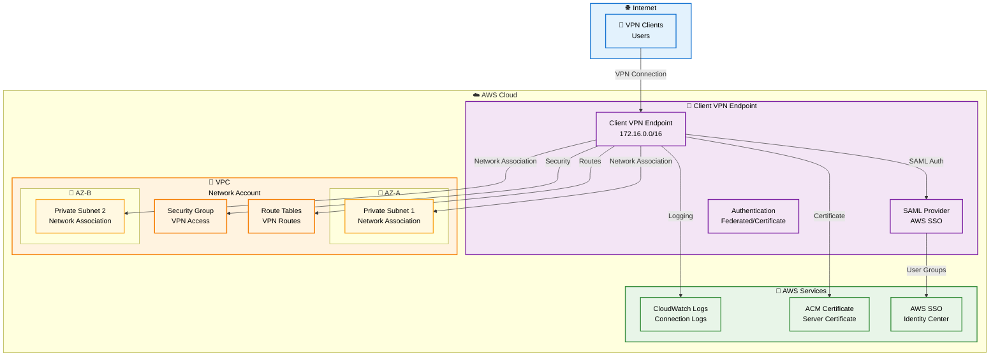
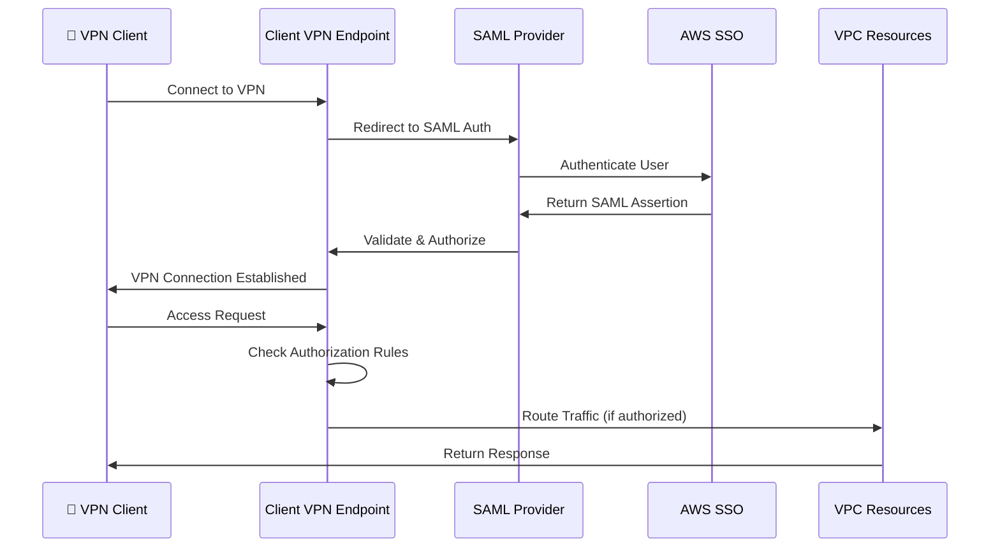
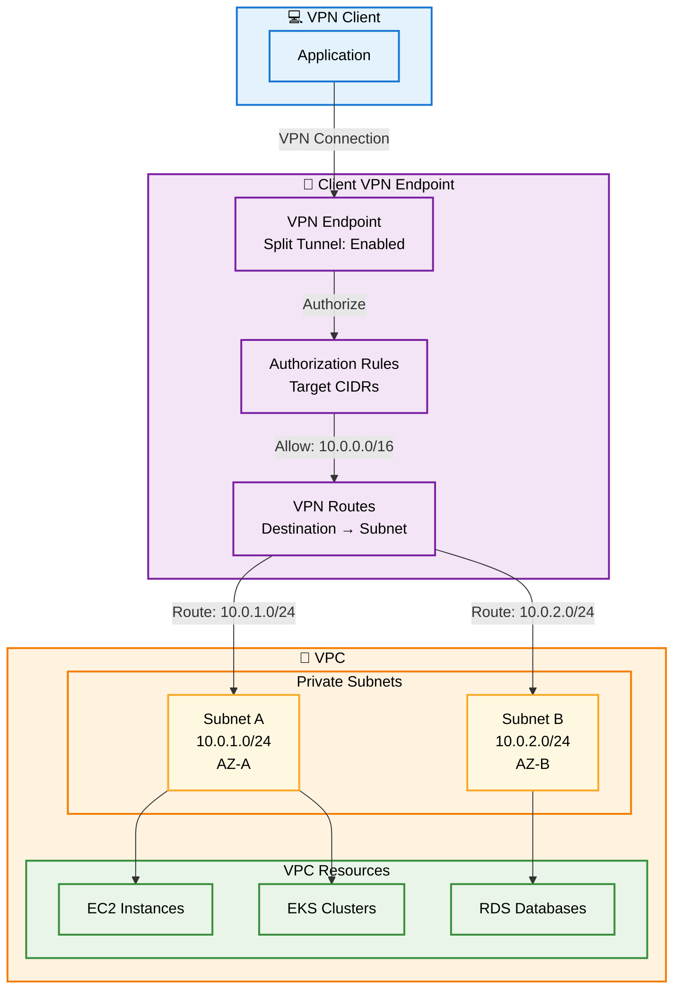

# AWS Client VPN Module

This module deploys AWS Client VPN service with AWS SSO authentication, providing secure remote access to VPC resources. The configuration uses a structured `client_vpn_config` object organized into logical architecture sections.

## Overview

The Client VPN configuration is organized into a single `client_vpn_config` object with the following structure:

- **version** - Configuration version
- **region** - AWS region
- **metadata** - VPN endpoint metadata (name, environment, tags)
- **connection** - VPC connection configuration (VPC ID, subnet IDs)
- **networking** - Network configuration (client CIDR, split tunnel, DNS, routes)
- **security** - Security configuration (certificates, authentication, authorization rules)
- **logging** - Connection logging configuration (CloudWatch logs)
- **compliance** - Compliance configuration (SAML provider, SSO groups)
- **high_availability** - High availability settings (multi-AZ)

## Architecture Diagrams

### Client VPN Architecture Overview



### Authentication Flow with AWS SSO



### Network Architecture with Routes



## Configuration Structure

The `client_vpn_config` object follows this structure:

```hcl
client_vpn_config = {
  version = "1.0.0"
  region  = "us-east-1"

  metadata = {
    name        = "bb-apps-devstg-client-vpn"
    environment = "devstg"
    tags        = { ... }
  }

  connection = {
    vpc_id     = "vpc-xxxxx" # or null to use data source
    subnet_ids = ["subnet-xxxxx", "subnet-yyyyy"]
  }

  networking = {
    client_cidr_block  = "172.16.0.0/16"
    split_tunnel       = true
    dns_servers        = ["10.0.0.2"]
    transport_protocol = "udp"
    routes             = [ ... ]
  }

  security = {
    server_certificate_arn = "arn:aws:acm:..."
    security_group         = { ... }
    authentication         = { ... }
    authorization_rules    = [ ... ]
  }

  logging = {
    connection_logs = { ... }
  }

  compliance = {
    saml_provider = { ... }
    sso_groups    = { ... }
  }

  high_availability = {
    multi_az = true
  }
}
```

## Usage Example

### Basic Configuration

```hcl
# environments/devstg.tfvars
client_vpn_config = {
  version = "1.0.0"
  region  = "us-east-1"

  metadata = {
    name        = "bb-apps-devstg-client-vpn"
    environment = "devstg"
    tags = {
      Environment = "apps-devstg"
      Layer       = "client-vpn"
      Terraform   = "true"
    }
  }

  connection = {
    vpc_id     = null # Will be looked up from remote state
    subnet_ids = []   # Will be populated from remote state
  }

  networking = {
    client_cidr_block  = "172.16.0.0/16"
    split_tunnel       = true
    dns_servers        = []
    transport_protocol = "udp"
    routes             = []
  }

  security = {
    server_certificate_arn = "arn:aws:acm:us-east-1:123456789012:certificate/xxxxx"
    
    security_group = {
      create      = true
      description = "Security group for Client VPN endpoint"
      rules = {
        egress = [
          {
            rule        = "all-all"
            cidr_blocks = "0.0.0.0/0"
          }
        ]
      }
    }

    authentication = {
      type              = "federated-authentication"
      saml_provider_arn = null # Will use created SAML provider
    }

    authorization_rules = [
      {
        target_network_cidr = "10.0.0.0/16"
        access_group_id      = null # Will use SSO group
        authorize_all_groups = false
        description          = "Authorization for devops to VPC"
      }
    ]
  }

  logging = {
    connection_logs = {
      enabled              = true
      cloudwatch_log_group = null
      retention_in_days    = 60
      kms_key_id           = null
    }
  }

  compliance = {
    saml_provider = {
      name               = "bb-apps-devstg-client-vpn"
      saml_metadata_path = "saml-metadata.xml"
    }

    sso_groups = {
      devops = {
        group_name        = "DevOps"
        identity_store_id = null
      }
    }
  }

  high_availability = {
    multi_az = true
  }
}
```

### Apply Configuration

```bash
cd network/client-vpn
leverage tf init
leverage tf plan -var-file=environments/devstg.tfvars
leverage tf apply -var-file=environments/devstg.tfvars
```

## AWS SSO Configuration

Due to API limitations, the SSO application must be configured manually. For more information, see [this bug](https://github.com/hashicorp/terraform-provider-aws/issues/34813) and the [AWS Terraform Provider notes](https://registry.terraform.io/providers/hashicorp/aws/5.39.1/docs/resources/ssoadmin_application?lang=typescript).

### Manual SSO Setup Steps

1. In AWS Identity Center, go to "Applications", then click "Add a new application", then click "Add a custom SAML 2.0 application".
2. Complete the Name and description (note: if you import this resource to Terraform, you will not be able to change the name).
3. Download the AWS SSO Metadata file (save as `saml-metadata.xml` in this folder, it will be ignored by git for security reasons).
4. Enter `http://127.0.0.1:35001` as the Application ACS URL and `urn:amazon:webservices:clientvpn` as the Application SAML audience.
5. Set up the following attribute mappings:
   - **Subject**: value `${user:email}`, format `emailAddress`
   - **memberOf**: value `${user:groups}`, format `unspecified`

You can read a more complete guide in [this AWS Post](https://aws.amazon.com/es/blogs/networking-and-content-delivery/using-aws-sso-with-aws-client-vpn-for-authentication-and-authorization/). Note that some steps are done automatically using Terraform.

### SSO Layer in Leverage

To configure the group assignment as code, you can import the SSO Application in `management/global/sso`:

```bash
leverage tf import 'aws_ssoadmin_application.client_vpn[0]' application-arn
```

And configure this section in `locals.tf`:

```hcl
locals {
  enable_sso_client_vpn = true

  client_vpn_groups = [
    "devops"
  ]
}
```

Alternatively, you can use a local or variable to pass the application ARN to the group assignment resource:

```hcl
resource "aws_ssoadmin_application_assignment" "client_vpn" {
  for_each = local.enable_sso_client_vpn == true ? toset(local.client_vpn_groups) : toset([])

  application_arn = local.aws_vpn_sso_application_arn
  principal_id    = split("/", aws_identitystore_group.default[each.key].id)[1]
  principal_type  = "GROUP"
}
```

## Configuration Sections

### METADATA

- `version` - Configuration version identifier
- `region` - AWS region for deployment
- `metadata.name` - VPN endpoint name
- `metadata.environment` - Environment identifier (devstg, prd, shared)
- `metadata.tags` - Resource tags

### CONNECTION

- `connection.vpc_id` - VPC ID (can be null to use remote state data source)
- `connection.subnet_ids` - List of subnet IDs for network associations (multi-AZ recommended)

### NETWORKING

- `networking.client_cidr_block` - CIDR block for VPN clients (e.g., `172.16.0.0/16`)
- `networking.split_tunnel` - Enable split tunneling (recommended: `true`)
- `networking.dns_servers` - DNS servers for VPN clients (optional)
- `networking.transport_protocol` - Transport protocol (`udp` or `tcp`)
- `networking.routes` - List of routes (destination CIDR → target subnet)

### SECURITY

- `security.server_certificate_arn` - ACM certificate ARN for server authentication
- `security.security_group` - Security group configuration
  - `create` - Create security group (default: `true`)
  - `name` - Security group name (optional)
  - `description` - Security group description
  - `rules` - Security group rules (egress rules)
  - `tags` - Security group tags
- `security.authentication` - Authentication configuration
  - `type` - Authentication type (`federated-authentication` or `certificate-authentication`)
  - `saml_provider_arn` - SAML provider ARN (for federated auth)
  - `root_certificate_chain_arn` - Root certificate chain ARN (for certificate auth)
- `security.authorization_rules` - Authorization rules
  - `target_network_cidr` - Target network CIDR block
  - `access_group_id` - SSO group ID for access
  - `authorize_all_groups` - Authorize all groups (default: `false`)
  - `description` - Rule description

### LOGGING

- `logging.connection_logs` - Connection logging configuration
  - `enabled` - Enable connection logging (default: `true`)
  - `cloudwatch_log_group` - CloudWatch log group name (optional, auto-created if null)
  - `retention_in_days` - Log retention in days (default: `60`)
  - `kms_key_id` - KMS key ID for encryption (optional)

### COMPLIANCE

- `compliance.saml_provider` - SAML provider configuration
  - `name` - SAML provider name
  - `saml_metadata_path` - Path to SAML metadata XML file
- `compliance.sso_groups` - SSO group mappings
  - `group_name` - SSO group name
  - `identity_store_id` - Identity store ID (optional, auto-detected)

### HIGH_AVAILABILITY

- `high_availability.multi_az` - Enable multi-AZ deployment (default: `true`)

## Best Practices

### Network Configuration

1. **Split Tunneling**: Enable split tunneling (`split_tunnel = true`) to route only VPC traffic through the VPN, improving performance and reducing bandwidth costs.

2. **Multi-AZ Deployment**: Always use multiple availability zones for network associations to ensure high availability:
   ```hcl
   connection = {
     subnet_ids = [
       "subnet-xxxxx", # AZ-A
       "subnet-yyyyy"  # AZ-B
     ]
   }
   ```

3. **Routes**: Avoid adding a route to `0.0.0.0/0` as it breaks split tunneling and may cause authorization issues.

4. **Client CIDR Block**: Use a non-overlapping CIDR block (e.g., `172.16.0.0/16`) for VPN clients.

### Security Configuration

1. **Certificates**: Use ACM certificates for server authentication. Ensure certificates are valid and not expired.

2. **Security Groups**: Create a dedicated security group for the VPN endpoint with appropriate egress rules.

3. **Authorization Rules**: Use specific CIDR blocks and SSO groups for authorization rather than allowing all groups.

4. **SAML Provider**: Store SAML metadata securely and use version control exclusions for sensitive files.

### Logging and Monitoring

1. **Connection Logs**: Enable connection logging for audit and troubleshooting purposes.

2. **Log Retention**: Set appropriate retention periods based on compliance requirements (60 days for dev, 90+ days for production).

3. **KMS Encryption**: Use KMS encryption for CloudWatch logs in production environments.

### High Availability

1. **Multi-AZ**: Always enable multi-AZ deployment for production environments.

2. **Subnet Selection**: Use private subnets in different availability zones for network associations.

## Troubleshooting

### Common Issues

1. **VPN Connection Fails**
   - Verify certificate ARN is correct and valid
   - Check security group rules allow necessary traffic
   - Verify SAML provider configuration

2. **Authorization Denied**
   - Verify SSO groups are correctly configured
   - Check authorization rules match target CIDRs
   - Ensure users are assigned to correct SSO groups

3. **Routes Not Working**
   - Verify routes are correctly configured in `networking.routes`
   - Check route table associations for target subnets
   - Ensure split tunneling is not blocking routes

4. **SSO Authentication Issues**
   - Verify SAML metadata file is correct and up-to-date
   - Check SSO application configuration in AWS Identity Center
   - Verify attribute mappings are correct

### Debugging

Enable detailed logging:

```hcl
logging = {
  connection_logs = {
    enabled              = true
    cloudwatch_log_group = "client-vpn-logs"
    retention_in_days    = 7
  }
}
```

Check CloudWatch logs for connection issues:

```bash
aws logs tail /aws/clientvpn/bb-apps-devstg-client-vpn-logs --follow
```

## Outputs

The module provides the following outputs:

- `client_vpn_endpoint_id` - The ID of the Client VPN endpoint
- `client_vpn_endpoint_arn` - The ARN of the Client VPN endpoint
- `client_vpn_endpoint_dns_name` - The DNS name for VPN clients
- `security_group_id` - The ID of the security group
- `security_group_arn` - The ARN of the security group
- `network_associations` - Map of network associations
- `authorization_rules` - Map of authorization rules
- `routes` - Map of VPN routes
- `cloudwatch_log_group_name` - CloudWatch log group name
- `cloudwatch_log_group_arn` - CloudWatch log group ARN
- `saml_provider_arn` - SAML provider ARN (if created)
- `client_vpn_config_summary` - Summary of configuration for debugging

## Requirements

| Name | Version |
|------|---------|
| terraform | ~> 1.6 |
| aws | ~> 5.0 |

## Providers

| Name | Version |
|------|---------|
| aws | ~> 5.0 |
| aws.management | ~> 5.0 (for SSO access) |

## Resources

| Name | Type |
|------|------|
| aws_ec2_client_vpn_endpoint | resource |
| aws_ec2_client_vpn_network_association | resource |
| aws_ec2_client_vpn_authorization_rule | resource |
| aws_ec2_client_vpn_route | resource |
| aws_iam_saml_provider | resource |
| aws_cloudwatch_log_group | resource |
| module.vpn_sso_sg | module |

## Inputs

| Name | Description | Type | Default | Required |
|------|-------------|------|---------|:--------:|
| client_vpn_config | Design spec for Client VPN | `object` | n/a | yes |
| profile | AWS profile to use | `string` | `null` | no |
| bucket | S3 bucket for remote state data sources | `string` | `null` | no |

## Outputs

| Name | Description |
|------|-------------|
| client_vpn_endpoint_id | The ID of the Client VPN endpoint |
| client_vpn_endpoint_arn | The ARN of the Client VPN endpoint |
| client_vpn_endpoint_dns_name | The DNS name for VPN clients |
| security_group_id | The ID of the security group |
| network_associations | Map of network associations |
| authorization_rules | Map of authorization rules |
| routes | Map of VPN routes |

## License

This module is part of the Leverage Terraform Infrastructure repository.
