# AWS Transit Gateway Module

This module deploys AWS Transit Gateway (TGW) infrastructure with multi-account VPC attachments, route tables, and optional Network Firewall integration. The configuration uses a structured `tgw_config` object organized into logical architecture sections.

## Overview

The Transit Gateway configuration is organized into a single `tgw_config` object with the following structure:

- **version** - Configuration version
- **region** - AWS region (primary)
- **region_secondary** - Secondary region for DR (optional)
- **metadata** - TGW metadata (name, environment, tags)
- **connection** - Connection configuration (accounts, VPC attachments)
- **networking** - Network configuration (route tables, routes, blackhole routes)
- **security** - Security configuration (RAM sharing, Network Firewall)
- **high_availability** - High availability settings (multi-region peering)
- **monitoring** - Monitoring configuration (optional)
- **logging** - Logging configuration (optional)
- **compliance** - Compliance tags (optional)
- **automation** - Automation settings (optional)

## Architecture Diagrams

### Multi-Account Transit Gateway Architecture

```mermaid
graph TB
    subgraph NetworkAccount["🏢 Network Account"]
        TGW["Transit Gateway<br/>bb-network-tgw"]
        RTDefault["Default Route Table"]
        RTInspection["Inspection Route Table<br/>Network Firewall"]
        
        subgraph NetworkVPC["Network VPC<br/>10.0.0.0/16"]
            NetworkSubnet["Private Subnets<br/>VPC Attachment"]
        end
        
        subgraph NetworkFW["Network Firewall VPC"]
            FWSubnet["Inspection Subnets<br/>VPC Attachment"]
        end
    end
    
    subgraph SharedAccount["🔧 Shared Account"]
        subgraph SharedVPC["Shared VPC<br/>10.1.0.0/16"]
            SharedSubnet["Private Subnets<br/>VPC Attachment"]
        end
    end
    
    subgraph DevStgAccount["🛠️ DevStg Account"]
        RTDevStg["Apps-DevStg Route Table"]
        subgraph DevStgVPC["DevStg VPC<br/>10.2.0.0/16"]
            DevStgSubnet["Private Subnets<br/>VPC Attachment"]
        end
    end
    
    subgraph PrdAccount["🚀 Production Account"]
        RTPrd["Apps-Prd Route Table"]
        subgraph PrdVPC["Prd VPC<br/>10.3.0.0/16"]
            PrdSubnet["Private Subnets<br/>VPC Attachment"]
        end
    end
    
    TGW --> RTDefault
    TGW --> RTInspection
    TGW --> RTDevStg
    TGW --> RTPrd
    
    NetworkSubnet -->|VPC Attachment| TGW
    FWSubnet -->|VPC Attachment| TGW
    SharedSubnet -->|VPC Attachment| TGW
    DevStgSubnet -->|VPC Attachment| TGW
    PrdSubnet -->|VPC Attachment| TGW
    
    RTDefault -->|Routes| NetworkSubnet
    RTInspection -->|Routes| FWSubnet
    RTDevStg -->|Routes| DevStgSubnet
    RTPrd -->|Routes| PrdSubnet
    
    classDef network fill:#e3f2fd,stroke:#1976d2,stroke-width:2px,color:#000
    classDef shared fill:#fff3e0,stroke:#f57c00,stroke-width:2px,color:#000
    classDef devstg fill:#e8f5e8,stroke:#388e3c,stroke-width:2px,color:#000
    classDef prd fill:#ffebee,stroke:#d32f2f,stroke-width:2px,color:#000
    classDef tgw fill:#f3e5f5,stroke:#7b1fa2,stroke-width:2px,color:#000
    classDef route fill:#fff8e1,stroke:#f9a825,stroke-width:2px,color:#000
    
    class NetworkAccount,TGW,NetworkVPC,NetworkSubnet,NetworkFW,FWSubnet network
    class SharedAccount,SharedVPC,SharedSubnet shared
    class DevStgAccount,DevStgVPC,DevStgSubnet,RTDevStg devstg
    class PrdAccount,PrdVPC,PrdSubnet,RTPrd prd
    class RTDefault,RTInspection route
```



### Transit Gateway Routing Flow

```mermaid
graph LR
    subgraph DevStgVPC["DevStg VPC<br/>10.2.0.0/16"]
        DevStgEC2["EC2 Instance"]
    end
    
    subgraph TGW["Transit Gateway"]
        RTDevStg["Apps-DevStg RT"]
        RTDefault["Default RT"]
        Routes["Routes<br/>10.0.0.0/16 → Network<br/>10.1.0.0/16 → Shared<br/>0.0.0.0/0 → Network"]
    end
    
    subgraph NetworkVPC["Network VPC<br/>10.0.0.0/16"]
        NetworkEC2["EC2 Instance"]
    end
    
    subgraph SharedVPC["Shared VPC<br/>10.1.0.0/16"]
        SharedRDS["RDS Database"]
    end
    
    DevStgEC2 -->|Request: 10.0.0.0/16| RTDevStg
    RTDevStg -->|Route Match| Routes
    Routes -->|Route to Network| NetworkVPC
    NetworkVPC --> NetworkEC2
    
    DevStgEC2 -->|Request: 10.1.0.0/16| RTDevStg
    RTDevStg -->|Route Match| Routes
    Routes -->|Route to Shared| SharedVPC
    SharedVPC --> SharedRDS
    
    classDef vpc fill:#e3f2fd,stroke:#1976d2,stroke-width:2px,color:#000
    classDef tgw fill:#f3e5f5,stroke:#7b1fa2,stroke-width:2px,color:#000
    classDef route fill:#fff8e1,stroke:#f9a825,stroke-width:2px,color:#000
    classDef resource fill:#e8f5e8,stroke:#388e3c,stroke-width:2px,color:#000
    
    class DevStgVPC,NetworkVPC,SharedVPC vpc
    class TGW,RTDevStg,RTDefault,Routes tgw
    class DevStgEC2,NetworkEC2,SharedRDS resource
```



### Network Firewall Integration

```mermaid
graph TB
    subgraph NetworkAccount["🏢 Network Account"]
        TGW["Transit Gateway"]
        RTDefault["Default Route Table"]
        RTInspection["Inspection Route Table"]
        
        subgraph NetworkVPC["Network VPC<br/>10.0.0.0/16"]
            NetworkSubnet["Private Subnets"]
        end
        
        subgraph NetworkFW["Network Firewall VPC"]
            FWEndpoint["Network Firewall<br/>Inspection Endpoint"]
            FWSubnet["Inspection Subnets"]
        end
    end
    
    subgraph SharedAccount["🔧 Shared Account"]
        SharedVPC["Shared VPC<br/>10.1.0.0/16"]
    end
    
    NetworkSubnet -->|VPC Attachment| TGW
    FWSubnet -->|VPC Attachment| TGW
    
    TGW --> RTDefault
    TGW --> RTInspection
    
    RTDefault -->|Association| NetworkSubnet
    RTInspection -->|Association| FWSubnet
    
    NetworkSubnet -->|Traffic: 0.0.0.0/0| RTDefault
    RTDefault -->|Route: 0.0.0.0/0| FWEndpoint
    FWEndpoint -->|Inspect & Forward| RTInspection
    RTInspection -->|Route: 0.0.0.0/0| NetworkSubnet
    
    SharedVPC -->|VPC Attachment| TGW
    RTInspection -->|Association| SharedVPC
    
    classDef network fill:#e3f2fd,stroke:#1976d2,stroke-width:2px,color:#000
    classDef shared fill:#fff3e0,stroke:#f57c00,stroke-width:2px,color:#000
    classDef tgw fill:#f3e5f5,stroke:#7b1fa2,stroke-width:2px,color:#000
    classDef firewall fill:#ffebee,stroke:#d32f2f,stroke-width:2px,color:#000
    classDef route fill:#fff8e1,stroke:#f9a825,stroke-width:2px,color:#000
    
    class NetworkAccount,NetworkVPC,NetworkSubnet network
    class SharedAccount,SharedVPC shared
    class TGW,RTDefault,RTInspection tgw
    class NetworkFW,FWEndpoint,FWSubnet firewall
```



### Multi-Region Peering Architecture


## Configuration Structure

The `tgw_config` object follows this structure:

```hcl
tgw_config = {
  version          = "1.0.0"
  region           = "us-east-1"
  region_secondary = "us-east-2" # optional

  metadata = {
    name        = "bb-network-tgw"
    environment = "network"
    tags        = { ... }
  }

  connection = {
    create          = true
    existing_tgw_id = null
    accounts = {
      network     = true
      shared      = true
      apps-devstg = false
      apps-prd    = false
    }
    vpc_attachments = { ... }
  }

  networking = {
    route_tables = {
      default     = { create = true }
      inspection  = { create = true }
      apps-devstg = { create = false }
      apps-prd    = { create = false }
    }
    blackhole_routes = []
  }

  security = {
    ram_sharing = {
      enabled    = true
      principals = []
    }
    network_firewall = {
      enabled = true
    }
  }

  high_availability = {
    multi_region = {
      enabled     = true
      peer_region = "us-east-2"
    }
  }
}
```

## Usage Example

### Basic Configuration

```hcl
# environments/shared.tfvars
tgw_config = {
  version          = "1.0.0"
  region           = "us-east-1"
  region_secondary = null

  metadata = {
    name        = "bb-network-tgw"
    environment = "network"
    tags = {
      Environment = "network"
      Layer       = "transit-gateway"
      Terraform   = "true"
    }
  }

  connection = {
    create          = true
    existing_tgw_id = null
    accounts = {
      network     = true
      shared      = true
      apps-devstg = false
      apps-prd    = false
    }
    vpc_attachments = {}
  }

  networking = {
    route_tables = {
      default = {
        create = true
      }
      inspection = {
        create = true
      }
      apps-devstg = {
        create = false
      }
      apps-prd = {
        create = false
      }
    }
    blackhole_routes = []
  }

  security = {
    ram_sharing = {
      enabled    = true
      principals = []
    }
    network_firewall = {
      enabled = true
    }
  }

  high_availability = {
    multi_region = {
      enabled     = false
      peer_region = null
    }
  }

  monitoring = {
    enabled = false
  }

  logging = {
    enabled = false
  }

  compliance = {
    tags = {}
  }

  automation = {
    auto_accept_attachments = false
    auto_propagate_routes   = false
  }
}
```

### Apply Configuration

```bash
cd network/transit-gateway
leverage tf init
leverage tf plan -var-file=environments/shared.tfvars
leverage tf apply -var-file=environments/shared.tfvars
```

## Configuration Sections

### METADATA

- `version` - Configuration version identifier
- `region` - AWS region for deployment
- `region_secondary` - Secondary region for DR (optional)
- `metadata.name` - Transit Gateway name
- `metadata.environment` - Environment identifier (network, apps-devstg, apps-prd)
- `metadata.tags` - Resource tags

### CONNECTION

- `connection.create` - Create Transit Gateway (default: `true`)
- `connection.existing_tgw_id` - Use existing Transit Gateway ID (optional)
- `connection.accounts` - Account configurations for VPC attachments
  - `network` - Enable network account VPC attachments
  - `shared` - Enable shared account VPC attachments
  - `apps-devstg` - Enable apps-devstg account VPC attachments
  - `apps-prd` - Enable apps-prd account VPC attachments
- `connection.vpc_attachments` - VPC attachment configurations (optional map)

### NETWORKING

- `networking.route_tables` - Route table configurations
  - `default` - Default route table (default: `create = true`)
  - `inspection` - Inspection route table for Network Firewall (default: `create = false`)
  - `apps-devstg` - Apps-devstg route table (default: `create = false`)
  - `apps-prd` - Apps-prd route table (default: `create = false`)
- `networking.blackhole_routes` - List of CIDR blocks for blackhole routes

### SECURITY

- `security.ram_sharing` - RAM resource sharing configuration
  - `enabled` - Enable RAM sharing (default: `true`)
  - `principals` - List of account IDs or organization ARN (default: `[]`)
- `security.network_firewall` - Network Firewall integration
  - `enabled` - Enable Network Firewall support (default: `false`)

### HIGH_AVAILABILITY

- `high_availability.multi_region` - Multi-region peering configuration
  - `enabled` - Enable multi-region peering (default: `false`)
  - `peer_region` - Peer region for DR (optional)

### MONITORING

- `monitoring.enabled` - Enable monitoring (default: `false`)

### LOGGING

- `logging.enabled` - Enable logging (default: `false`)

### COMPLIANCE

- `compliance.tags` - Additional compliance tags (default: `{}`)

### AUTOMATION

- `automation.auto_accept_attachments` - Auto-accept attachments (default: `false`)
- `automation.auto_propagate_routes` - Auto-propagate routes (default: `false`)

## Route Table Strategy

The module supports multiple route tables for different purposes:

1. **Default Route Table** - Main route table for network and shared VPCs
2. **Inspection Route Table** - Used with Network Firewall for traffic inspection
3. **Apps-DevStg Route Table** - Isolated route table for dev/staging workloads
4. **Apps-Prd Route Table** - Isolated route table for production workloads

### Route Table Associations

- **Network VPCs** → Default Route Table (or Inspection Route Table if Network Firewall enabled)
- **Shared VPCs** → Default Route Table (or Inspection Route Table if Network Firewall enabled)
- **Apps-DevStg VPCs** → Apps-DevStg Route Table
- **Apps-Prd VPCs** → Apps-Prd Route Table

### Route Propagations

- All VPC attachments propagate routes to the Default Route Table
- Apps-DevStg and Apps-Prd route tables receive routes to shared and network VPCs
- Network Firewall routes traffic through Inspection Route Table

## Best Practices

### Multi-Account Architecture

1. **Centralized Transit Gateway**: Deploy Transit Gateway in the network account and share via RAM
2. **Route Table Isolation**: Use separate route tables for different environments (devstg, prd)
3. **Network Firewall**: Enable Network Firewall in network account for centralized inspection
4. **RAM Sharing**: Enable RAM sharing to allow cross-account VPC attachments

### Network Configuration

1. **Route Tables**: Create dedicated route tables for each environment to isolate traffic
2. **Blackhole Routes**: Use blackhole routes to prevent traffic to unwanted destinations
3. **Static Routes**: Use static routes for specific routing requirements (higher precedence than propagated routes)

### Security Configuration

1. **RAM Sharing**: Configure RAM sharing with specific principals (account IDs or organization ARN)
2. **Network Firewall**: Enable Network Firewall for traffic inspection and filtering
3. **Route Table Associations**: Associate VPCs with appropriate route tables based on security requirements

### High Availability

1. **Multi-Region**: Enable multi-region peering for disaster recovery
2. **Route Redundancy**: Configure routes to DR region VPCs for failover scenarios
3. **Cross-Region Connectivity**: Use Transit Gateway peering for cross-region VPC communication

### VPC Attachments

1. **Subnet Selection**: Use private subnets in multiple availability zones for VPC attachments
2. **Appliance Mode**: Enable appliance mode for Network Firewall attachments
3. **Route Table Associations**: Associate attachments with appropriate route tables

## Troubleshooting

### Common Issues

1. **VPC Attachment Fails**
   - Verify RAM sharing is enabled and principals are configured correctly
   - Check IAM permissions for cross-account VPC attachment
   - Verify subnet IDs are correct and in the same region

2. **Routes Not Working**
   - Verify route table associations are correct
   - Check route propagations are enabled
   - Verify static routes are configured correctly (they have higher precedence)

3. **Network Firewall Integration Issues**
   - Verify Network Firewall is deployed and accessible
   - Check inspection route table associations
   - Verify routes are configured correctly for traffic flow

4. **Multi-Region Peering Issues**
   - Verify peer Transit Gateway exists in the secondary region
   - Check peering attachment status
   - Verify routes to DR region VPCs are configured

5. **Cross-Account Access Denied**
   - Verify RAM sharing is enabled
   - Check IAM roles and permissions
   - Verify account IDs in `security.ram_sharing.principals`

### Debugging

Check Transit Gateway route tables:

```bash
aws ec2 describe-transit-gateway-route-tables \
  --transit-gateway-id tgw-xxxxx \
  --region us-east-1
```

Check VPC attachments:

```bash
aws ec2 describe-transit-gateway-vpc-attachments \
  --transit-gateway-id tgw-xxxxx \
  --region us-east-1
```

Check routes:

```bash
aws ec2 search-transit-gateway-routes \
  --transit-gateway-route-table-id rtb-xxxxx \
  --region us-east-1
```

## Outputs

The module provides the following outputs:

- `tgw_id` - The ID of the Transit Gateway
- `tgw_route_table_id` - The ID of the default route table
- `tgw_inspection_route_table_id` - The ID of the inspection route table (if Network Firewall enabled)
- `enable_tgw` - Whether Transit Gateway is enabled
- `enable_vpc_attach` - VPC attachments per account configuration
- `tgw_attachment_id` - The ID of the multi-region peering attachment (if enabled)

## Requirements

| Name | Version |
|------|---------|
| terraform | ~> 1.6 |
| aws | ~> 4.0 |

## Providers

| Name | Version |
|------|---------|
| aws | ~> 4.0 |
| aws.network | ~> 4.0 (for network account) |
| aws.shared | ~> 4.0 (for shared account) |
| aws.apps-devstg | ~> 4.0 (for apps-devstg account) |
| aws.apps-prd | ~> 4.0 (for apps-prd account) |

## Resources

| Name | Type |
|------|------|
| module.tgw | Transit Gateway module |
| module.tgw_inspection_route_table | Inspection route table module |
| module.tgw_apps_devstg_route_table | Apps-devstg route table module |
| module.tgw_apps_prd_route_table | Apps-prd route table module |
| module.tgw_vpc_attachments_and_subnet_routes_* | VPC attachment modules |
| aws_ec2_transit_gateway_peering_attachment | Multi-region peering |
| aws_ec2_transit_gateway_route | Static routes |
| aws_ec2_transit_gateway_route_table_association | Route table associations |
| aws_ec2_transit_gateway_route_table_propagation | Route propagations |

## Inputs

| Name | Description | Type | Default | Required |
|------|-------------|------|---------|:--------:|
| tgw_config | Design spec for Transit Gateway | `object` | n/a | yes |
| profile | AWS profile to use | `string` | `null` | no |

## Outputs

| Name | Description |
|------|-------------|
| tgw_id | The ID of the Transit Gateway |
| tgw_route_table_id | The ID of the default route table |
| tgw_inspection_route_table_id | The ID of the inspection route table |
| enable_tgw | Whether Transit Gateway is enabled |
| enable_vpc_attach | VPC attachments per account |
| tgw_attachment_id | Multi-region peering attachment ID |

## Migration from Legacy Variables

The module supports backward compatibility with legacy variables:

- `var.enable_tgw` → `tgw_config.connection.create`
- `var.enable_vpc_attach` → `tgw_config.connection.accounts`
- `var.enable_network_firewall` → `tgw_config.security.network_firewall.enabled`
- `var.enable_tgw_multi_region` → `tgw_config.high_availability.multi_region.enabled`
- `var.tgw_cidrs` → `tgw_config.networking.blackhole_routes`

Legacy variables are automatically mapped from `tgw_config` in `runtime.tf` for backward compatibility.

## License

This module is part of the Leverage Terraform Infrastructure repository.

